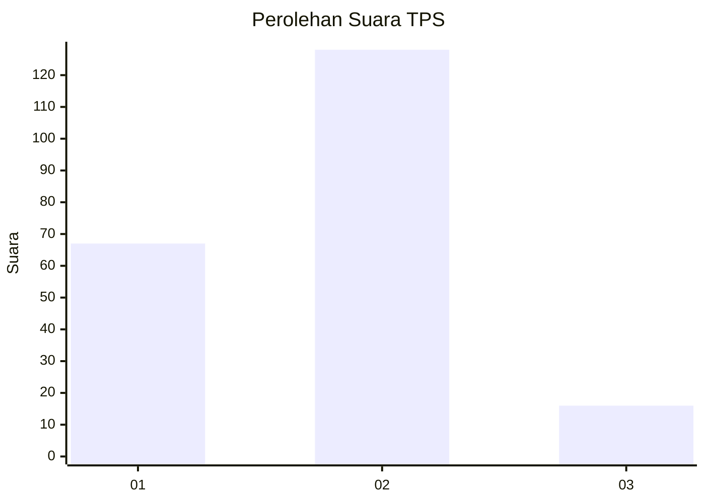
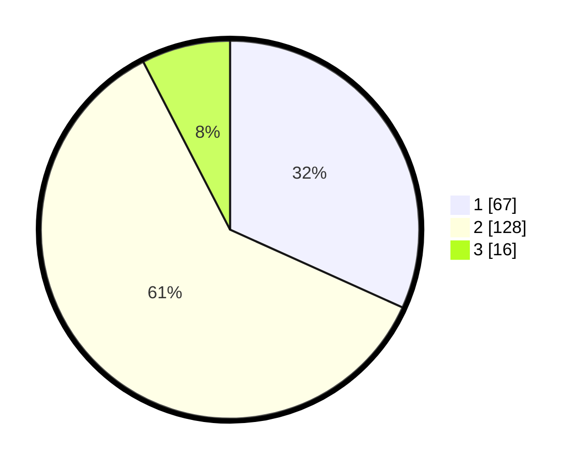

# Hasil

## Grafik

## Tabel

| No. | Nama Paslon    | Suara | Suara (raw) | Persentase |
|:--- |:-------------- | -----:| -----------:| ----------:|
| 1   | ANIES MUHAIMIN | 67    | [67][p-1]   | 31,75      |
| 2   | PRABOWO GIBRAN | 128   | [128][p-2]  | 60,66      |
| 3   | GANJAR MAHFUD  | 16    | [16][p-3]   | 7,58       |

[p-1]: https://github.com/gigit-pemilu/pemilu-2024/blob/main/pilpres/hitung-suara/sub/32-jawa-barat/sub/07-ciamis/sub/01-ciamis/sub/2012-panyingkiran/sub/006-tps/sub/paslon-1.txt
[p-2]: https://github.com/gigit-pemilu/pemilu-2024/blob/main/pilpres/hitung-suara/sub/32-jawa-barat/sub/07-ciamis/sub/01-ciamis/sub/2012-panyingkiran/sub/006-tps/sub/paslon-2.txt
[p-3]: https://github.com/gigit-pemilu/pemilu-2024/blob/main/pilpres/hitung-suara/sub/32-jawa-barat/sub/07-ciamis/sub/01-ciamis/sub/2012-panyingkiran/sub/006-tps/sub/paslon-3.txt

## Foto C Plano

https://sirekap-obj-formc.kpu.go.id/38a1/pemilu/ppwp/32/07/01/20/12/3207012012006-20240214-210008--f59cc4b3-6b8b-49d7-ae7e-57412b373beb.jpg

https://sirekap-obj-formc.kpu.go.id/38a1/pemilu/ppwp/32/07/01/20/12/3207012012006-20240214-210128--cf14a97b-8970-4d07-99d8-a327902f621f.jpg

https://sirekap-obj-formc.kpu.go.id/38a1/pemilu/ppwp/32/07/01/20/12/3207012012006-20240214-210210--68ae77bb-4c0e-4f7b-9021-7b3aa12c9ee4.jpg

## Metadata

| Key        | Value               |
| ---------- | ------------------- |
| Time Stamp | 2024-02-15 22:00:27 |

