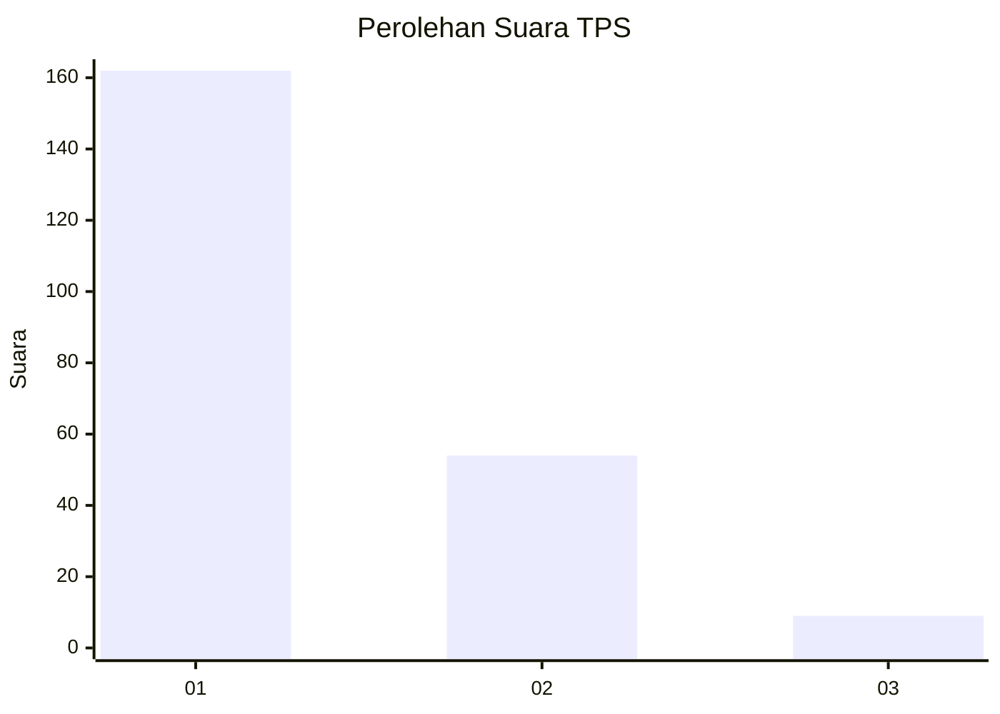
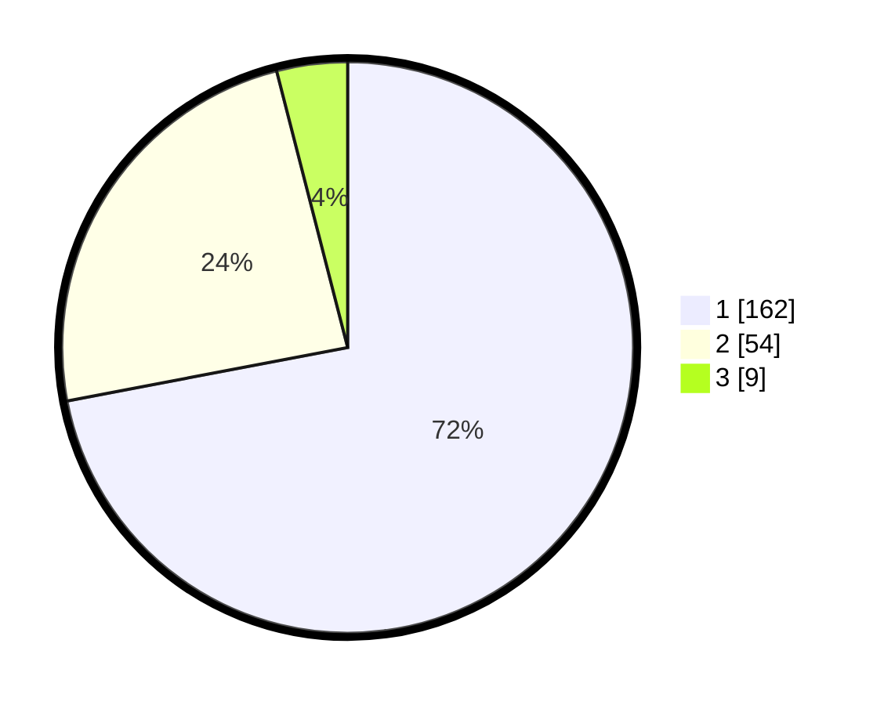

# Hasil

## Grafik

## Tabel

| No. | Nama Paslon    | Suara | Suara (raw) | Persentase |
|:--- |:-------------- | -----:| -----------:| ----------:|
| 1   | ANIES MUHAIMIN | 162   | [162][p-1]  | 72,00      |
| 2   | PRABOWO GIBRAN | 54    | [54][p-2]   | 24,00      |
| 3   | GANJAR MAHFUD  | 9     | [9][p-3]    | 4,00       |

[p-1]: https://github.com/gigit-pemilu/pemilu-2024/blob/main/pilpres/hitung-suara/sub/32-jawa-barat/sub/07-ciamis/sub/02-cikoneng/sub/2013-kujang/sub/003-tps/sub/paslon-1.txt
[p-2]: https://github.com/gigit-pemilu/pemilu-2024/blob/main/pilpres/hitung-suara/sub/32-jawa-barat/sub/07-ciamis/sub/02-cikoneng/sub/2013-kujang/sub/003-tps/sub/paslon-2.txt
[p-3]: https://github.com/gigit-pemilu/pemilu-2024/blob/main/pilpres/hitung-suara/sub/32-jawa-barat/sub/07-ciamis/sub/02-cikoneng/sub/2013-kujang/sub/003-tps/sub/paslon-3.txt

## Foto C Plano

https://sirekap-obj-formc.kpu.go.id/6e14/pemilu/ppwp/32/07/02/20/13/3207022013003-20240216-190542--06343432-7374-4b83-b0de-558e51396eb4.jpg

https://sirekap-obj-formc.kpu.go.id/6e14/pemilu/ppwp/32/07/02/20/13/3207022013003-20240215-041841--7f0f84cf-4fd6-42e6-940a-559cf3fbfcf2.jpg

https://sirekap-obj-formc.kpu.go.id/6e14/pemilu/ppwp/32/07/02/20/13/3207022013003-20240215-041916--232a695e-b11c-49c6-8dc3-cc17ba3700ba.jpg

## Metadata

| Key        | Value               |
| ---------- | ------------------- |
| Time Stamp | 2024-02-17 16:00:02 |

