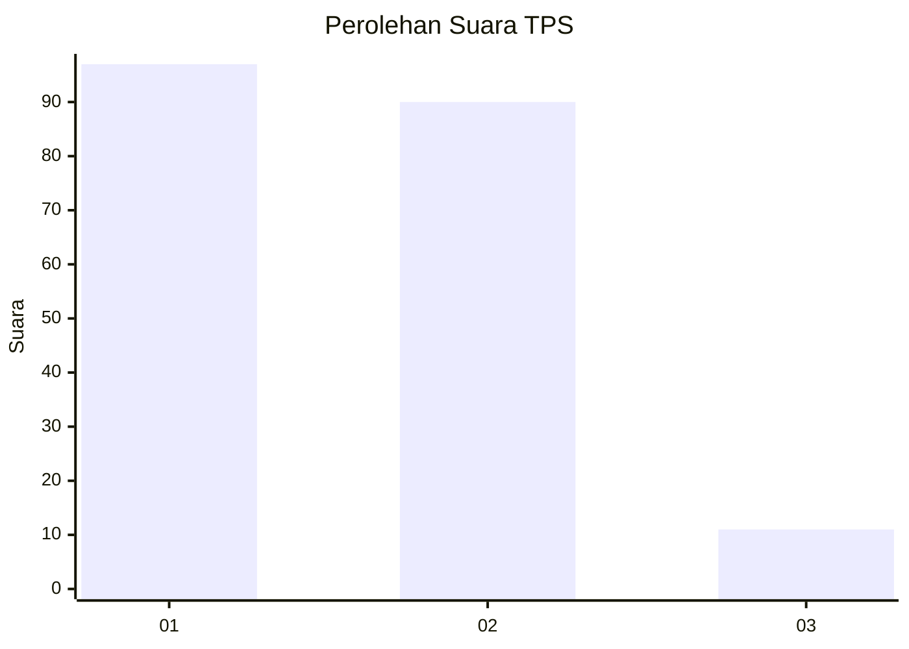
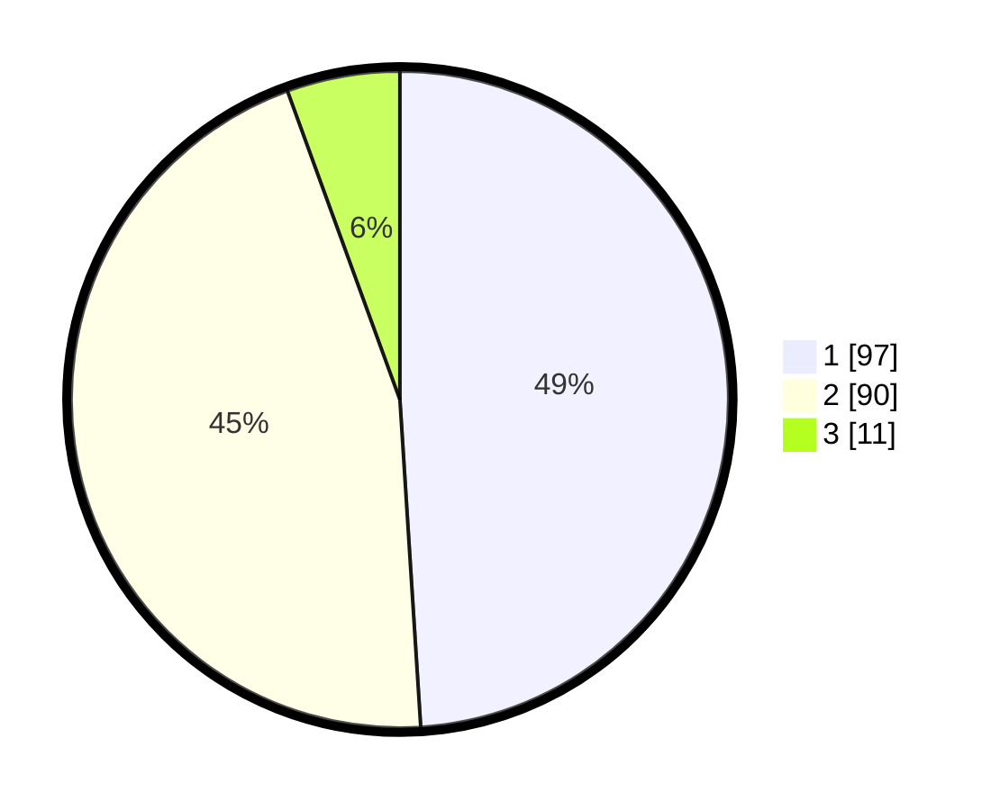

# Hasil

## Grafik

## Tabel

| No. | Nama Paslon    | Suara | Suara (raw) | Persentase |
|:--- |:-------------- | -----:| -----------:| ----------:|
| 1   | ANIES MUHAIMIN | 97    | [97][p-1]   | 48,99      |
| 2   | PRABOWO GIBRAN | 90    | [90][p-2]   | 45,45      |
| 3   | GANJAR MAHFUD  | 11    | [11][p-3]   | 5,56       |

[p-1]: https://github.com/gigit-pemilu/pemilu-2024/blob/main/pilpres/hitung-suara/sub/32-jawa-barat/sub/07-ciamis/sub/03-cijeungjing/sub/2001-handapherang/sub/002-tps/sub/paslon-1.txt
[p-2]: https://github.com/gigit-pemilu/pemilu-2024/blob/main/pilpres/hitung-suara/sub/32-jawa-barat/sub/07-ciamis/sub/03-cijeungjing/sub/2001-handapherang/sub/002-tps/sub/paslon-2.txt
[p-3]: https://github.com/gigit-pemilu/pemilu-2024/blob/main/pilpres/hitung-suara/sub/32-jawa-barat/sub/07-ciamis/sub/03-cijeungjing/sub/2001-handapherang/sub/002-tps/sub/paslon-3.txt

## Foto C Plano

https://sirekap-obj-formc.kpu.go.id/6789/pemilu/ppwp/32/07/03/20/01/3207032001002-20240215-084128--8d7faf3e-cac3-485c-8396-5a3178569250.jpg

https://sirekap-obj-formc.kpu.go.id/6789/pemilu/ppwp/32/07/03/20/01/3207032001002-20240215-084215--fe54bc14-7e49-4bd5-9137-af37deb19163.jpg

https://sirekap-obj-formc.kpu.go.id/6789/pemilu/ppwp/32/07/03/20/01/3207032001002-20240215-031047--efba8378-c917-459f-a992-890887727e83.jpg

## Metadata

| Key        | Value               |
| ---------- | ------------------- |
| Time Stamp | 2024-02-17 16:00:02 |

