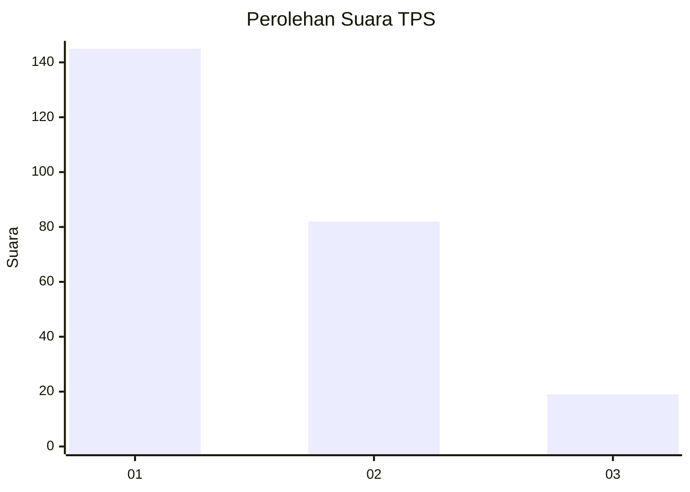
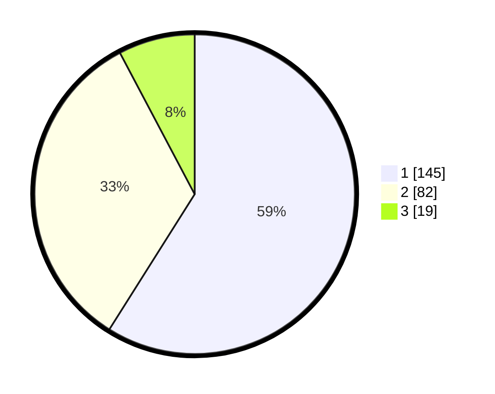

# Hasil

## Grafik

## Tabel

| No. | Nama Paslon    | Suara | Suara (raw) | Persentase |
|:--- |:-------------- | -----:| -----------:| ----------:|
| 1   | ANIES MUHAIMIN | 145   | [145][p-1]  | 58,94      |
| 2   | PRABOWO GIBRAN | 82    | [82][p-2]   | 33,33      |
| 3   | GANJAR MAHFUD  | 19    | [19][p-3]   | 7,72       |

[p-1]: https://github.com/gigit-pemilu/pemilu-2024-32-jawa-barat/blob/main/pilpres/hitung-suara/sub/32-jawa-barat/sub/07-ciamis/sub/03-cijeungjing/sub/2002-ciharalang/sub/017-tps/sub/paslon-1.txt
[p-2]: https://github.com/gigit-pemilu/pemilu-2024-32-jawa-barat/blob/main/pilpres/hitung-suara/sub/32-jawa-barat/sub/07-ciamis/sub/03-cijeungjing/sub/2002-ciharalang/sub/017-tps/sub/paslon-2.txt
[p-3]: https://github.com/gigit-pemilu/pemilu-2024-32-jawa-barat/blob/main/pilpres/hitung-suara/sub/32-jawa-barat/sub/07-ciamis/sub/03-cijeungjing/sub/2002-ciharalang/sub/017-tps/sub/paslon-3.txt

## Foto C Plano

https://sirekap-obj-formc.kpu.go.id/55bd/pemilu/ppwp/32/07/03/20/02/3207032002017-20240219-120408--9eeb82b7-b3c7-4be6-b91e-2417d02cc5a5.jpg

https://sirekap-obj-formc.kpu.go.id/55bd/pemilu/ppwp/32/07/03/20/02/3207032002017-20240219-120452--ba567938-efb6-42a2-b2f3-27f399e522c7.jpg

https://sirekap-obj-formc.kpu.go.id/55bd/pemilu/ppwp/32/07/03/20/02/3207032002017-20240219-120521--e6e9bca2-83c3-4d0d-a4e1-df7595cf01f9.jpg

## Metadata

| Key        | Value               |
| ---------- | ------------------- |
| Time Stamp | 2024-02-20 10:00:00 |

## DATA PEMILIH TETAP

Jumlah pemilih dalam DPT: **377**.
 * L: **574**.
 * P: **695**.

## DATA PENGGUNA HAK PILIH

Jumlah pengguna hak pilih dalam DPT: **251**.
 * L: **625**.
 * P: **555**.

Jumlah pengguna hak pilih dalam DPTb: **850**.
 * L: **808**.
 * P: **808**.

Jumlah pengguna hak pilih dalam DPK: **880**.
 * L: **80**.
 * P: **50**.

Jumlah pengguna hak pilih: **259**.
 * L: **736**.
 * P: **135**.

## JUMLAH SUARA SAH DAN TIDAK SAH

JUMLAH SELURUH SUARA SAH: **246**.

JUMLAH SUARA TIDAK SAH: **5**.

JUMLAH SELURUH SUARA SAH DAN SUARA TIDAK SAH: **251**.

