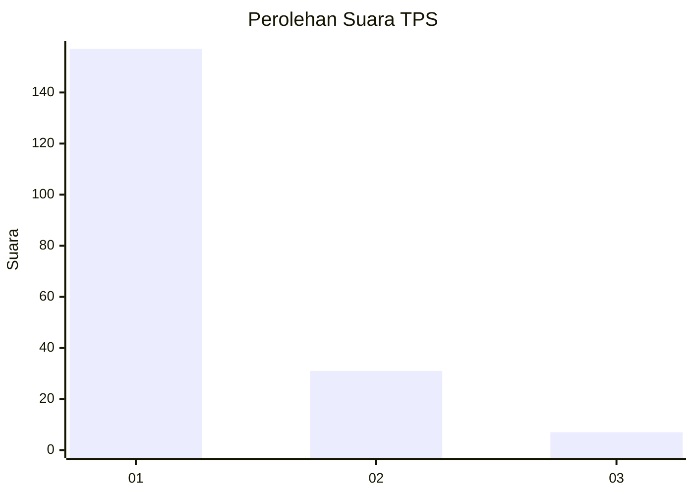
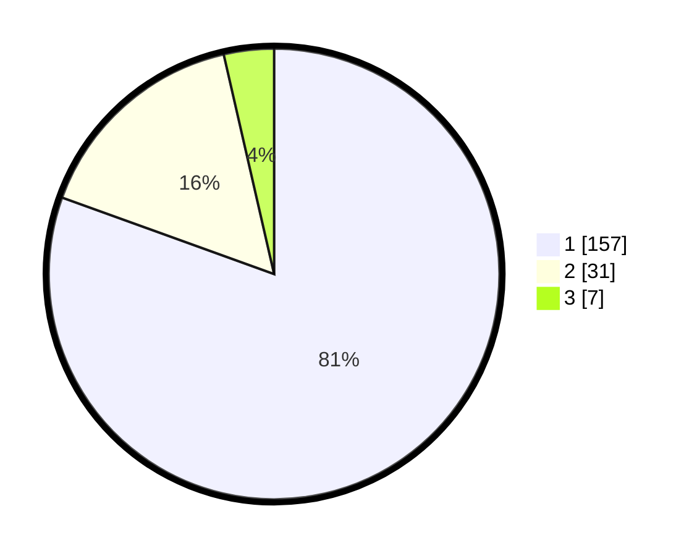

# Hasil

## Grafik

## Tabel

| No. | Nama Paslon    | Suara | Suara (raw) | Persentase |
|:--- |:-------------- | -----:| -----------:| ----------:|
| 1   | ANIES MUHAIMIN | 157   | [157][p-1]  | 80,51      |
| 2   | PRABOWO GIBRAN | 31    | [31][p-2]   | 15,90      |
| 3   | GANJAR MAHFUD  | 7     | [7][p-3]    | 3,59       |

[p-1]: https://github.com/gigit-pemilu/pemilu-2024/blob/main/pilpres/hitung-suara/sub/32-jawa-barat/sub/07-ciamis/sub/03-cijeungjing/sub/2010-kertaharja/sub/004-tps/sub/paslon-1.txt
[p-2]: https://github.com/gigit-pemilu/pemilu-2024/blob/main/pilpres/hitung-suara/sub/32-jawa-barat/sub/07-ciamis/sub/03-cijeungjing/sub/2010-kertaharja/sub/004-tps/sub/paslon-2.txt
[p-3]: https://github.com/gigit-pemilu/pemilu-2024/blob/main/pilpres/hitung-suara/sub/32-jawa-barat/sub/07-ciamis/sub/03-cijeungjing/sub/2010-kertaharja/sub/004-tps/sub/paslon-3.txt

## Foto C Plano

https://sirekap-obj-formc.kpu.go.id/9bf4/pemilu/ppwp/32/07/03/20/10/3207032010004-20240215-053312--9de3894f-5ea8-4f12-a59c-6163c4830daf.jpg

https://sirekap-obj-formc.kpu.go.id/9bf4/pemilu/ppwp/32/07/03/20/10/3207032010004-20240215-053359--826eb693-226d-4678-9740-17bf225dfa80.jpg

https://sirekap-obj-formc.kpu.go.id/9bf4/pemilu/ppwp/32/07/03/20/10/3207032010004-20240215-053501--cdc1e505-28d6-4f1e-a6b8-ef9871c58fb0.jpg

## Metadata

| Key        | Value               |
| ---------- | ------------------- |
| Time Stamp | 2024-02-17 16:00:02 |

