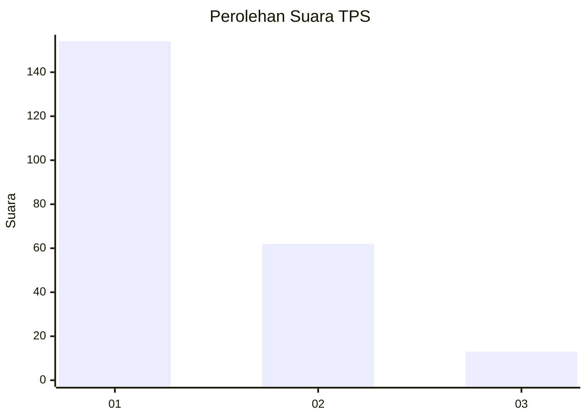
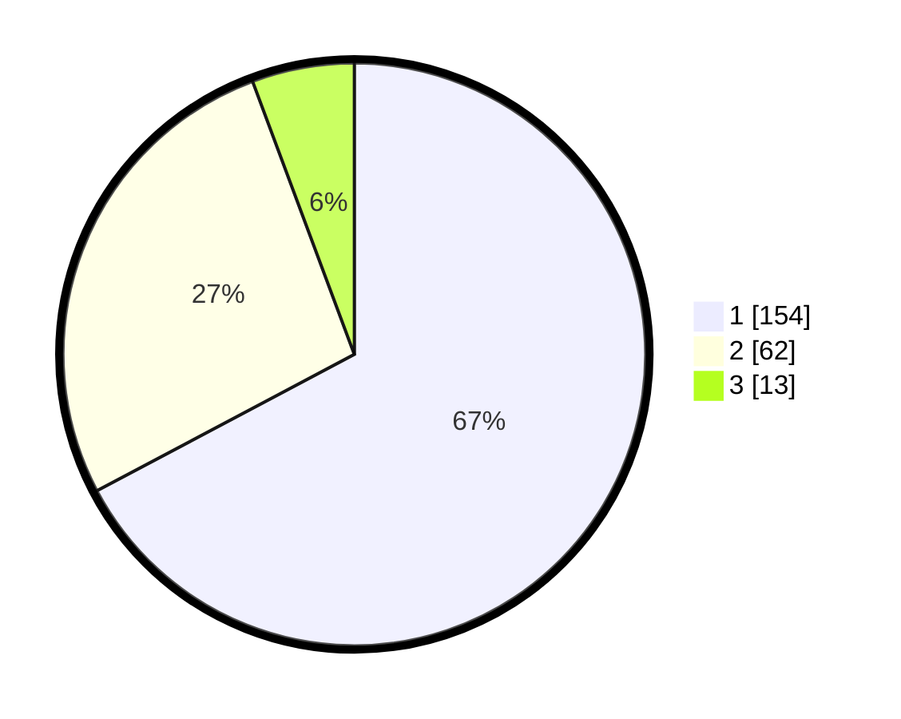

# Hasil

## Grafik

## Tabel

| No. | Nama Paslon    | Suara | Suara (raw) | Persentase |
|:--- |:-------------- | -----:| -----------:| ----------:|
| 1   | ANIES MUHAIMIN | 154   | [154][p-1]  | 67,25      |
| 2   | PRABOWO GIBRAN | 62    | [62][p-2]   | 27,07      |
| 3   | GANJAR MAHFUD  | 13    | [13][p-3]   | 5,68       |

[p-1]: https://github.com/gigit-pemilu/pemilu-2024/blob/main/pilpres/hitung-suara/sub/32-jawa-barat/sub/07-ciamis/sub/03-cijeungjing/sub/2010-kertaharja/sub/006-tps/sub/paslon-1.txt
[p-2]: https://github.com/gigit-pemilu/pemilu-2024/blob/main/pilpres/hitung-suara/sub/32-jawa-barat/sub/07-ciamis/sub/03-cijeungjing/sub/2010-kertaharja/sub/006-tps/sub/paslon-2.txt
[p-3]: https://github.com/gigit-pemilu/pemilu-2024/blob/main/pilpres/hitung-suara/sub/32-jawa-barat/sub/07-ciamis/sub/03-cijeungjing/sub/2010-kertaharja/sub/006-tps/sub/paslon-3.txt

## Foto C Plano

https://sirekap-obj-formc.kpu.go.id/ea1d/pemilu/ppwp/32/07/03/20/10/3207032010006-20240215-052216--d155019f-fcc9-4ace-b500-d623628fbe69.jpg

https://sirekap-obj-formc.kpu.go.id/ea1d/pemilu/ppwp/32/07/03/20/10/3207032010006-20240215-052315--ed253927-2901-4f74-9e6e-ab6052030bb8.jpg

https://sirekap-obj-formc.kpu.go.id/ea1d/pemilu/ppwp/32/07/03/20/10/3207032010006-20240215-052354--b65e1523-d386-46a2-96a7-31f55b3686a8.jpg

## Metadata

| Key        | Value               |
| ---------- | ------------------- |
| Time Stamp | 2024-02-17 16:00:02 |

