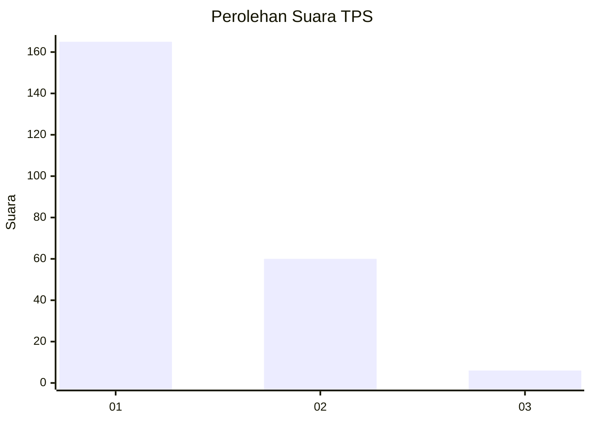
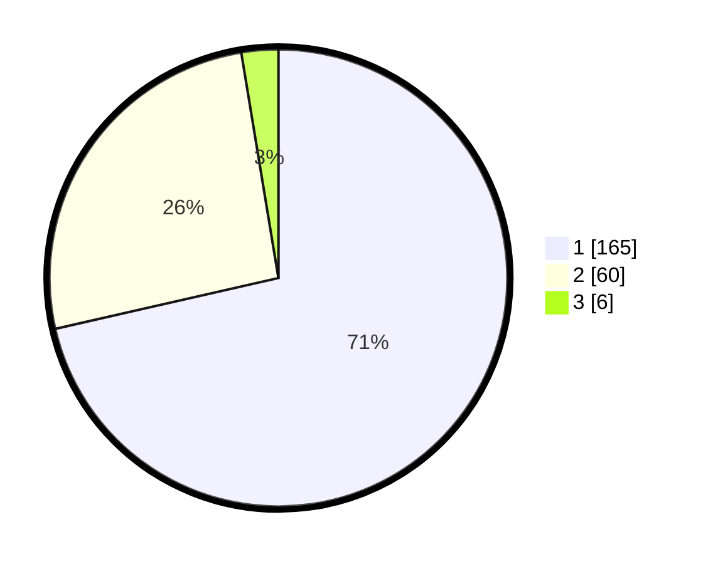

# Hasil

## Grafik

## Tabel

| No. | Nama Paslon    | Suara | Suara (raw) | Persentase |
|:--- |:-------------- | -----:| -----------:| ----------:|
| 1   | ANIES MUHAIMIN | 165   | [165][p-1]  | 71,43      |
| 2   | PRABOWO GIBRAN | 60    | [60][p-2]   | 25,97      |
| 3   | GANJAR MAHFUD  | 6     | [6][p-3]    | 2,60       |

[p-1]: https://github.com/gigit-pemilu/pemilu-2024/blob/main/pilpres/hitung-suara/sub/32-jawa-barat/sub/07-ciamis/sub/04-sadananya/sub/2001-gunungsari/sub/002-tps/sub/paslon-1.txt
[p-2]: https://github.com/gigit-pemilu/pemilu-2024/blob/main/pilpres/hitung-suara/sub/32-jawa-barat/sub/07-ciamis/sub/04-sadananya/sub/2001-gunungsari/sub/002-tps/sub/paslon-2.txt
[p-3]: https://github.com/gigit-pemilu/pemilu-2024/blob/main/pilpres/hitung-suara/sub/32-jawa-barat/sub/07-ciamis/sub/04-sadananya/sub/2001-gunungsari/sub/002-tps/sub/paslon-3.txt

## Foto C Plano

https://sirekap-obj-formc.kpu.go.id/7ba5/pemilu/ppwp/32/07/04/20/01/3207042001002-20240217-194743--86b0762a-488c-4e8b-9295-5dc9601eaf27.jpg

https://sirekap-obj-formc.kpu.go.id/7ba5/pemilu/ppwp/32/07/04/20/01/3207042001002-20240215-021744--4154c32c-efc4-4f85-ab88-4fd06a0cc945.jpg

https://sirekap-obj-formc.kpu.go.id/7ba5/pemilu/ppwp/32/07/04/20/01/3207042001002-20240215-021925--ed56a620-27d0-404a-be99-507d3f706dba.jpg

## Metadata

| Key        | Value               |
| ---------- | ------------------- |
| Time Stamp | 2024-02-19 06:16:00 |

