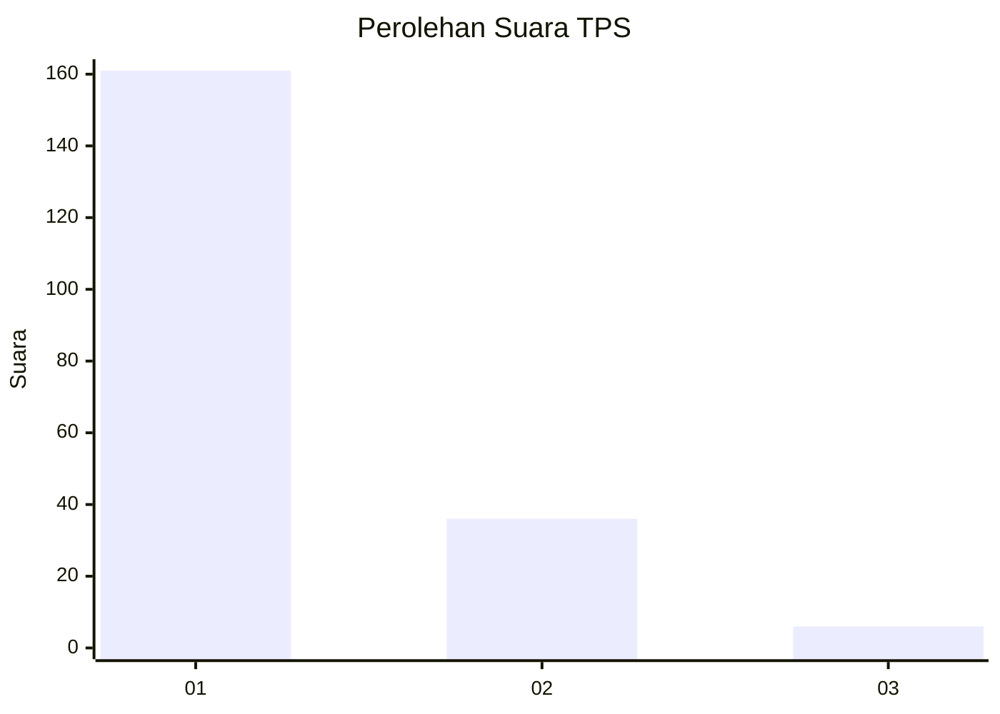
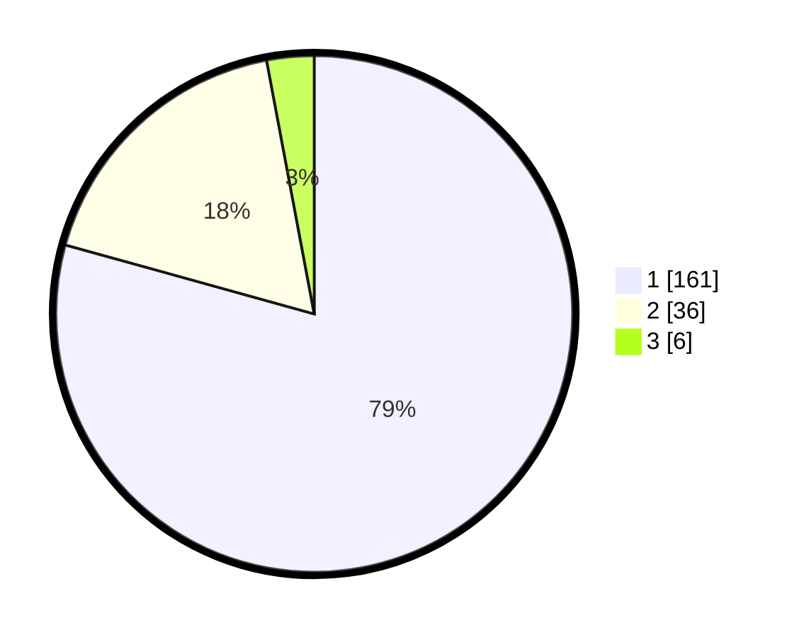

# Hasil

## Grafik

## Tabel

| No. | Nama Paslon    | Suara | Suara (raw) | Persentase |
|:--- |:-------------- | -----:| -----------:| ----------:|
| 1   | ANIES MUHAIMIN | 161   | [161][p-1]  | 79,31      |
| 2   | PRABOWO GIBRAN | 36    | [36][p-2]   | 17,73      |
| 3   | GANJAR MAHFUD  | 6     | [6][p-3]    | 2,96       |

[p-1]: https://github.com/gigit-pemilu/pemilu-2024/blob/main/pilpres/hitung-suara/sub/32-jawa-barat/sub/07-ciamis/sub/04-sadananya/sub/2005-tanjungsari/sub/012-tps/sub/paslon-1.txt
[p-2]: https://github.com/gigit-pemilu/pemilu-2024/blob/main/pilpres/hitung-suara/sub/32-jawa-barat/sub/07-ciamis/sub/04-sadananya/sub/2005-tanjungsari/sub/012-tps/sub/paslon-2.txt
[p-3]: https://github.com/gigit-pemilu/pemilu-2024/blob/main/pilpres/hitung-suara/sub/32-jawa-barat/sub/07-ciamis/sub/04-sadananya/sub/2005-tanjungsari/sub/012-tps/sub/paslon-3.txt

## Foto C Plano

https://sirekap-obj-formc.kpu.go.id/9220/pemilu/ppwp/32/07/04/20/05/3207042005012-20240214-211544--882f4650-844b-4c40-afde-503c42be4ade.jpg

https://sirekap-obj-formc.kpu.go.id/9220/pemilu/ppwp/32/07/04/20/05/3207042005012-20240214-223953--2e98c445-b4a6-4ff7-b19d-6d04e7e846b7.jpg

https://sirekap-obj-formc.kpu.go.id/9220/pemilu/ppwp/32/07/04/20/05/3207042005012-20240214-210041--87804d55-cf61-434f-a32c-5aa1fb6524b5.jpg

## Metadata

| Key        | Value               |
| ---------- | ------------------- |
| Time Stamp | 2024-02-15 06:00:23 |

