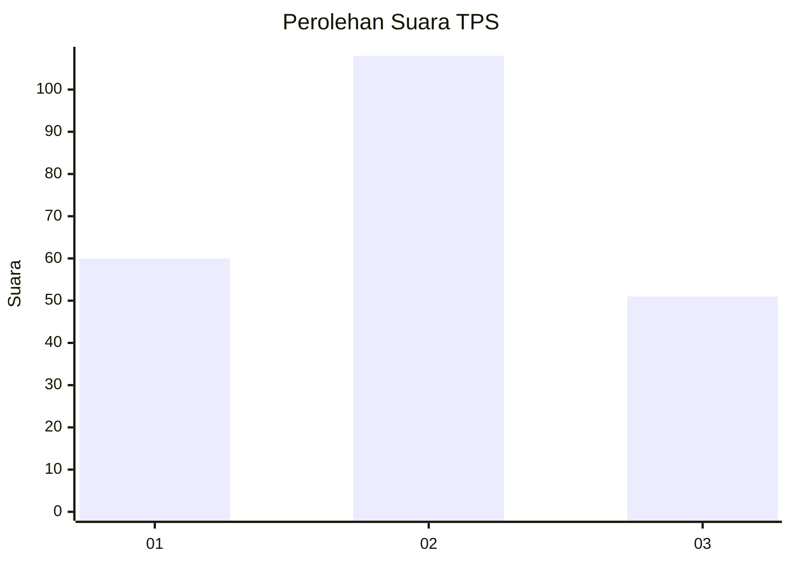
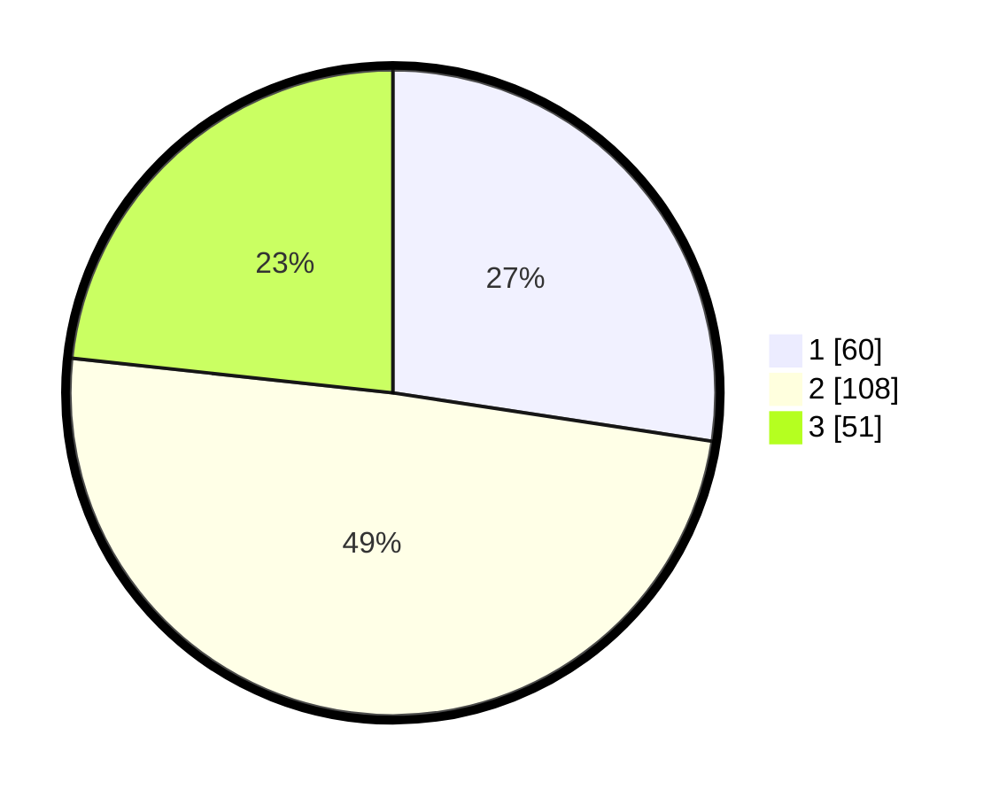

# Hasil

## Grafik

## Tabel

| No. | Nama Paslon    | Suara | Suara (raw) | Persentase |
|:--- |:-------------- | -----:| -----------:| ----------:|
| 1   | ANIES MUHAIMIN | 60    | [60][p-1]   | 27,40      |
| 2   | PRABOWO GIBRAN | 108   | [108][p-2]  | 49,32      |
| 3   | GANJAR MAHFUD  | 51    | [51][p-3]   | 23,29      |

[p-1]: https://github.com/gigit-pemilu/pemilu-2024-32-jawa-barat/blob/main/pilpres/hitung-suara/sub/32-jawa-barat/sub/07-ciamis/sub/05-cidolog/sub/2001-cidolog/sub/004-tps/sub/paslon-1.txt
[p-2]: https://github.com/gigit-pemilu/pemilu-2024-32-jawa-barat/blob/main/pilpres/hitung-suara/sub/32-jawa-barat/sub/07-ciamis/sub/05-cidolog/sub/2001-cidolog/sub/004-tps/sub/paslon-2.txt
[p-3]: https://github.com/gigit-pemilu/pemilu-2024-32-jawa-barat/blob/main/pilpres/hitung-suara/sub/32-jawa-barat/sub/07-ciamis/sub/05-cidolog/sub/2001-cidolog/sub/004-tps/sub/paslon-3.txt

## Foto C Plano

https://sirekap-obj-formc.kpu.go.id/8efb/pemilu/ppwp/32/07/05/20/01/3207052001004-20240214-221405--7ba44182-b27b-43df-9303-8b1fc63e49d9.jpg

https://sirekap-obj-formc.kpu.go.id/8efb/pemilu/ppwp/32/07/05/20/01/3207052001004-20240216-093154--0180f2ee-bb4f-4b1c-aba4-fd2593b6b92a.jpg

https://sirekap-obj-formc.kpu.go.id/8efb/pemilu/ppwp/32/07/05/20/01/3207052001004-20240216-093215--0f54cbb3-2566-4103-b952-825e1dde0765.jpg

## Metadata

| Key        | Value               |
| ---------- | ------------------- |
| Time Stamp | 2024-02-19 06:16:00 |

