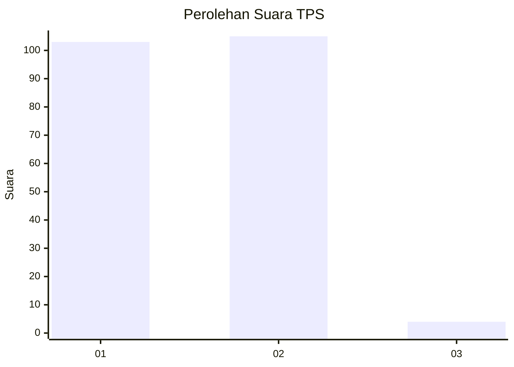
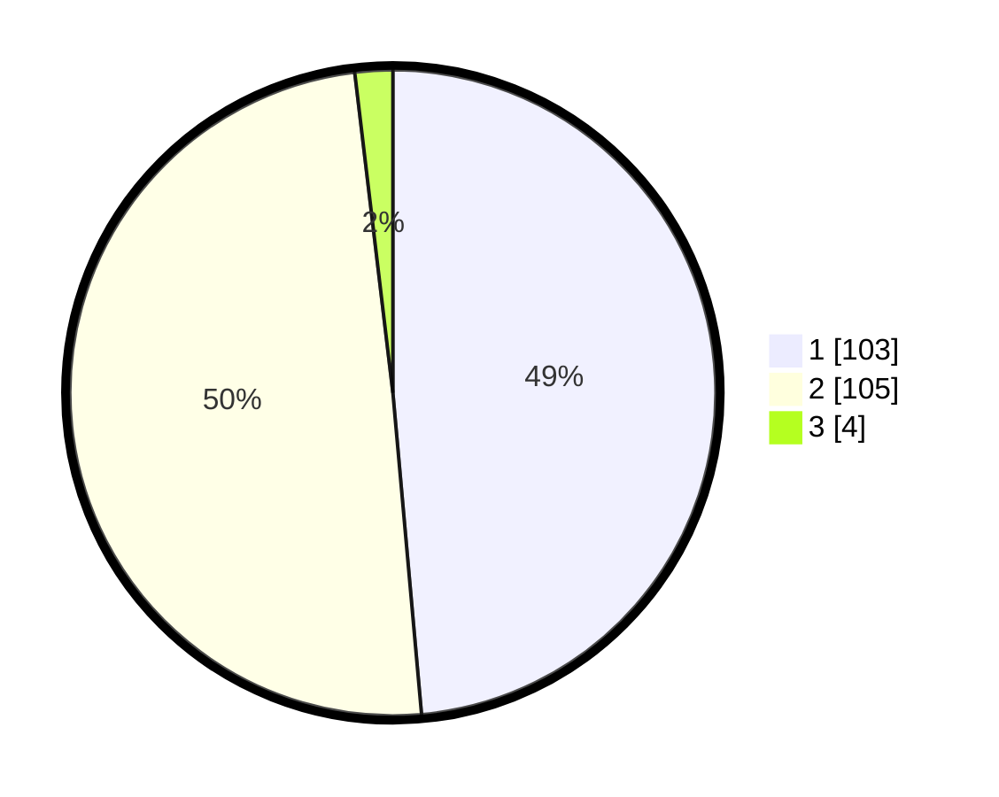

# Hasil

## Grafik

## Tabel

| No. | Nama Paslon    | Suara | Suara (raw) | Persentase |
|:--- |:-------------- | -----:| -----------:| ----------:|
| 1   | ANIES MUHAIMIN | 103   | [103][p-1]  | 48,58      |
| 2   | PRABOWO GIBRAN | 105   | [105][p-2]  | 49,53      |
| 3   | GANJAR MAHFUD  | 4     | [4][p-3]    | 1,89       |

[p-1]: https://github.com/gigit-pemilu/pemilu-2024/blob/main/pilpres/hitung-suara/sub/32-jawa-barat/sub/07-ciamis/sub/06-cihaurbeuti/sub/2001-sukamulya/sub/007-tps/sub/paslon-1.txt
[p-2]: https://github.com/gigit-pemilu/pemilu-2024/blob/main/pilpres/hitung-suara/sub/32-jawa-barat/sub/07-ciamis/sub/06-cihaurbeuti/sub/2001-sukamulya/sub/007-tps/sub/paslon-2.txt
[p-3]: https://github.com/gigit-pemilu/pemilu-2024/blob/main/pilpres/hitung-suara/sub/32-jawa-barat/sub/07-ciamis/sub/06-cihaurbeuti/sub/2001-sukamulya/sub/007-tps/sub/paslon-3.txt

## Foto C Plano

https://sirekap-obj-formc.kpu.go.id/582e/pemilu/ppwp/32/07/06/20/01/3207062001007-20240219-115706--e33ac198-ddf2-498f-bd69-675b9b0d8ffc.jpg

https://sirekap-obj-formc.kpu.go.id/582e/pemilu/ppwp/32/07/06/20/01/3207062001007-20240219-172309--dd668d03-6517-4ce1-bc03-79ae51f7051a.jpg

https://sirekap-obj-formc.kpu.go.id/582e/pemilu/ppwp/32/07/06/20/01/3207062001007-20240219-172514--de1f8267-0b32-4096-9b1b-2363a1c2c55c.jpg

## Metadata

| Key        | Value               |
| ---------- | ------------------- |
| Time Stamp | 2024-02-25 17:00:00 |

