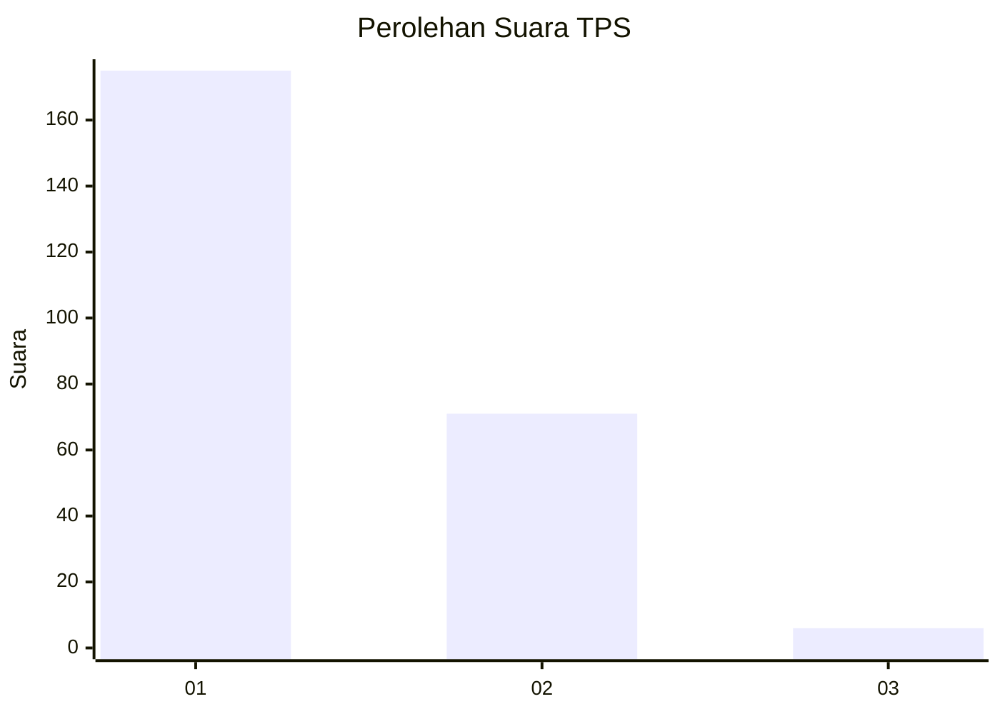
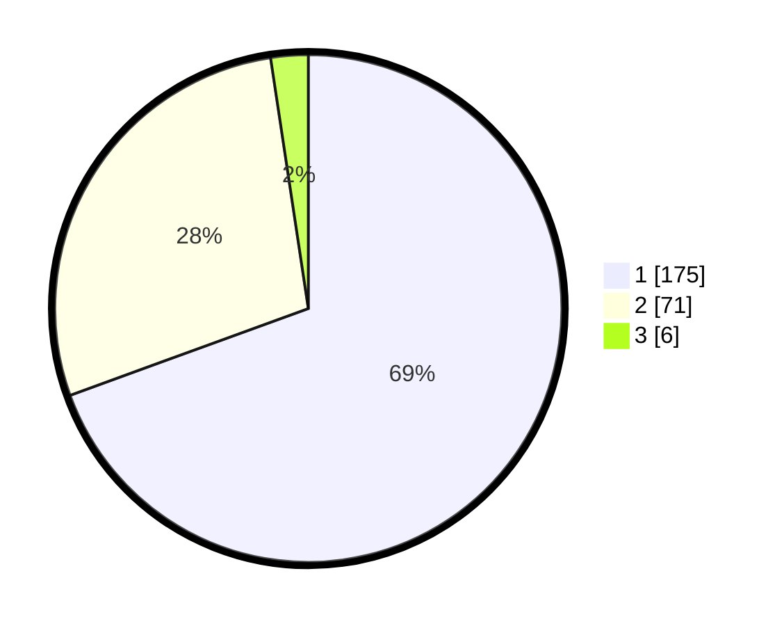

# Hasil

## Grafik

## Tabel

| No. | Nama Paslon    | Suara | Suara (raw) | Persentase |
|:--- |:-------------- | -----:| -----------:| ----------:|
| 1   | ANIES MUHAIMIN | 175   | [175][p-1]  | 69,44      |
| 2   | PRABOWO GIBRAN | 71    | [71][p-2]   | 28,17      |
| 3   | GANJAR MAHFUD  | 6     | [6][p-3]    | 2,38       |

[p-1]: https://github.com/gigit-pemilu/pemilu-2024-32-jawa-barat/blob/main/pilpres/hitung-suara/sub/32-jawa-barat/sub/07-ciamis/sub/08-panjalu/sub/2003-ciomas/sub/002-tps/sub/paslon-1.txt
[p-2]: https://github.com/gigit-pemilu/pemilu-2024-32-jawa-barat/blob/main/pilpres/hitung-suara/sub/32-jawa-barat/sub/07-ciamis/sub/08-panjalu/sub/2003-ciomas/sub/002-tps/sub/paslon-2.txt
[p-3]: https://github.com/gigit-pemilu/pemilu-2024-32-jawa-barat/blob/main/pilpres/hitung-suara/sub/32-jawa-barat/sub/07-ciamis/sub/08-panjalu/sub/2003-ciomas/sub/002-tps/sub/paslon-3.txt

## Foto C Plano

https://sirekap-obj-formc.kpu.go.id/8b3b/pemilu/ppwp/32/07/08/20/03/3207082003002-20240214-220014--fa452e45-e5b1-43e1-8e63-f3278c3f5f95.jpg

https://sirekap-obj-formc.kpu.go.id/8b3b/pemilu/ppwp/32/07/08/20/03/3207082003002-20240214-220130--84ae816e-5f81-4e22-b99c-874337953d67.jpg

https://sirekap-obj-formc.kpu.go.id/8b3b/pemilu/ppwp/32/07/08/20/03/3207082003002-20240214-220303--ad88857d-d118-4fb2-bd8c-99a9f5950d0b.jpg

## Metadata

| Key        | Value               |
| ---------- | ------------------- |
| Time Stamp | 2024-02-17 13:37:34 |

