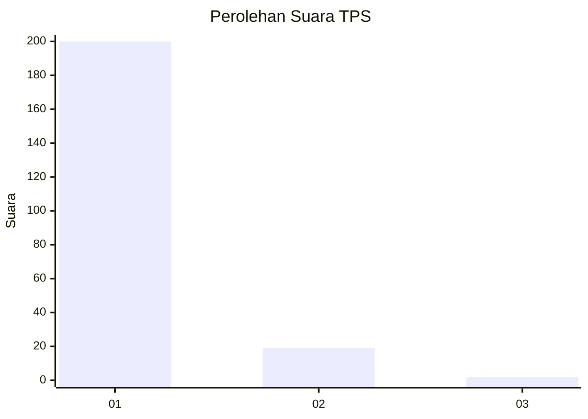
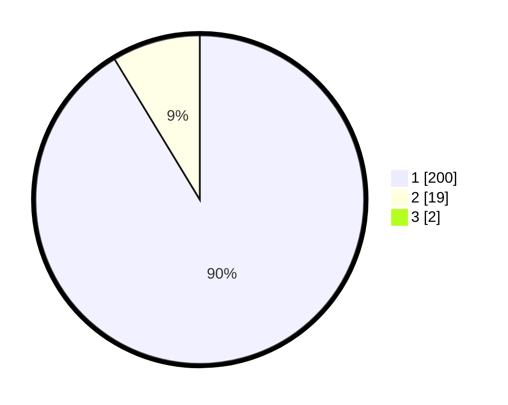

# Hasil

## Grafik

## Tabel

| No. | Nama Paslon    | Suara | Suara (raw) | Persentase |
|:--- |:-------------- | -----:| -----------:| ----------:|
| 1   | ANIES MUHAIMIN | 200   | [200][p-1]  | 90,50      |
| 2   | PRABOWO GIBRAN | 19    | [19][p-2]   | 8,60       |
| 3   | GANJAR MAHFUD  | 2     | [2][p-3]    | 0,90       |

[p-1]: https://github.com/gigit-pemilu/pemilu-2024-32-jawa-barat/blob/main/pilpres/hitung-suara/sub/32-jawa-barat/sub/07-ciamis/sub/08-panjalu/sub/2003-ciomas/sub/007-tps/sub/paslon-1.txt
[p-2]: https://github.com/gigit-pemilu/pemilu-2024-32-jawa-barat/blob/main/pilpres/hitung-suara/sub/32-jawa-barat/sub/07-ciamis/sub/08-panjalu/sub/2003-ciomas/sub/007-tps/sub/paslon-2.txt
[p-3]: https://github.com/gigit-pemilu/pemilu-2024-32-jawa-barat/blob/main/pilpres/hitung-suara/sub/32-jawa-barat/sub/07-ciamis/sub/08-panjalu/sub/2003-ciomas/sub/007-tps/sub/paslon-3.txt

## Foto C Plano

https://sirekap-obj-formc.kpu.go.id/ce19/pemilu/ppwp/32/07/08/20/03/3207082003007-20240214-195738--7b1318a7-bde1-4a19-a604-e1849d0234a9.jpg

https://sirekap-obj-formc.kpu.go.id/ce19/pemilu/ppwp/32/07/08/20/03/3207082003007-20240214-195811--efd4e59a-f390-481a-915a-7bb5ff4c0ed4.jpg

https://sirekap-obj-formc.kpu.go.id/ce19/pemilu/ppwp/32/07/08/20/03/3207082003007-20240214-195848--0dde6ef5-e8ff-4e62-aa59-3ae73470c551.jpg

## Metadata

| Key        | Value               |
| ---------- | ------------------- |
| Time Stamp | 2024-02-17 13:37:34 |

