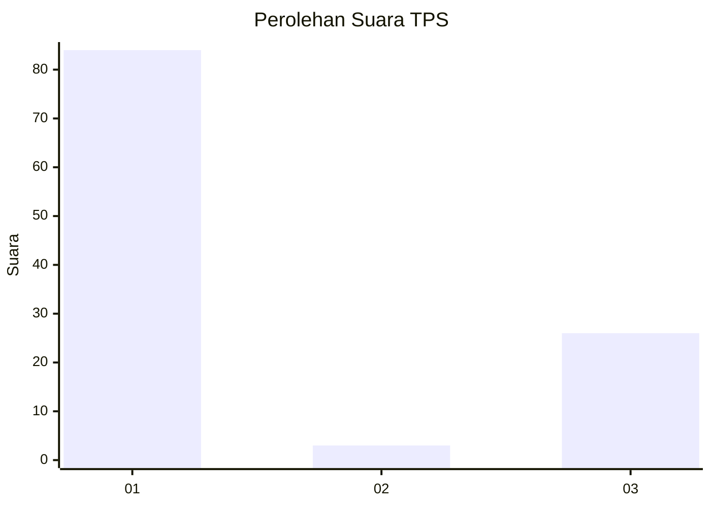
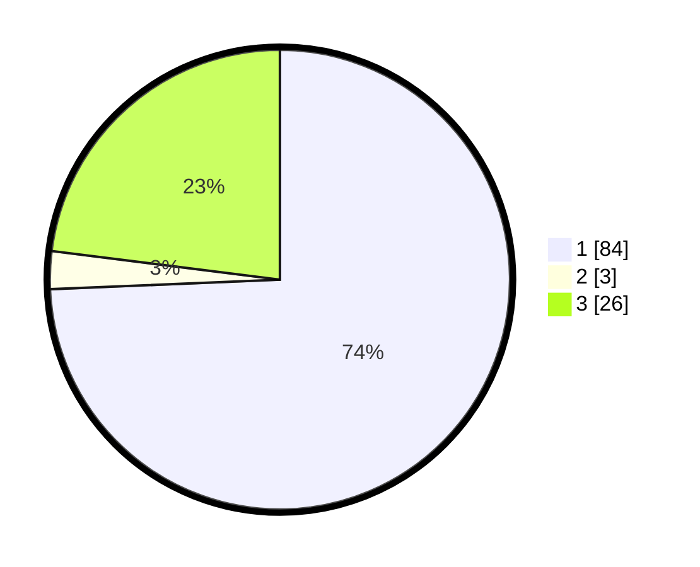

# Hasil

## Grafik

## Tabel

| No. | Nama Paslon    | Suara | Suara (raw) | Persentase |
|:--- |:-------------- | -----:| -----------:| ----------:|
| 1   | ANIES MUHAIMIN | 84    | [84][p-1]   | 74,34      |
| 2   | PRABOWO GIBRAN | 3     | [3][p-2]    | 2,65       |
| 3   | GANJAR MAHFUD  | 26    | [26][p-3]   | 23,01      |

[p-1]: https://github.com/gigit-pemilu/pemilu-2024/blob/main/pilpres/hitung-suara/sub/32-jawa-barat/sub/07-ciamis/sub/08-panjalu/sub/2005-maparah/sub/024-tps/sub/paslon-1.txt
[p-2]: https://github.com/gigit-pemilu/pemilu-2024/blob/main/pilpres/hitung-suara/sub/32-jawa-barat/sub/07-ciamis/sub/08-panjalu/sub/2005-maparah/sub/024-tps/sub/paslon-2.txt
[p-3]: https://github.com/gigit-pemilu/pemilu-2024/blob/main/pilpres/hitung-suara/sub/32-jawa-barat/sub/07-ciamis/sub/08-panjalu/sub/2005-maparah/sub/024-tps/sub/paslon-3.txt

## Foto C Plano

https://sirekap-obj-formc.kpu.go.id/86d8/pemilu/ppwp/32/07/08/20/05/3207082005024-20240220-153242--9f28b7da-620c-48e0-8053-8dd9dc075c22.jpg

https://sirekap-obj-formc.kpu.go.id/86d8/pemilu/ppwp/32/07/08/20/05/3207082005024-20240220-151851--2f12a116-2acf-4dcd-8b77-09839336b41d.jpg

https://sirekap-obj-formc.kpu.go.id/86d8/pemilu/ppwp/32/07/08/20/05/3207082005024-20240220-153350--333eb0ac-ca65-4a84-af85-3c93eddc4c1b.jpg

## Metadata

| Key        | Value               |
| ---------- | ------------------- |
| Time Stamp | 2024-02-20 16:00:00 |

