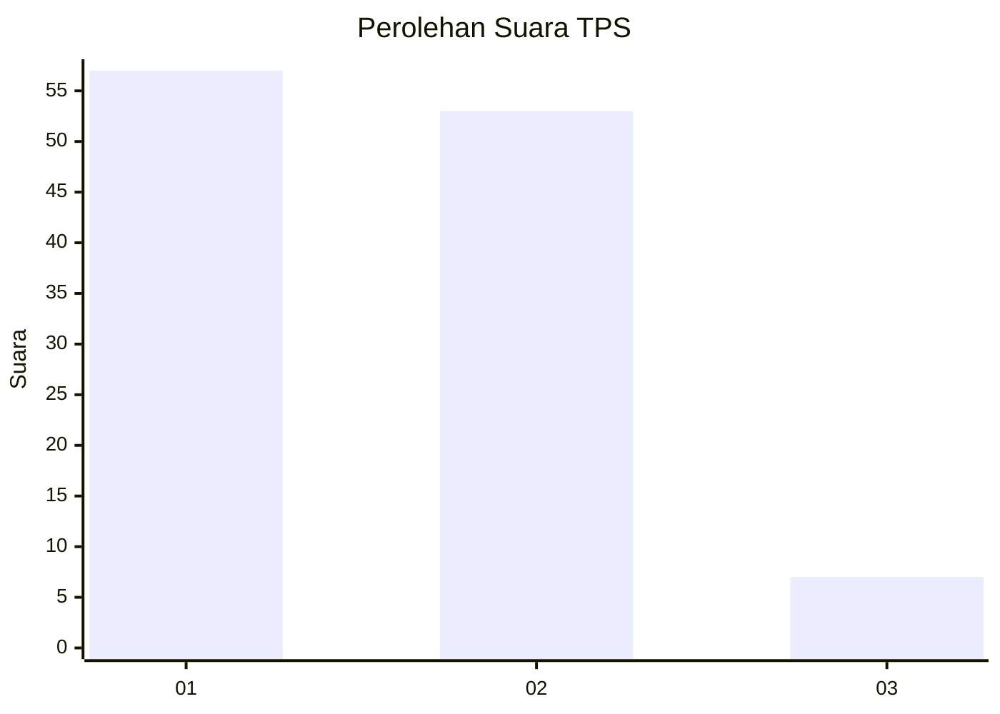
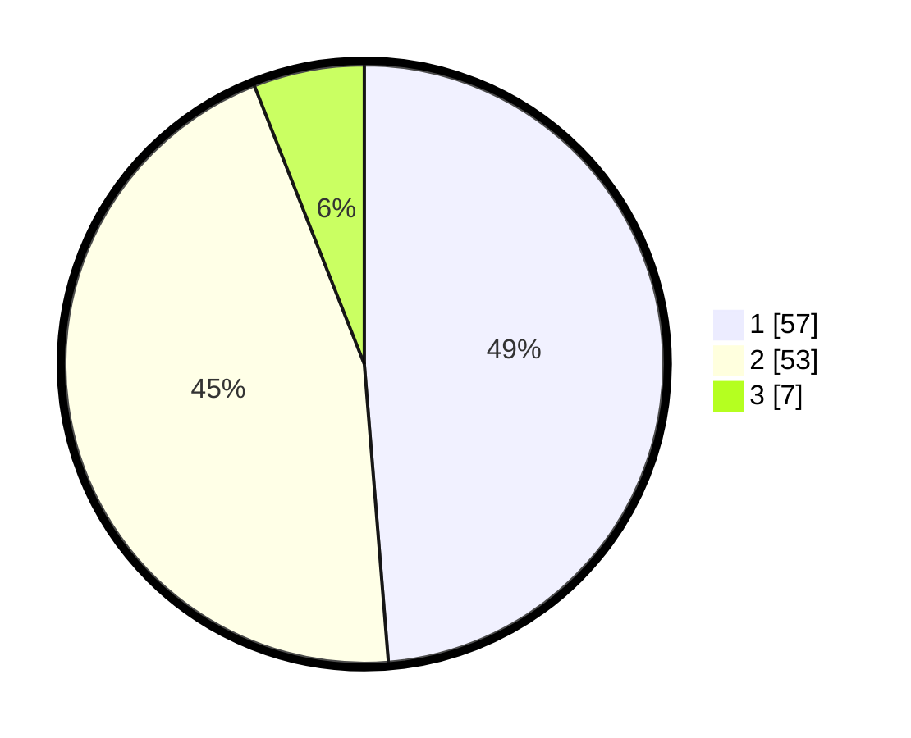

# Hasil

## Grafik

## Tabel

| No. | Nama Paslon    | Suara | Suara (raw) | Persentase |
|:--- |:-------------- | -----:| -----------:| ----------:|
| 1   | ANIES MUHAIMIN | 57    | [57][p-1]   | 48,72      |
| 2   | PRABOWO GIBRAN | 53    | [53][p-2]   | 45,30      |
| 3   | GANJAR MAHFUD  | 7     | [7][p-3]    | 5,98       |

[p-1]: https://github.com/gigit-pemilu/pemilu-2024/blob/main/pilpres/hitung-suara/sub/32-jawa-barat/sub/07-ciamis/sub/08-panjalu/sub/2013-mandalare/sub/005-tps/sub/paslon-1.txt
[p-2]: https://github.com/gigit-pemilu/pemilu-2024/blob/main/pilpres/hitung-suara/sub/32-jawa-barat/sub/07-ciamis/sub/08-panjalu/sub/2013-mandalare/sub/005-tps/sub/paslon-2.txt
[p-3]: https://github.com/gigit-pemilu/pemilu-2024/blob/main/pilpres/hitung-suara/sub/32-jawa-barat/sub/07-ciamis/sub/08-panjalu/sub/2013-mandalare/sub/005-tps/sub/paslon-3.txt

## Foto C Plano

https://sirekap-obj-formc.kpu.go.id/01f7/pemilu/ppwp/32/07/08/20/13/3207082013005-20240214-141333--69c1df2a-b239-4f84-a774-4b95a637608d.jpg

https://sirekap-obj-formc.kpu.go.id/01f7/pemilu/ppwp/32/07/08/20/13/3207082013005-20240214-141454--e56d625d-b11c-4e34-9c4a-2c501ff14d6f.jpg

https://sirekap-obj-formc.kpu.go.id/01f7/pemilu/ppwp/32/07/08/20/13/3207082013005-20240214-141608--ec6c1791-c92c-49e8-988e-3dcb35a33b24.jpg

## Metadata

| Key        | Value               |
| ---------- | ------------------- |
| Time Stamp | 2024-02-17 13:37:34 |

