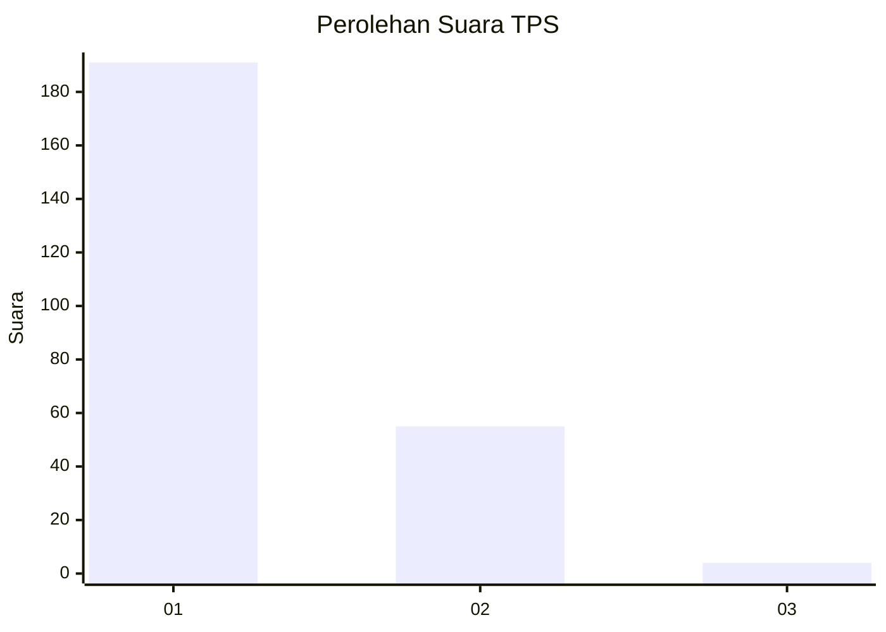
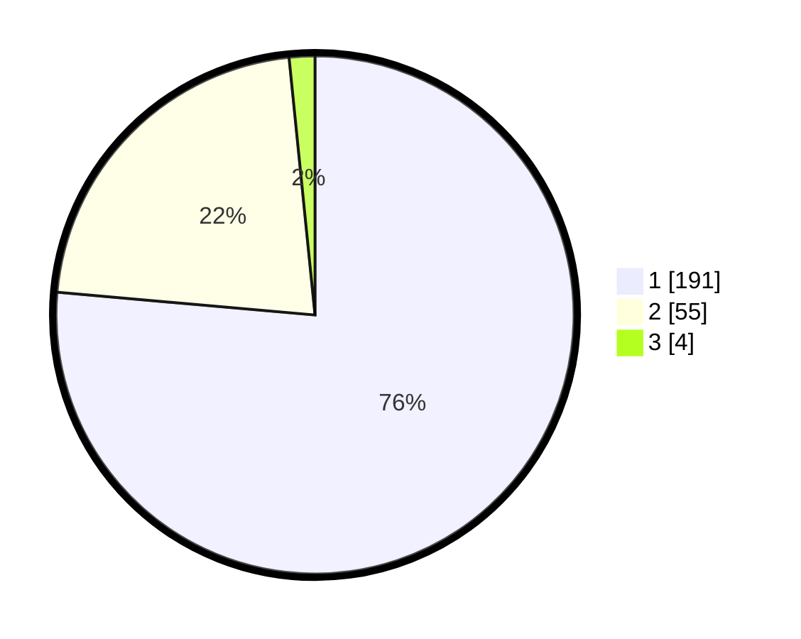

# Hasil

## Grafik

## Tabel

| No. | Nama Paslon    | Suara | Suara (raw) | Persentase |
|:--- |:-------------- | -----:| -----------:| ----------:|
| 1   | ANIES MUHAIMIN | 191   | [191][p-1]  | 76,40      |
| 2   | PRABOWO GIBRAN | 55    | [55][p-2]   | 22,00      |
| 3   | GANJAR MAHFUD  | 4     | [4][p-3]    | 1,60       |

[p-1]: https://github.com/gigit-pemilu/pemilu-2024-32-jawa-barat/blob/main/pilpres/hitung-suara/sub/32-jawa-barat/sub/07-ciamis/sub/09-kawali/sub/2005-winduraja/sub/013-tps/sub/paslon-1.txt
[p-2]: https://github.com/gigit-pemilu/pemilu-2024-32-jawa-barat/blob/main/pilpres/hitung-suara/sub/32-jawa-barat/sub/07-ciamis/sub/09-kawali/sub/2005-winduraja/sub/013-tps/sub/paslon-2.txt
[p-3]: https://github.com/gigit-pemilu/pemilu-2024-32-jawa-barat/blob/main/pilpres/hitung-suara/sub/32-jawa-barat/sub/07-ciamis/sub/09-kawali/sub/2005-winduraja/sub/013-tps/sub/paslon-3.txt

## Foto C Plano

https://sirekap-obj-formc.kpu.go.id/3ee9/pemilu/ppwp/32/07/09/20/05/3207092005013-20240215-060546--55ba5822-8351-49cb-838a-bf38ee9ee609.jpg

https://sirekap-obj-formc.kpu.go.id/3ee9/pemilu/ppwp/32/07/09/20/05/3207092005013-20240215-003556--0eaeaf27-b085-4cf8-ad0a-d91fe951e2bf.jpg

https://sirekap-obj-formc.kpu.go.id/3ee9/pemilu/ppwp/32/07/09/20/05/3207092005013-20240215-003922--97d6432a-65a4-47cb-865a-da091c4ef486.jpg

## Metadata

| Key        | Value               |
| ---------- | ------------------- |
| Time Stamp | 2024-02-17 16:00:02 |

