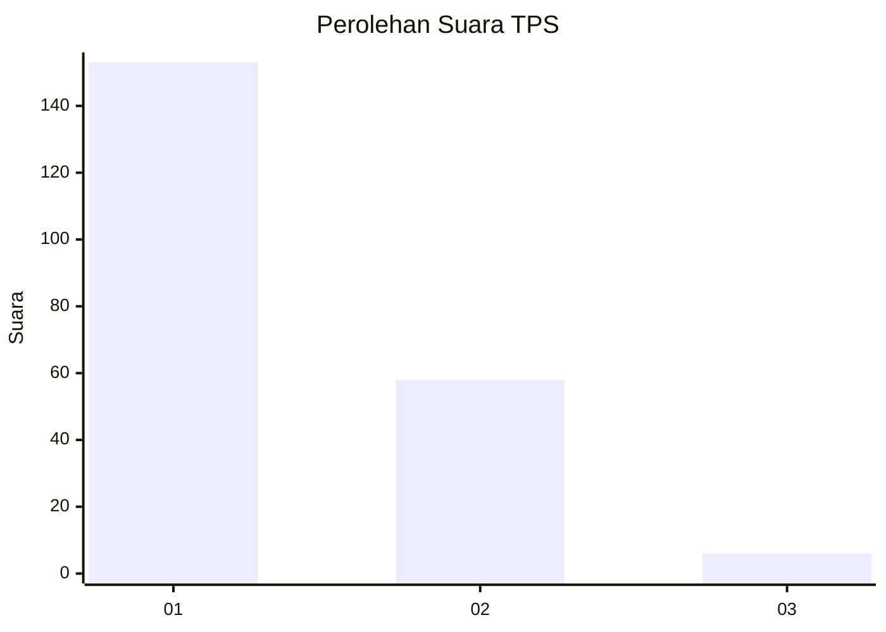
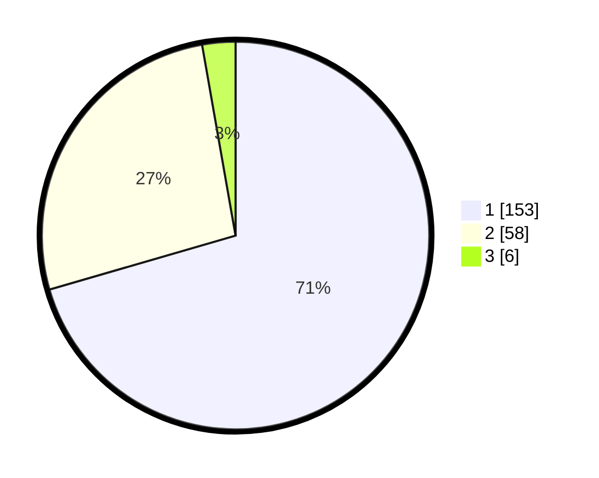

# Hasil

## Grafik

## Tabel

| No. | Nama Paslon    | Suara | Suara (raw) | Persentase |
|:--- |:-------------- | -----:| -----------:| ----------:|
| 1   | ANIES MUHAIMIN | 153   | [153][p-1]  | 70,51      |
| 2   | PRABOWO GIBRAN | 58    | [58][p-2]   | 26,73      |
| 3   | GANJAR MAHFUD  | 6     | [6][p-3]    | 2,76       |

[p-1]: https://github.com/gigit-pemilu/pemilu-2024-32-jawa-barat/blob/main/pilpres/hitung-suara/sub/32-jawa-barat/sub/07-ciamis/sub/09-kawali/sub/2011-citeureup/sub/003-tps/sub/paslon-1.txt
[p-2]: https://github.com/gigit-pemilu/pemilu-2024-32-jawa-barat/blob/main/pilpres/hitung-suara/sub/32-jawa-barat/sub/07-ciamis/sub/09-kawali/sub/2011-citeureup/sub/003-tps/sub/paslon-2.txt
[p-3]: https://github.com/gigit-pemilu/pemilu-2024-32-jawa-barat/blob/main/pilpres/hitung-suara/sub/32-jawa-barat/sub/07-ciamis/sub/09-kawali/sub/2011-citeureup/sub/003-tps/sub/paslon-3.txt

## Foto C Plano

https://sirekap-obj-formc.kpu.go.id/45c6/pemilu/ppwp/32/07/09/20/11/3207092011003-20240214-202630--570ad502-5fcf-49b2-b23f-4f50e6fb9ada.jpg

https://sirekap-obj-formc.kpu.go.id/45c6/pemilu/ppwp/32/07/09/20/11/3207092011003-20240214-203631--af7fd49d-9012-4502-a7ce-2146f74c3393.jpg

https://sirekap-obj-formc.kpu.go.id/45c6/pemilu/ppwp/32/07/09/20/11/3207092011003-20240214-203728--0a1339c2-7ca7-4529-827d-c9a51485f0c2.jpg

## Metadata

| Key        | Value               |
| ---------- | ------------------- |
| Time Stamp | 2024-02-16 12:51:22 |

