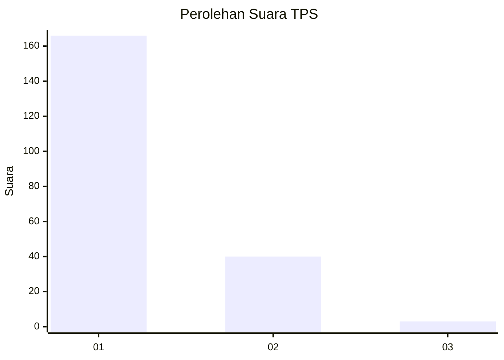
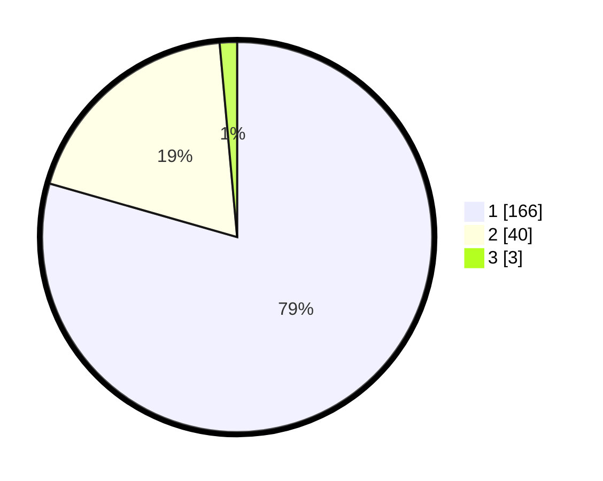

# Hasil

## Grafik

## Tabel

| No. | Nama Paslon    | Suara | Suara (raw) | Persentase |
|:--- |:-------------- | -----:| -----------:| ----------:|
| 1   | ANIES MUHAIMIN | 166   | [166][p-1]  | 79,43      |
| 2   | PRABOWO GIBRAN | 40    | [40][p-2]   | 19,14      |
| 3   | GANJAR MAHFUD  | 3     | [3][p-3]    | 1,44       |

[p-1]: https://github.com/gigit-pemilu/pemilu-2024-32-jawa-barat/blob/main/pilpres/hitung-suara/sub/32-jawa-barat/sub/07-ciamis/sub/09-kawali/sub/2014-sindangsari/sub/009-tps/sub/paslon-1.txt
[p-2]: https://github.com/gigit-pemilu/pemilu-2024-32-jawa-barat/blob/main/pilpres/hitung-suara/sub/32-jawa-barat/sub/07-ciamis/sub/09-kawali/sub/2014-sindangsari/sub/009-tps/sub/paslon-2.txt
[p-3]: https://github.com/gigit-pemilu/pemilu-2024-32-jawa-barat/blob/main/pilpres/hitung-suara/sub/32-jawa-barat/sub/07-ciamis/sub/09-kawali/sub/2014-sindangsari/sub/009-tps/sub/paslon-3.txt

## Foto C Plano

https://sirekap-obj-formc.kpu.go.id/4e79/pemilu/ppwp/32/07/09/20/14/3207092014009-20240214-184740--d051acd1-d5bc-4179-8f23-28687c9593e6.jpg

https://sirekap-obj-formc.kpu.go.id/4e79/pemilu/ppwp/32/07/09/20/14/3207092014009-20240214-155228--523f2d09-1830-41e8-8c24-6af26a5c7801.jpg

https://sirekap-obj-formc.kpu.go.id/4e79/pemilu/ppwp/32/07/09/20/14/3207092014009-20240214-155744--20e8aa38-97ea-4d2c-b041-6bc8cc8a5795.jpg

## Metadata

| Key        | Value               |
| ---------- | ------------------- |
| Time Stamp | 2024-02-14 21:46:01 |

