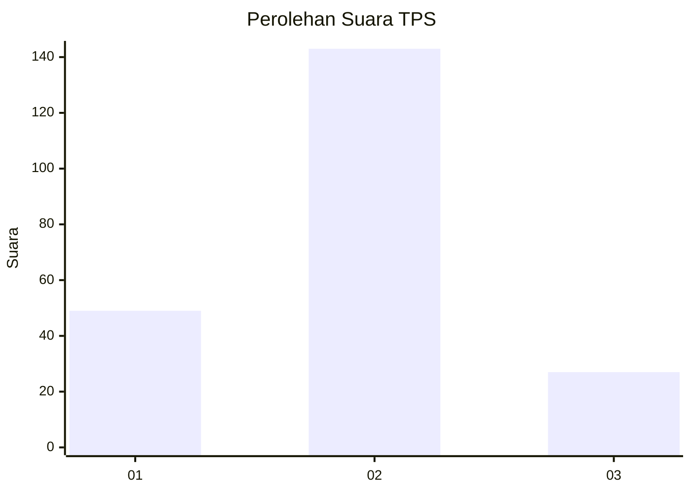
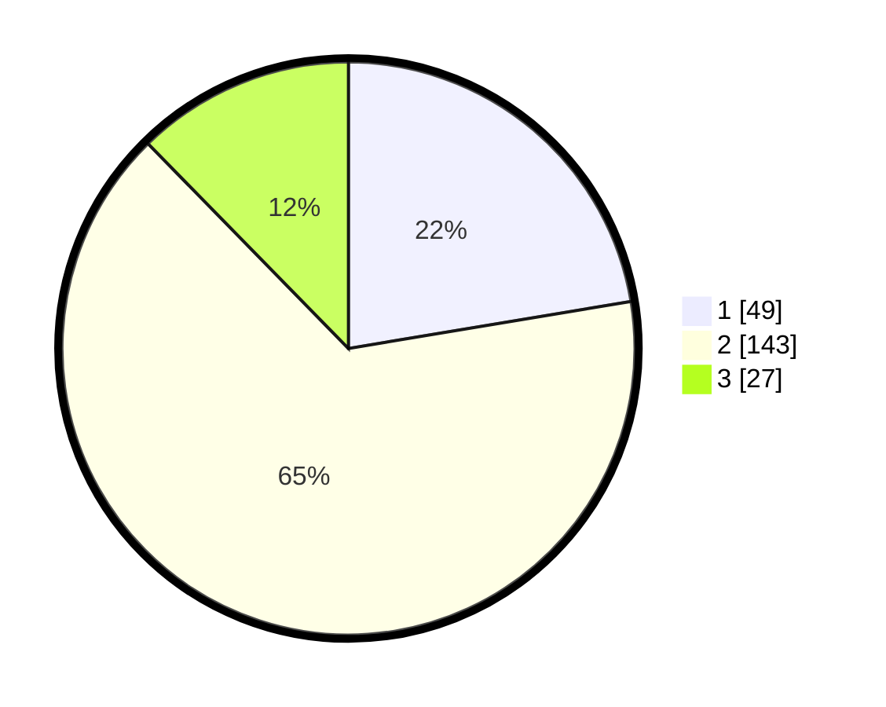

# Hasil

## Grafik

## Tabel

| No. | Nama Paslon    | Suara | Suara (raw) | Persentase |
|:--- |:-------------- | -----:| -----------:| ----------:|
| 1   | ANIES MUHAIMIN | 49    | [49][p-1]   | 22,37      |
| 2   | PRABOWO GIBRAN | 143   | [143][p-2]  | 65,30      |
| 3   | GANJAR MAHFUD  | 27    | [27][p-3]   | 12,33      |

[p-1]: https://github.com/gigit-pemilu/pemilu-2024-32-jawa-barat/blob/main/pilpres/hitung-suara/sub/32-jawa-barat/sub/07-ciamis/sub/10-panawangan/sub/2001-panawangan/sub/004-tps/sub/paslon-1.txt
[p-2]: https://github.com/gigit-pemilu/pemilu-2024-32-jawa-barat/blob/main/pilpres/hitung-suara/sub/32-jawa-barat/sub/07-ciamis/sub/10-panawangan/sub/2001-panawangan/sub/004-tps/sub/paslon-2.txt
[p-3]: https://github.com/gigit-pemilu/pemilu-2024-32-jawa-barat/blob/main/pilpres/hitung-suara/sub/32-jawa-barat/sub/07-ciamis/sub/10-panawangan/sub/2001-panawangan/sub/004-tps/sub/paslon-3.txt

## Foto C Plano

https://sirekap-obj-formc.kpu.go.id/ed71/pemilu/ppwp/32/07/10/20/01/3207102001004-20240214-195755--0ceb2b57-38d9-4f6c-9e8c-3017fa3a6a04.jpg

https://sirekap-obj-formc.kpu.go.id/ed71/pemilu/ppwp/32/07/10/20/01/3207102001004-20240215-005608--4b1cd3e7-6814-4630-aeba-ebe64a777397.jpg

https://sirekap-obj-formc.kpu.go.id/ed71/pemilu/ppwp/32/07/10/20/01/3207102001004-20240215-005847--504913b9-ac3d-4a0d-9853-b4c381ea8915.jpg

## Metadata

| Key        | Value               |
| ---------- | ------------------- |
| Time Stamp | 2024-02-17 12:00:00 |

