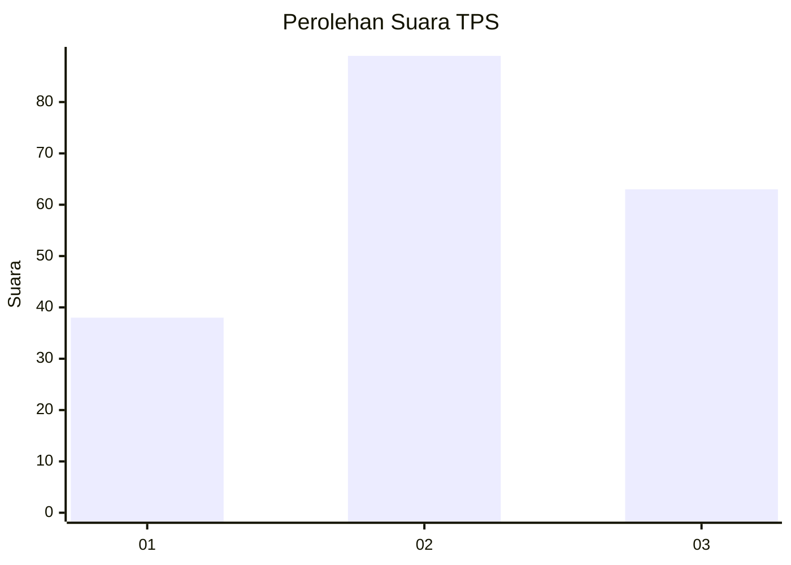
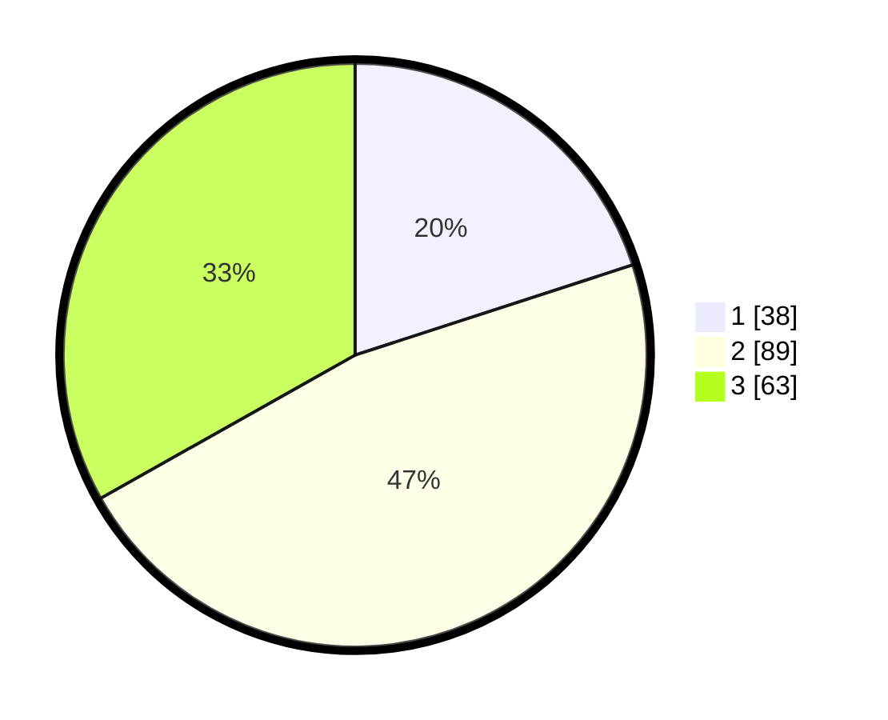

# Hasil

## Grafik

## Tabel

| No. | Nama Paslon    | Suara | Suara (raw) | Persentase |
|:--- |:-------------- | -----:| -----------:| ----------:|
| 1   | ANIES MUHAIMIN | 38    | [38][p-1]   | 20,00      |
| 2   | PRABOWO GIBRAN | 89    | [89][p-2]   | 46,84      |
| 3   | GANJAR MAHFUD  | 63    | [63][p-3]   | 33,16      |

[p-1]: https://github.com/gigit-pemilu/pemilu-2024/blob/main/pilpres/hitung-suara/sub/32-jawa-barat/sub/07-ciamis/sub/10-panawangan/sub/2001-panawangan/sub/008-tps/sub/paslon-1.txt
[p-2]: https://github.com/gigit-pemilu/pemilu-2024/blob/main/pilpres/hitung-suara/sub/32-jawa-barat/sub/07-ciamis/sub/10-panawangan/sub/2001-panawangan/sub/008-tps/sub/paslon-2.txt
[p-3]: https://github.com/gigit-pemilu/pemilu-2024/blob/main/pilpres/hitung-suara/sub/32-jawa-barat/sub/07-ciamis/sub/10-panawangan/sub/2001-panawangan/sub/008-tps/sub/paslon-3.txt

## Foto C Plano

https://sirekap-obj-formc.kpu.go.id/dcd9/pemilu/ppwp/32/07/10/20/01/3207102001008-20240214-141928--8f5b99e6-277b-465a-adcb-687e63c6e328.jpg

https://sirekap-obj-formc.kpu.go.id/dcd9/pemilu/ppwp/32/07/10/20/01/3207102001008-20240214-141404--a31452cd-dffc-4b72-9ad5-3db3b9c32711.jpg

https://sirekap-obj-formc.kpu.go.id/dcd9/pemilu/ppwp/32/07/10/20/01/3207102001008-20240214-141513--fd6d4407-f8f1-4ef1-91be-bb28c1029e45.jpg

## Metadata

| Key        | Value               |
| ---------- | ------------------- |
| Time Stamp | 2024-02-17 12:00:00 |

