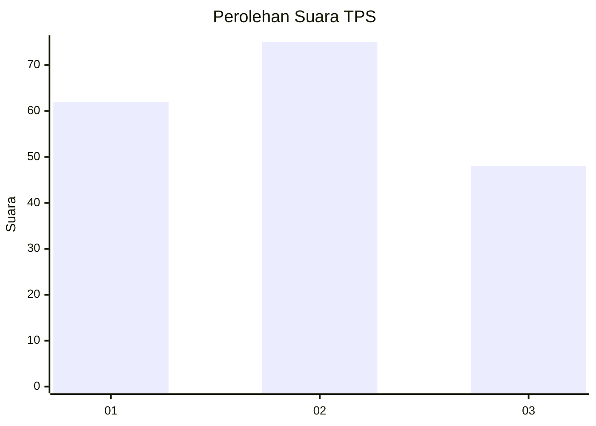
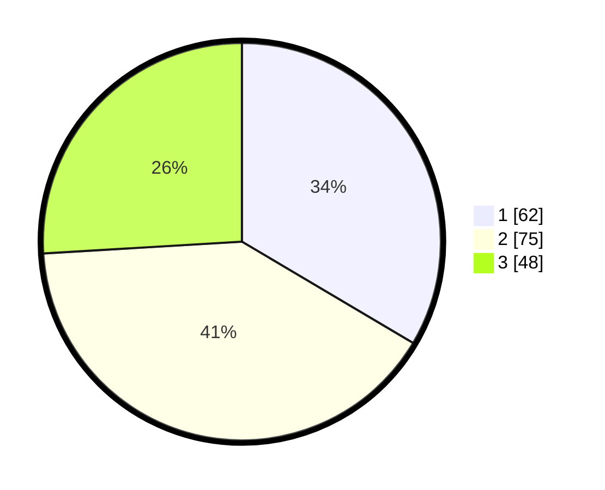

# Hasil

## Grafik

## Tabel

| No. | Nama Paslon    | Suara | Suara (raw) | Persentase |
|:--- |:-------------- | -----:| -----------:| ----------:|
| 1   | ANIES MUHAIMIN | 62    | [62][p-1]   | 33,51      |
| 2   | PRABOWO GIBRAN | 75    | [75][p-2]   | 40,54      |
| 3   | GANJAR MAHFUD  | 48    | [48][p-3]   | 25,95      |

[p-1]: https://github.com/gigit-pemilu/pemilu-2024/blob/main/pilpres/hitung-suara/sub/32-jawa-barat/sub/07-ciamis/sub/10-panawangan/sub/2001-panawangan/sub/010-tps/sub/paslon-1.txt
[p-2]: https://github.com/gigit-pemilu/pemilu-2024/blob/main/pilpres/hitung-suara/sub/32-jawa-barat/sub/07-ciamis/sub/10-panawangan/sub/2001-panawangan/sub/010-tps/sub/paslon-2.txt
[p-3]: https://github.com/gigit-pemilu/pemilu-2024/blob/main/pilpres/hitung-suara/sub/32-jawa-barat/sub/07-ciamis/sub/10-panawangan/sub/2001-panawangan/sub/010-tps/sub/paslon-3.txt

## Foto C Plano

https://sirekap-obj-formc.kpu.go.id/622d/pemilu/ppwp/32/07/10/20/01/3207102001010-20240215-021501--a2baae2a-78bf-4fb1-9827-667dbd50e611.jpg

https://sirekap-obj-formc.kpu.go.id/622d/pemilu/ppwp/32/07/10/20/01/3207102001010-20240215-021623--8ba0a618-77f9-494a-b6e9-520b6307a80d.jpg

https://sirekap-obj-formc.kpu.go.id/622d/pemilu/ppwp/32/07/10/20/01/3207102001010-20240215-021745--ec5f25ed-0451-4c66-8c27-92b64ff2d990.jpg

## Metadata

| Key        | Value               |
| ---------- | ------------------- |
| Time Stamp | 2024-02-17 12:00:00 |

