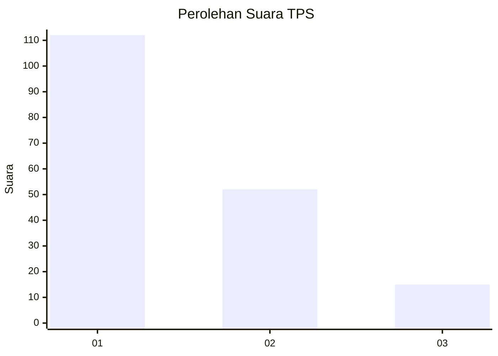
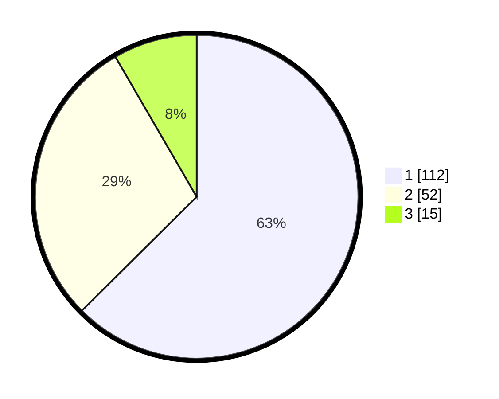

# Hasil

## Grafik

## Tabel

| No. | Nama Paslon    | Suara | Suara (raw) | Persentase |
|:--- |:-------------- | -----:| -----------:| ----------:|
| 1   | ANIES MUHAIMIN | 112   | [112][p-1]  | 62,57      |
| 2   | PRABOWO GIBRAN | 52    | [52][p-2]   | 29,05      |
| 3   | GANJAR MAHFUD  | 15    | [15][p-3]   | 8,38       |

[p-1]: https://github.com/gigit-pemilu/pemilu-2024-32-jawa-barat/blob/main/pilpres/hitung-suara/sub/32-jawa-barat/sub/07-ciamis/sub/11-cipaku/sub/2002-selacai/sub/003-tps/sub/paslon-1.txt
[p-2]: https://github.com/gigit-pemilu/pemilu-2024-32-jawa-barat/blob/main/pilpres/hitung-suara/sub/32-jawa-barat/sub/07-ciamis/sub/11-cipaku/sub/2002-selacai/sub/003-tps/sub/paslon-2.txt
[p-3]: https://github.com/gigit-pemilu/pemilu-2024-32-jawa-barat/blob/main/pilpres/hitung-suara/sub/32-jawa-barat/sub/07-ciamis/sub/11-cipaku/sub/2002-selacai/sub/003-tps/sub/paslon-3.txt

## Foto C Plano

https://sirekap-obj-formc.kpu.go.id/5013/pemilu/ppwp/32/07/11/20/02/3207112002003-20240214-234158--93bd03f1-f587-443a-b5d5-40d0c6597276.jpg

https://sirekap-obj-formc.kpu.go.id/5013/pemilu/ppwp/32/07/11/20/02/3207112002003-20240214-234704--feca0296-5e20-4a91-92e8-a1b7a269099d.jpg

https://sirekap-obj-formc.kpu.go.id/5013/pemilu/ppwp/32/07/11/20/02/3207112002003-20240214-234804--ee998329-90b4-4fe4-b6f8-50e02eca8a78.jpg

## Metadata

| Key        | Value               |
| ---------- | ------------------- |
| Time Stamp | 2024-02-17 11:30:03 |

