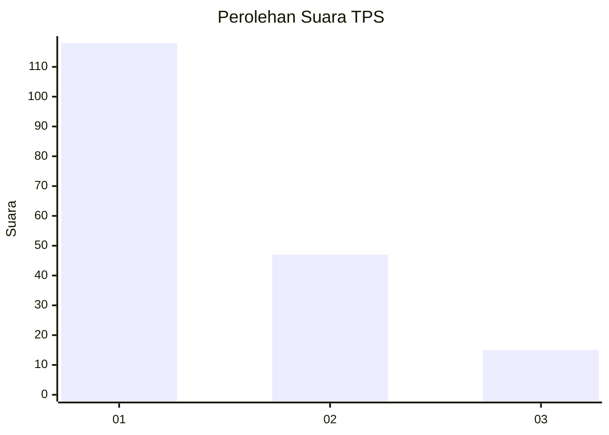
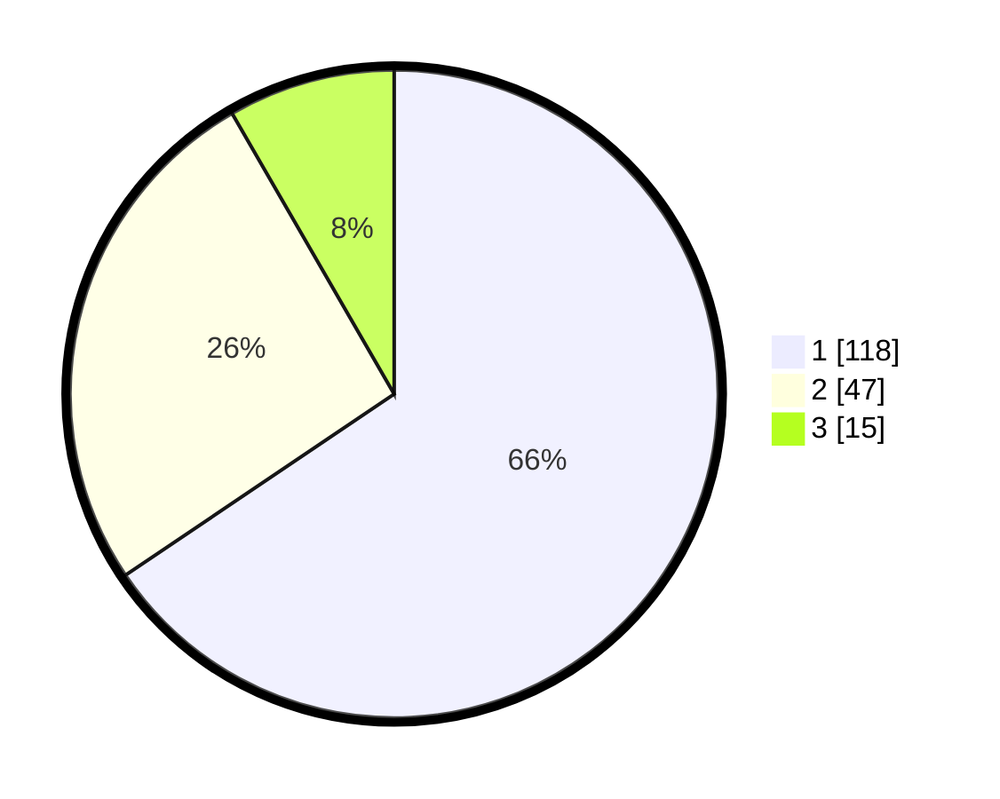

# Hasil

## Grafik

## Tabel

| No. | Nama Paslon    | Suara | Suara (raw) | Persentase |
|:--- |:-------------- | -----:| -----------:| ----------:|
| 1   | ANIES MUHAIMIN | 118   | [118][p-1]  | 65,56      |
| 2   | PRABOWO GIBRAN | 47    | [47][p-2]   | 26,11      |
| 3   | GANJAR MAHFUD  | 15    | [15][p-3]   | 8,33       |

[p-1]: https://github.com/gigit-pemilu/pemilu-2024/blob/main/pilpres/hitung-suara/sub/32-jawa-barat/sub/07-ciamis/sub/11-cipaku/sub/2002-selacai/sub/005-tps/sub/paslon-1.txt
[p-2]: https://github.com/gigit-pemilu/pemilu-2024/blob/main/pilpres/hitung-suara/sub/32-jawa-barat/sub/07-ciamis/sub/11-cipaku/sub/2002-selacai/sub/005-tps/sub/paslon-2.txt
[p-3]: https://github.com/gigit-pemilu/pemilu-2024/blob/main/pilpres/hitung-suara/sub/32-jawa-barat/sub/07-ciamis/sub/11-cipaku/sub/2002-selacai/sub/005-tps/sub/paslon-3.txt

## Foto C Plano

https://sirekap-obj-formc.kpu.go.id/f33d/pemilu/ppwp/32/07/11/20/02/3207112002005-20240215-001434--691670c9-847c-4835-97de-e79e69b30cda.jpg

https://sirekap-obj-formc.kpu.go.id/f33d/pemilu/ppwp/32/07/11/20/02/3207112002005-20240215-001800--1321c36b-b8b9-4f7b-8db6-938a163e0b8c.jpg

https://sirekap-obj-formc.kpu.go.id/f33d/pemilu/ppwp/32/07/11/20/02/3207112002005-20240215-002119--e4fa6fef-7ac1-4283-a991-427647f554be.jpg

## Metadata

| Key        | Value               |
| ---------- | ------------------- |
| Time Stamp | 2024-02-15 20:00:44 |

