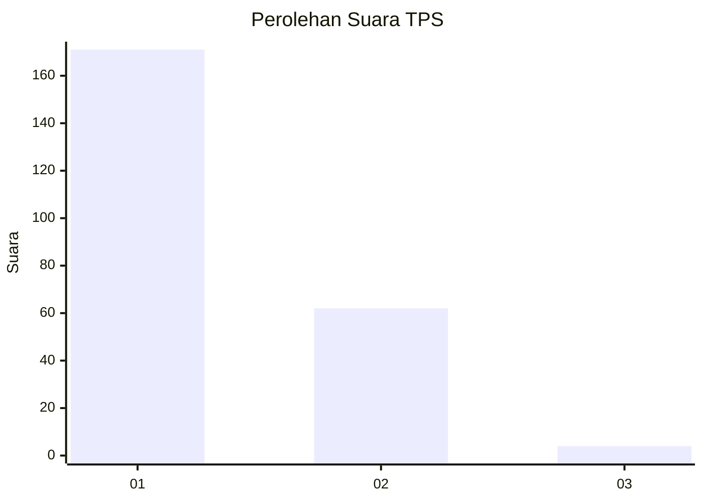
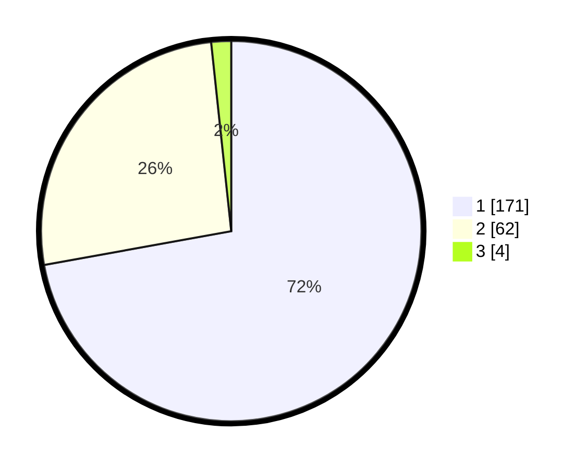

# Hasil

## Grafik

## Tabel

| No. | Nama Paslon    | Suara | Suara (raw) | Persentase |
|:--- |:-------------- | -----:| -----------:| ----------:|
| 1   | ANIES MUHAIMIN | 171   | [171][p-1]  | 72,15      |
| 2   | PRABOWO GIBRAN | 62    | [62][p-2]   | 26,16      |
| 3   | GANJAR MAHFUD  | 4     | [4][p-3]    | 1,69       |

[p-1]: https://github.com/gigit-pemilu/pemilu-2024-32-jawa-barat/blob/main/pilpres/hitung-suara/sub/32-jawa-barat/sub/07-ciamis/sub/11-cipaku/sub/2007-muktisari/sub/005-tps/sub/paslon-1.txt
[p-2]: https://github.com/gigit-pemilu/pemilu-2024-32-jawa-barat/blob/main/pilpres/hitung-suara/sub/32-jawa-barat/sub/07-ciamis/sub/11-cipaku/sub/2007-muktisari/sub/005-tps/sub/paslon-2.txt
[p-3]: https://github.com/gigit-pemilu/pemilu-2024-32-jawa-barat/blob/main/pilpres/hitung-suara/sub/32-jawa-barat/sub/07-ciamis/sub/11-cipaku/sub/2007-muktisari/sub/005-tps/sub/paslon-3.txt

## Foto C Plano

https://sirekap-obj-formc.kpu.go.id/8611/pemilu/ppwp/32/07/11/20/07/3207112007005-20240215-070723--9bf44f30-d1dc-4572-b875-156574e4b360.jpg

https://sirekap-obj-formc.kpu.go.id/8611/pemilu/ppwp/32/07/11/20/07/3207112007005-20240215-070711--eabb4e0d-0dff-491f-9963-dde22e8aa6a6.jpg

https://sirekap-obj-formc.kpu.go.id/8611/pemilu/ppwp/32/07/11/20/07/3207112007005-20240215-070801--b64f7fd0-5d54-4458-a21e-22bdf71b5259.jpg

## Metadata

| Key        | Value               |
| ---------- | ------------------- |
| Time Stamp | 2024-02-16 05:30:26 |

