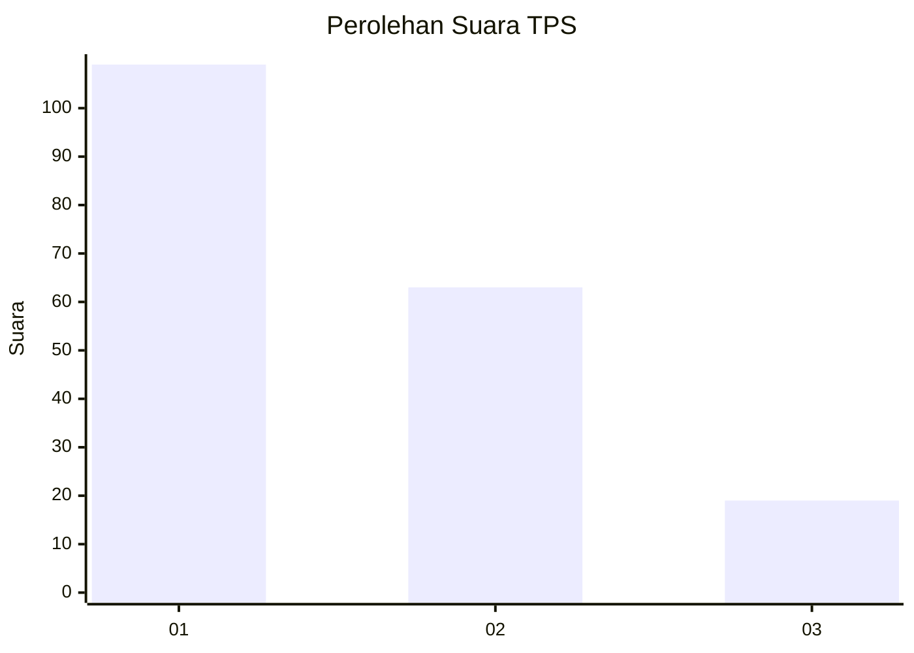
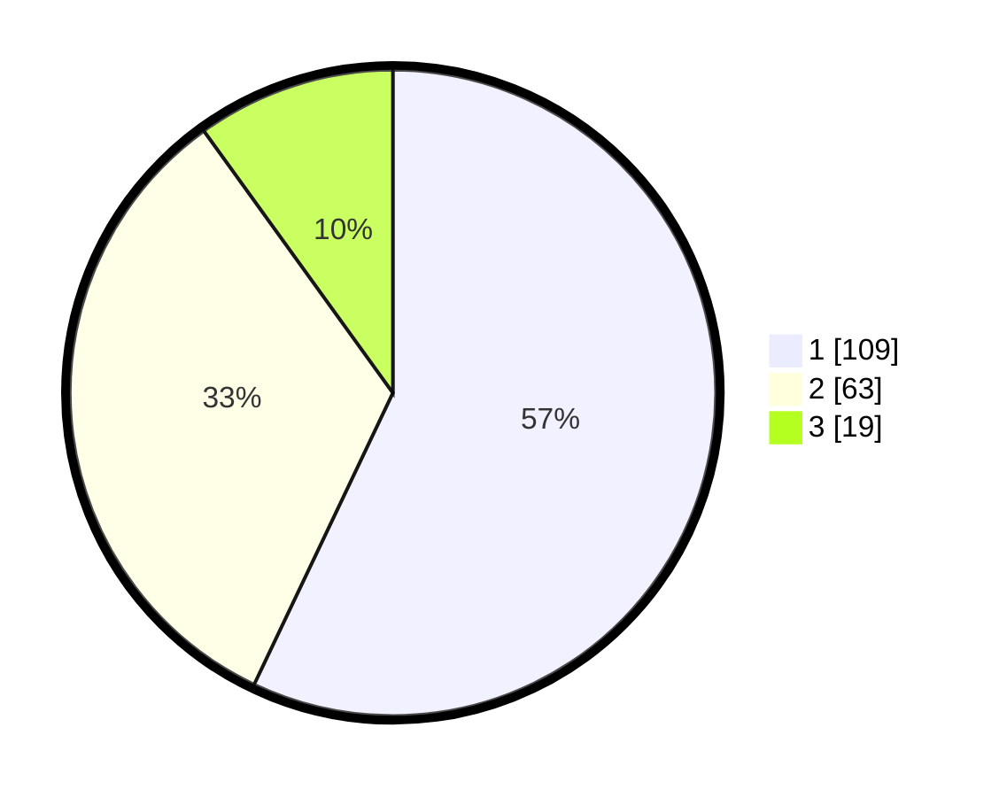

# Hasil

## Grafik

## Tabel

| No. | Nama Paslon    | Suara | Suara (raw) | Persentase |
|:--- |:-------------- | -----:| -----------:| ----------:|
| 1   | ANIES MUHAIMIN | 109   | [109][p-1]  | 57,07      |
| 2   | PRABOWO GIBRAN | 63    | [63][p-2]   | 32,98      |
| 3   | GANJAR MAHFUD  | 19    | [19][p-3]   | 9,95       |

[p-1]: https://github.com/gigit-pemilu/pemilu-2024-32-jawa-barat/blob/main/pilpres/hitung-suara/sub/32-jawa-barat/sub/07-ciamis/sub/12-jatinagara/sub/2001-jatinagara/sub/003-tps/sub/paslon-1.txt
[p-2]: https://github.com/gigit-pemilu/pemilu-2024-32-jawa-barat/blob/main/pilpres/hitung-suara/sub/32-jawa-barat/sub/07-ciamis/sub/12-jatinagara/sub/2001-jatinagara/sub/003-tps/sub/paslon-2.txt
[p-3]: https://github.com/gigit-pemilu/pemilu-2024-32-jawa-barat/blob/main/pilpres/hitung-suara/sub/32-jawa-barat/sub/07-ciamis/sub/12-jatinagara/sub/2001-jatinagara/sub/003-tps/sub/paslon-3.txt

## Foto C Plano

https://sirekap-obj-formc.kpu.go.id/3240/pemilu/ppwp/32/07/12/20/01/3207122001003-20240224-201127--761436b6-333f-48d9-9346-f15913c3333e.jpg

https://sirekap-obj-formc.kpu.go.id/3240/pemilu/ppwp/32/07/12/20/01/3207122001003-20240224-200626--4839e4d8-36b2-4471-9158-3e10be436465.jpg

https://sirekap-obj-formc.kpu.go.id/3240/pemilu/ppwp/32/07/12/20/01/3207122001003-20240224-201410--d612db8f-a9fb-4e71-a602-08383b87d3b4.jpg

## Metadata

| Key        | Value               |
| ---------- | ------------------- |
| Time Stamp | 2024-02-28 19:00:00 |

