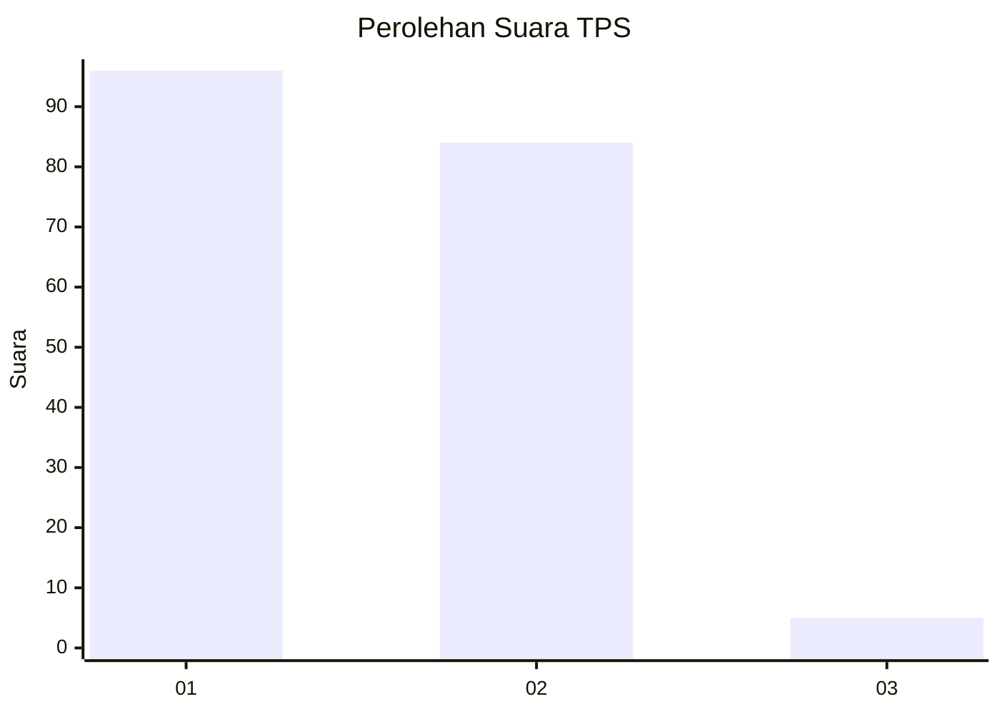
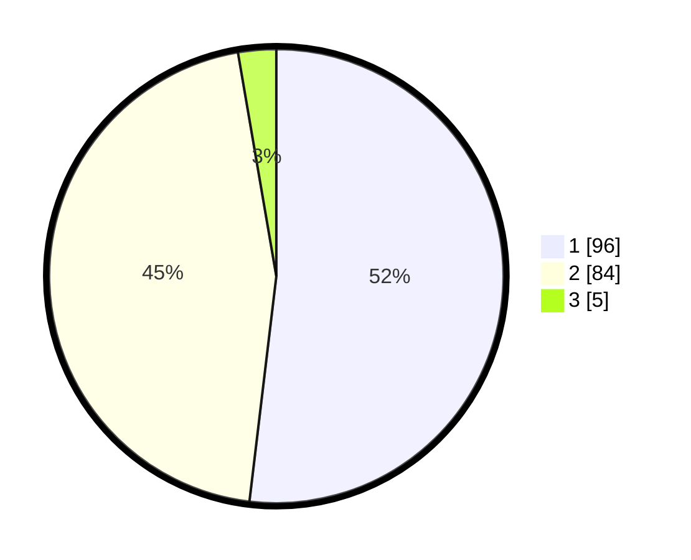

# Hasil

## Grafik

## Tabel

| No. | Nama Paslon    | Suara | Suara (raw) | Persentase |
|:--- |:-------------- | -----:| -----------:| ----------:|
| 1   | ANIES MUHAIMIN | 96    | [96][p-1]   | 51,89      |
| 2   | PRABOWO GIBRAN | 84    | [84][p-2]   | 45,41      |
| 3   | GANJAR MAHFUD  | 5     | [5][p-3]    | 2,70       |

[p-1]: https://github.com/gigit-pemilu/pemilu-2024-32-jawa-barat/blob/main/pilpres/hitung-suara/sub/32-jawa-barat/sub/07-ciamis/sub/12-jatinagara/sub/2001-jatinagara/sub/005-tps/sub/paslon-1.txt
[p-2]: https://github.com/gigit-pemilu/pemilu-2024-32-jawa-barat/blob/main/pilpres/hitung-suara/sub/32-jawa-barat/sub/07-ciamis/sub/12-jatinagara/sub/2001-jatinagara/sub/005-tps/sub/paslon-2.txt
[p-3]: https://github.com/gigit-pemilu/pemilu-2024-32-jawa-barat/blob/main/pilpres/hitung-suara/sub/32-jawa-barat/sub/07-ciamis/sub/12-jatinagara/sub/2001-jatinagara/sub/005-tps/sub/paslon-3.txt

## Foto C Plano

https://sirekap-obj-formc.kpu.go.id/72b0/pemilu/ppwp/32/07/12/20/01/3207122001005-20240215-003527--85af40e0-45e9-4d65-9ce0-b393ff6cbe8f.jpg

https://sirekap-obj-formc.kpu.go.id/72b0/pemilu/ppwp/32/07/12/20/01/3207122001005-20240215-003539--740420a5-1da2-4c18-a063-6104e3167faa.jpg

https://sirekap-obj-formc.kpu.go.id/72b0/pemilu/ppwp/32/07/12/20/01/3207122001005-20240215-003549--4839d075-0c61-45db-ad19-0c0c5d5ba40f.jpg

## Metadata

| Key        | Value               |
| ---------- | ------------------- |
| Time Stamp | 2024-02-16 22:30:00 |

