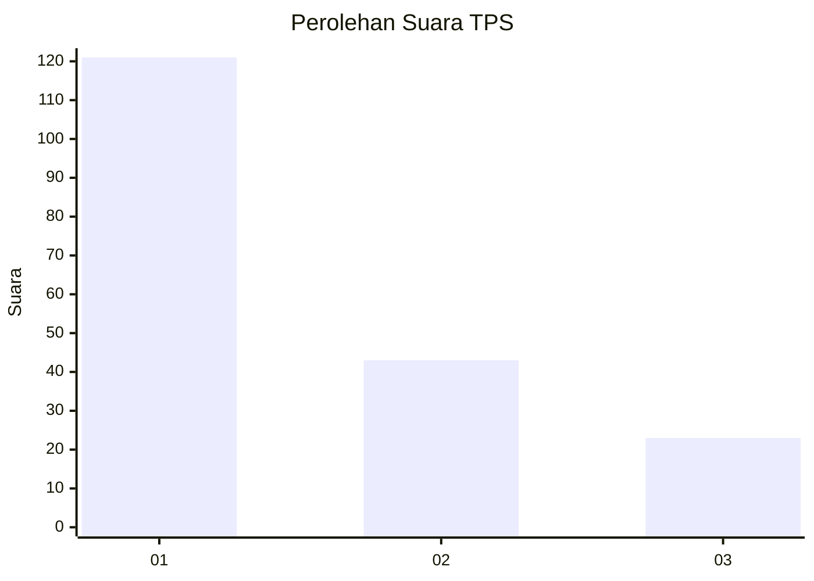
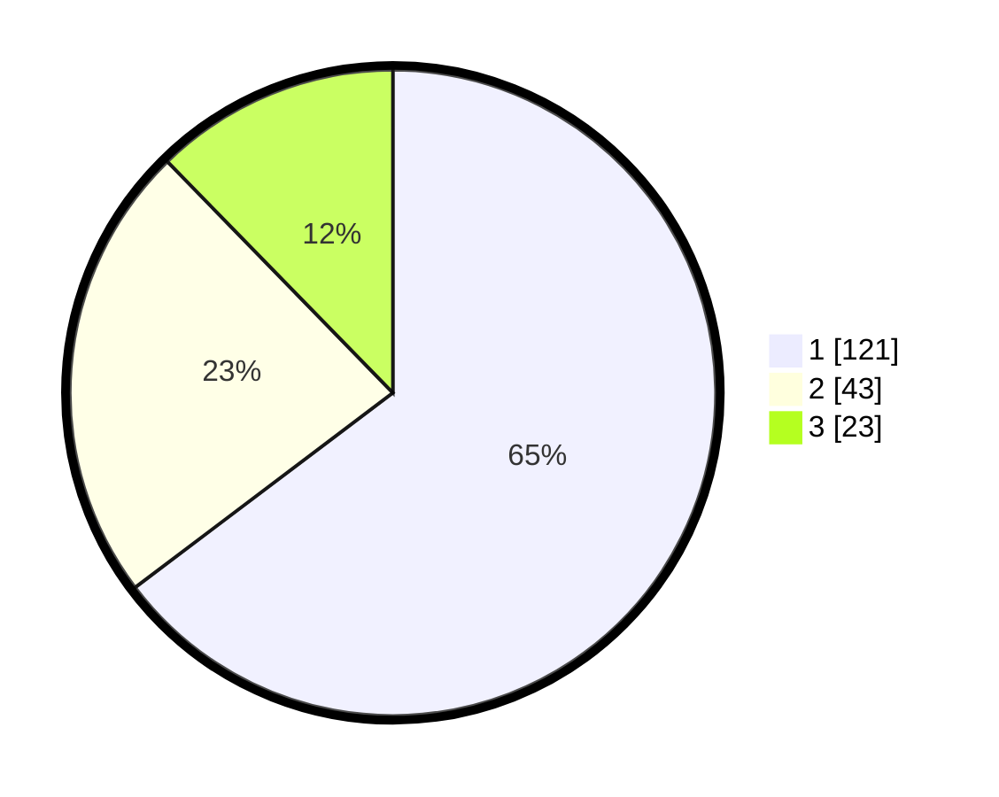

# Hasil

## Grafik

## Tabel

| No. | Nama Paslon    | Suara | Suara (raw) | Persentase |
|:--- |:-------------- | -----:| -----------:| ----------:|
| 1   | ANIES MUHAIMIN | 121   | [121][p-1]  | 64,71      |
| 2   | PRABOWO GIBRAN | 43    | [43][p-2]   | 22,99      |
| 3   | GANJAR MAHFUD  | 23    | [23][p-3]   | 12,30      |

[p-1]: https://github.com/gigit-pemilu/pemilu-2024/blob/main/pilpres/hitung-suara/sub/32-jawa-barat/sub/07-ciamis/sub/12-jatinagara/sub/2006-bayasari/sub/014-tps/sub/paslon-1.txt
[p-2]: https://github.com/gigit-pemilu/pemilu-2024/blob/main/pilpres/hitung-suara/sub/32-jawa-barat/sub/07-ciamis/sub/12-jatinagara/sub/2006-bayasari/sub/014-tps/sub/paslon-2.txt
[p-3]: https://github.com/gigit-pemilu/pemilu-2024/blob/main/pilpres/hitung-suara/sub/32-jawa-barat/sub/07-ciamis/sub/12-jatinagara/sub/2006-bayasari/sub/014-tps/sub/paslon-3.txt

## Foto C Plano

https://sirekap-obj-formc.kpu.go.id/f8c5/pemilu/ppwp/32/07/12/20/06/3207122006014-20240216-221754--f67b5700-7b83-43c8-bbba-e188062cacbc.jpg

https://sirekap-obj-formc.kpu.go.id/f8c5/pemilu/ppwp/32/07/12/20/06/3207122006014-20240216-220913--93b0ab04-5f8b-4acb-9284-aac5de5367d4.jpg

https://sirekap-obj-formc.kpu.go.id/f8c5/pemilu/ppwp/32/07/12/20/06/3207122006014-20240216-221042--92a480d2-6412-454e-98a6-708868b211f7.jpg

## Metadata

| Key        | Value               |
| ---------- | ------------------- |
| Time Stamp | 2024-02-16 22:30:00 |

