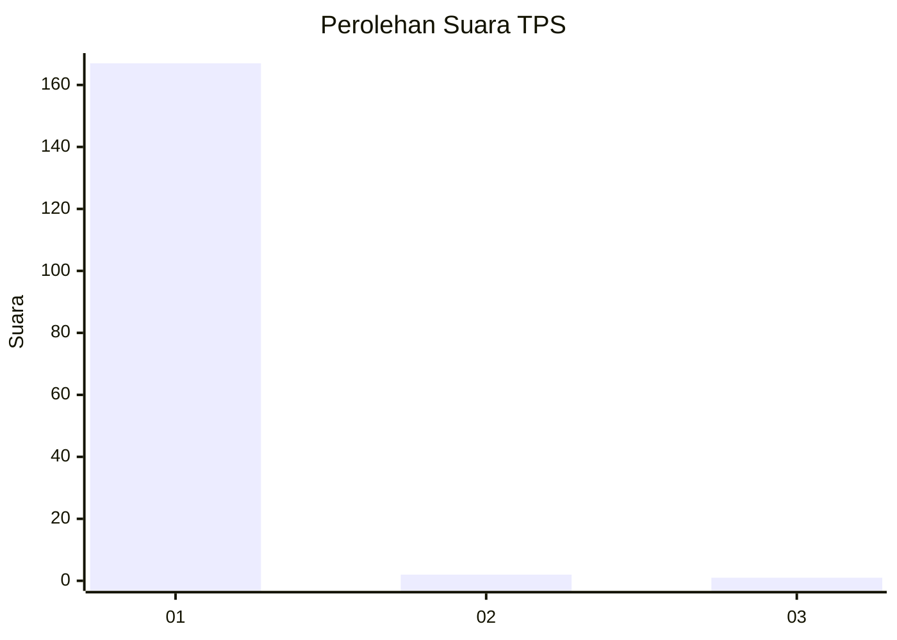
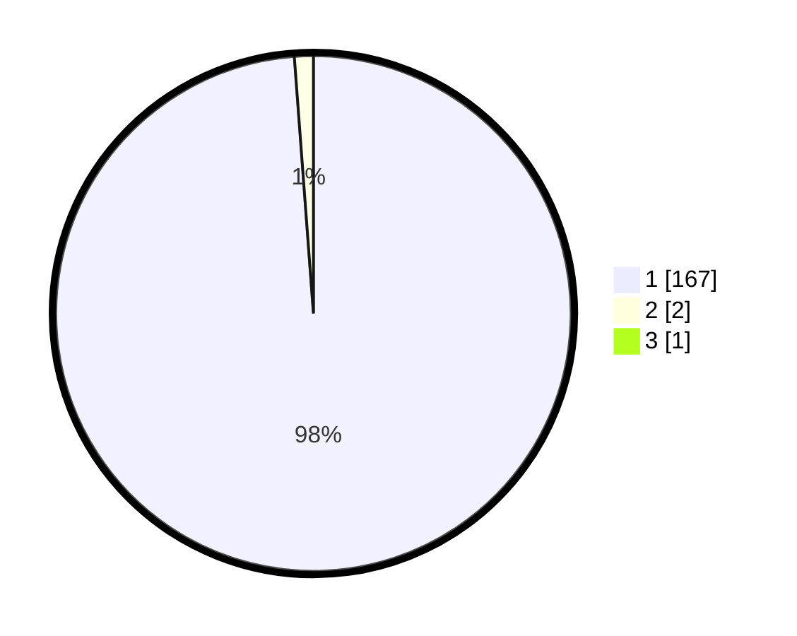

# Hasil

## Grafik

## Tabel

| No. | Nama Paslon    | Suara | Suara (raw) | Persentase |
|:--- |:-------------- | -----:| -----------:| ----------:|
| 1   | ANIES MUHAIMIN | 167   | [167][p-1]  | 98,24      |
| 2   | PRABOWO GIBRAN | 2     | [2][p-2]    | 1,18       |
| 3   | GANJAR MAHFUD  | 1     | [1][p-3]    | 0,59       |

[p-1]: https://github.com/gigit-pemilu/pemilu-2024/blob/main/pilpres/hitung-suara/sub/32-jawa-barat/sub/07-ciamis/sub/12-jatinagara/sub/2006-bayasari/sub/901-tps/sub/paslon-1.txt
[p-2]: https://github.com/gigit-pemilu/pemilu-2024/blob/main/pilpres/hitung-suara/sub/32-jawa-barat/sub/07-ciamis/sub/12-jatinagara/sub/2006-bayasari/sub/901-tps/sub/paslon-2.txt
[p-3]: https://github.com/gigit-pemilu/pemilu-2024/blob/main/pilpres/hitung-suara/sub/32-jawa-barat/sub/07-ciamis/sub/12-jatinagara/sub/2006-bayasari/sub/901-tps/sub/paslon-3.txt

## Foto C Plano

https://sirekap-obj-formc.kpu.go.id/8455/pemilu/ppwp/32/07/12/20/06/3207122006901-20240224-171246--7c2c05b5-d23b-4b5b-8144-b3b8fd625557.jpg

https://sirekap-obj-formc.kpu.go.id/8455/pemilu/ppwp/32/07/12/20/06/3207122006901-20240224-171321--1c31a066-cfe0-4dd1-bb72-d7118883e8f4.jpg

https://sirekap-obj-formc.kpu.go.id/8455/pemilu/ppwp/32/07/12/20/06/3207122006901-20240224-171500--9f61843f-bd20-4a6d-8c93-0251407b6e5c.jpg

## Metadata

| Key        | Value               |
| ---------- | ------------------- |
| Time Stamp | 2024-02-28 20:00:00 |

