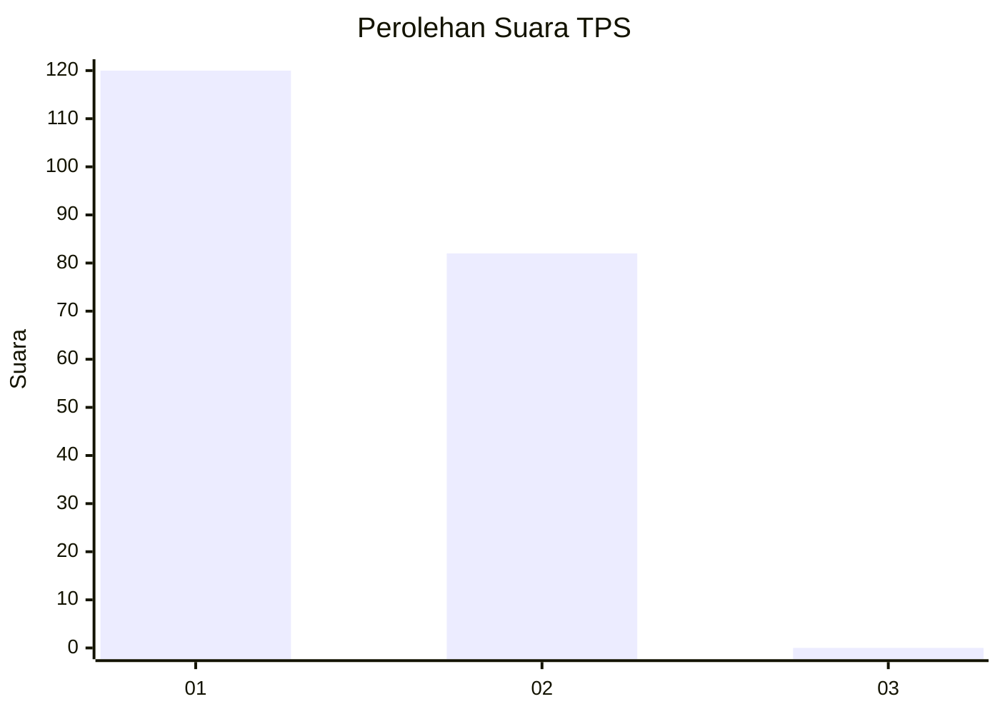
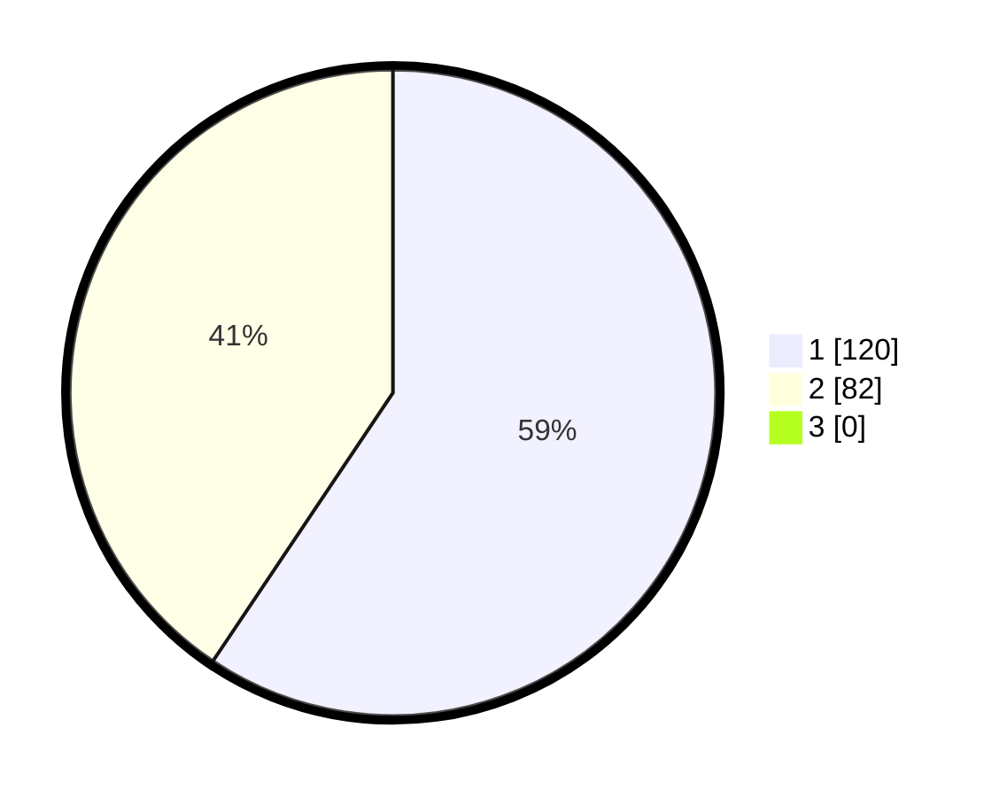

# Hasil

## Grafik

## Tabel

| No. | Nama Paslon    | Suara | Suara (raw) | Persentase |
|:--- |:-------------- | -----:| -----------:| ----------:|
| 1   | ANIES MUHAIMIN | 120   | [120][p-1]  | 59,41      |
| 2   | PRABOWO GIBRAN | 82    | [82][p-2]   | 40,59      |
| 3   | GANJAR MAHFUD  | 0     | [0][p-3]    | 0,00       |

[p-1]: https://github.com/gigit-pemilu/pemilu-2024-32-jawa-barat/blob/main/pilpres/hitung-suara/sub/32-jawa-barat/sub/07-ciamis/sub/13-rajadesa/sub/2001-rajadesa/sub/001-tps/sub/paslon-1.txt
[p-2]: https://github.com/gigit-pemilu/pemilu-2024-32-jawa-barat/blob/main/pilpres/hitung-suara/sub/32-jawa-barat/sub/07-ciamis/sub/13-rajadesa/sub/2001-rajadesa/sub/001-tps/sub/paslon-2.txt
[p-3]: https://github.com/gigit-pemilu/pemilu-2024-32-jawa-barat/blob/main/pilpres/hitung-suara/sub/32-jawa-barat/sub/07-ciamis/sub/13-rajadesa/sub/2001-rajadesa/sub/001-tps/sub/paslon-3.txt

## Foto C Plano

https://sirekap-obj-formc.kpu.go.id/9e7e/pemilu/ppwp/32/07/13/20/01/3207132001001-20240214-230028--e4e144d8-8b27-44f7-bbae-866e79ef748d.jpg

https://sirekap-obj-formc.kpu.go.id/9e7e/pemilu/ppwp/32/07/13/20/01/3207132001001-20240214-231813--952e706f-4b35-4717-bcfe-c05390f670c6.jpg

https://sirekap-obj-formc.kpu.go.id/9e7e/pemilu/ppwp/32/07/13/20/01/3207132001001-20240214-232142--042c5076-d453-4cac-9bbb-9d45165e549f.jpg

## Metadata

| Key        | Value               |
| ---------- | ------------------- |
| Time Stamp | 2024-02-16 06:00:27 |

