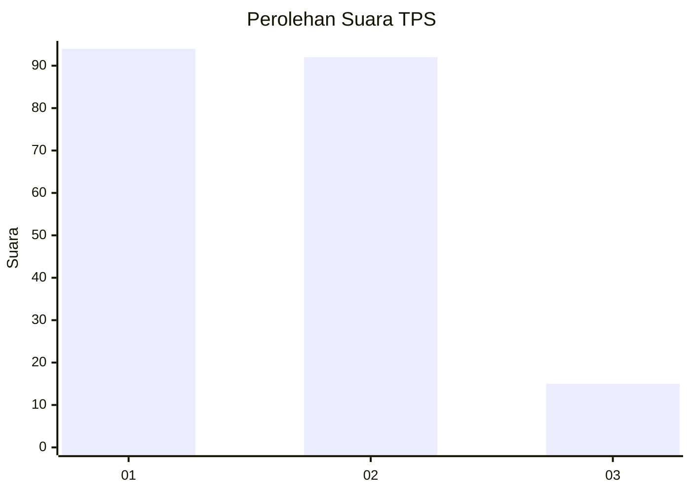
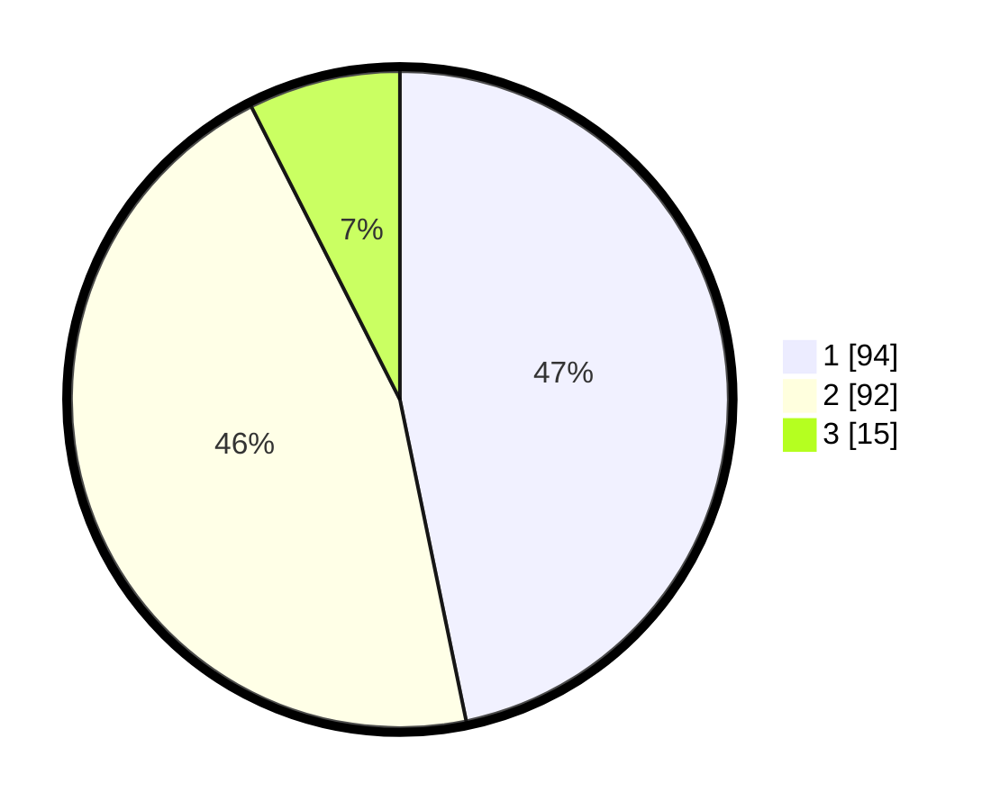

# Hasil

## Grafik

## Tabel

| No. | Nama Paslon    | Suara | Suara (raw) | Persentase |
|:--- |:-------------- | -----:| -----------:| ----------:|
| 1   | ANIES MUHAIMIN | 94    | [94][p-1]   | 46,77      |
| 2   | PRABOWO GIBRAN | 92    | [92][p-2]   | 45,77      |
| 3   | GANJAR MAHFUD  | 15    | [15][p-3]   | 7,46       |

[p-1]: https://github.com/gigit-pemilu/pemilu-2024-32-jawa-barat/blob/main/pilpres/hitung-suara/sub/32-jawa-barat/sub/07-ciamis/sub/13-rajadesa/sub/2001-rajadesa/sub/005-tps/sub/paslon-1.txt
[p-2]: https://github.com/gigit-pemilu/pemilu-2024-32-jawa-barat/blob/main/pilpres/hitung-suara/sub/32-jawa-barat/sub/07-ciamis/sub/13-rajadesa/sub/2001-rajadesa/sub/005-tps/sub/paslon-2.txt
[p-3]: https://github.com/gigit-pemilu/pemilu-2024-32-jawa-barat/blob/main/pilpres/hitung-suara/sub/32-jawa-barat/sub/07-ciamis/sub/13-rajadesa/sub/2001-rajadesa/sub/005-tps/sub/paslon-3.txt

## Foto C Plano

https://sirekap-obj-formc.kpu.go.id/7ff0/pemilu/ppwp/32/07/13/20/01/3207132001005-20240214-192439--369fcf13-b75b-44b8-ad35-eccaa333832e.jpg

https://sirekap-obj-formc.kpu.go.id/7ff0/pemilu/ppwp/32/07/13/20/01/3207132001005-20240214-192448--2eb01156-4731-48ae-bebb-30613c6fae7f.jpg

https://sirekap-obj-formc.kpu.go.id/7ff0/pemilu/ppwp/32/07/13/20/01/3207132001005-20240214-192453--427894d5-afd0-4fee-b97c-4464d53c81f8.jpg

## Metadata

| Key        | Value               |
| ---------- | ------------------- |
| Time Stamp | 2024-02-16 22:01:00 |

