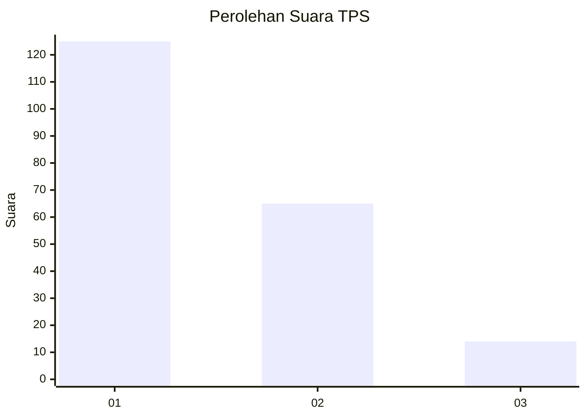
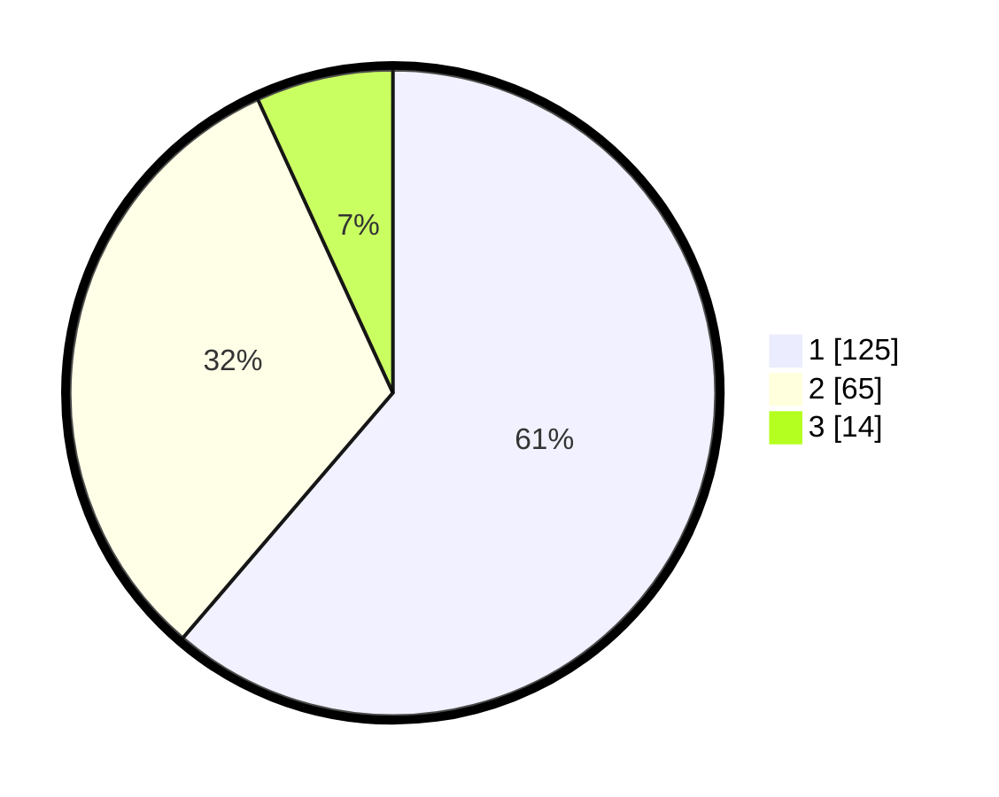

# Hasil

## Grafik

## Tabel

| No. | Nama Paslon    | Suara | Suara (raw) | Persentase |
|:--- |:-------------- | -----:| -----------:| ----------:|
| 1   | ANIES MUHAIMIN | 125   | [125][p-1]  | 61,27      |
| 2   | PRABOWO GIBRAN | 65    | [65][p-2]   | 31,86      |
| 3   | GANJAR MAHFUD  | 14    | [14][p-3]   | 6,86       |

[p-1]: https://github.com/gigit-pemilu/pemilu-2024/blob/main/pilpres/hitung-suara/sub/32-jawa-barat/sub/07-ciamis/sub/13-rajadesa/sub/2001-rajadesa/sub/008-tps/sub/paslon-1.txt
[p-2]: https://github.com/gigit-pemilu/pemilu-2024/blob/main/pilpres/hitung-suara/sub/32-jawa-barat/sub/07-ciamis/sub/13-rajadesa/sub/2001-rajadesa/sub/008-tps/sub/paslon-2.txt
[p-3]: https://github.com/gigit-pemilu/pemilu-2024/blob/main/pilpres/hitung-suara/sub/32-jawa-barat/sub/07-ciamis/sub/13-rajadesa/sub/2001-rajadesa/sub/008-tps/sub/paslon-3.txt

## Foto C Plano

https://sirekap-obj-formc.kpu.go.id/7faa/pemilu/ppwp/32/07/13/20/01/3207132001008-20240215-001448--f890e35a-330b-4d2f-87e5-c9e76d8a616f.jpg

https://sirekap-obj-formc.kpu.go.id/7faa/pemilu/ppwp/32/07/13/20/01/3207132001008-20240215-001611--a733c659-dc63-498f-86de-3bd2d857bf75.jpg

https://sirekap-obj-formc.kpu.go.id/7faa/pemilu/ppwp/32/07/13/20/01/3207132001008-20240215-001659--e228d088-6029-4d73-b5a7-c83ffa8f598d.jpg

## Metadata

| Key        | Value               |
| ---------- | ------------------- |
| Time Stamp | 2024-02-15 18:30:25 |

