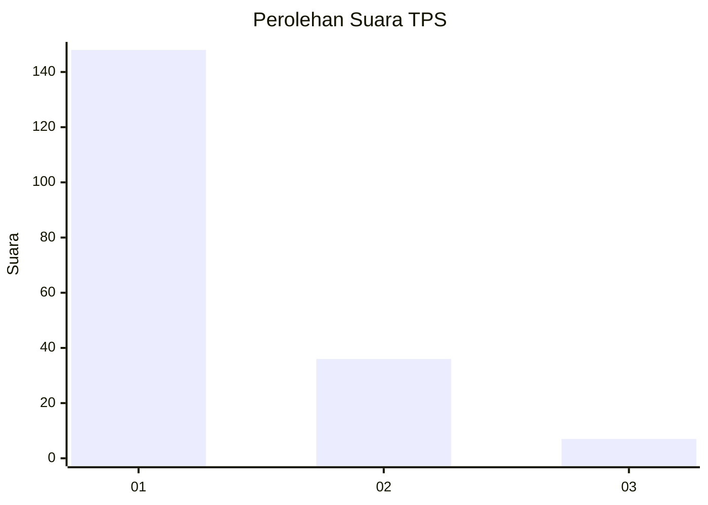
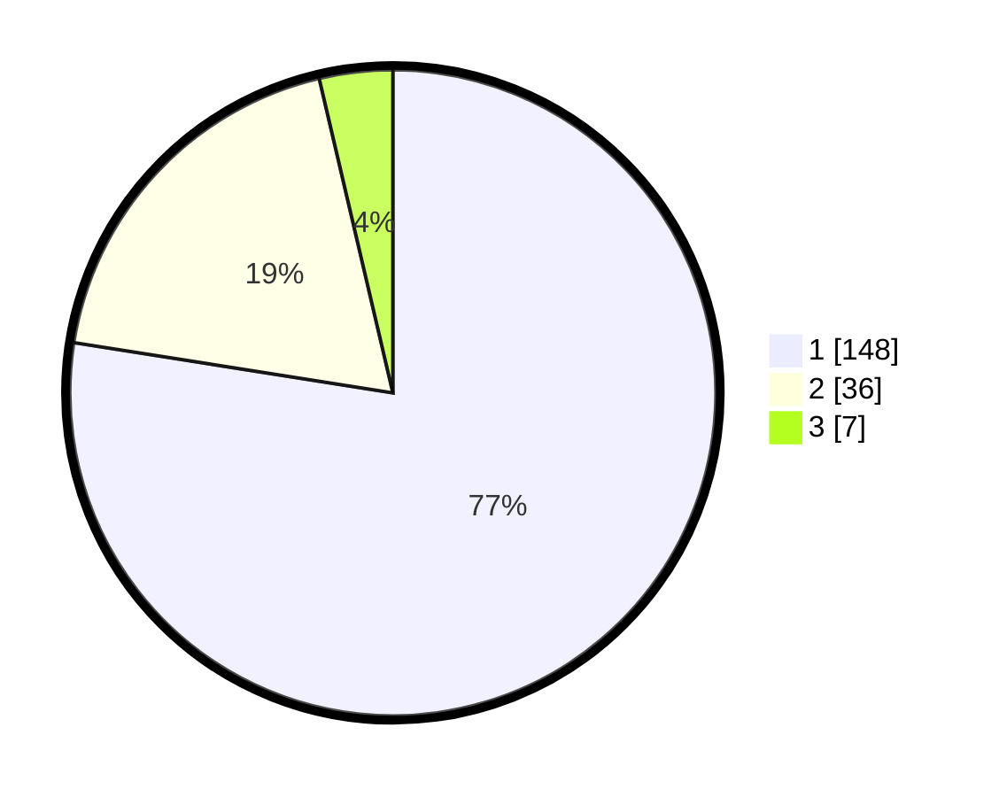

# Hasil

## Grafik

## Tabel

| No. | Nama Paslon    | Suara | Suara (raw) | Persentase |
|:--- |:-------------- | -----:| -----------:| ----------:|
| 1   | ANIES MUHAIMIN | 148   | [148][p-1]  | 77,49      |
| 2   | PRABOWO GIBRAN | 36    | [36][p-2]   | 18,85      |
| 3   | GANJAR MAHFUD  | 7     | [7][p-3]    | 3,66       |

[p-1]: https://github.com/gigit-pemilu/pemilu-2024/blob/main/pilpres/hitung-suara/sub/32-jawa-barat/sub/07-ciamis/sub/13-rajadesa/sub/2002-tanjungsukur/sub/002-tps/sub/paslon-1.txt
[p-2]: https://github.com/gigit-pemilu/pemilu-2024/blob/main/pilpres/hitung-suara/sub/32-jawa-barat/sub/07-ciamis/sub/13-rajadesa/sub/2002-tanjungsukur/sub/002-tps/sub/paslon-2.txt
[p-3]: https://github.com/gigit-pemilu/pemilu-2024/blob/main/pilpres/hitung-suara/sub/32-jawa-barat/sub/07-ciamis/sub/13-rajadesa/sub/2002-tanjungsukur/sub/002-tps/sub/paslon-3.txt

## Foto C Plano

https://sirekap-obj-formc.kpu.go.id/f292/pemilu/ppwp/32/07/13/20/02/3207132002002-20240214-205321--ca07acea-49b8-4061-b7eb-76563d3466a2.jpg

https://sirekap-obj-formc.kpu.go.id/f292/pemilu/ppwp/32/07/13/20/02/3207132002002-20240214-205427--e701c888-9de4-4d07-bc28-981f2a013e75.jpg

https://sirekap-obj-formc.kpu.go.id/f292/pemilu/ppwp/32/07/13/20/02/3207132002002-20240214-160104--dc28196c-687e-4a28-aceb-f5a91e85c4b6.jpg

## Metadata

| Key        | Value               |
| ---------- | ------------------- |
| Time Stamp | 2024-02-16 22:01:00 |

