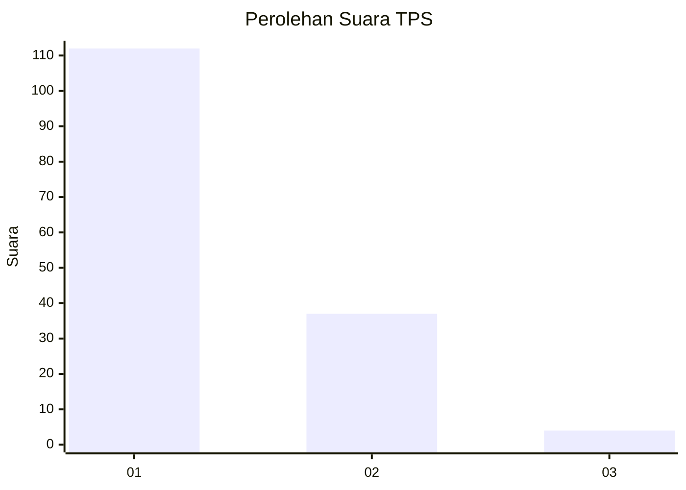
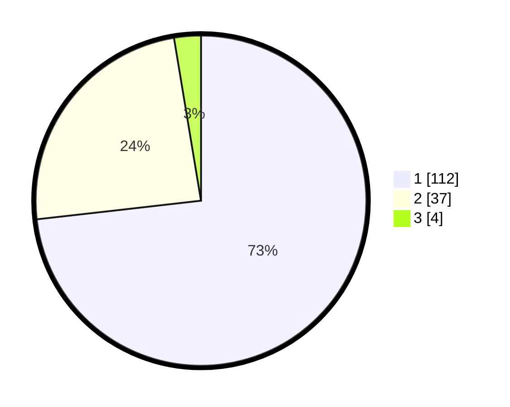

# Hasil

## Grafik

## Tabel

| No. | Nama Paslon    | Suara | Suara (raw) | Persentase |
|:--- |:-------------- | -----:| -----------:| ----------:|
| 1   | ANIES MUHAIMIN | 112   | [112][p-1]  | 73,20      |
| 2   | PRABOWO GIBRAN | 37    | [37][p-2]   | 24,18      |
| 3   | GANJAR MAHFUD  | 4     | [4][p-3]    | 2,61       |

[p-1]: https://github.com/gigit-pemilu/pemilu-2024-32-jawa-barat/blob/main/pilpres/hitung-suara/sub/32-jawa-barat/sub/07-ciamis/sub/13-rajadesa/sub/2002-tanjungsukur/sub/006-tps/sub/paslon-1.txt
[p-2]: https://github.com/gigit-pemilu/pemilu-2024-32-jawa-barat/blob/main/pilpres/hitung-suara/sub/32-jawa-barat/sub/07-ciamis/sub/13-rajadesa/sub/2002-tanjungsukur/sub/006-tps/sub/paslon-2.txt
[p-3]: https://github.com/gigit-pemilu/pemilu-2024-32-jawa-barat/blob/main/pilpres/hitung-suara/sub/32-jawa-barat/sub/07-ciamis/sub/13-rajadesa/sub/2002-tanjungsukur/sub/006-tps/sub/paslon-3.txt

## Foto C Plano

https://sirekap-obj-formc.kpu.go.id/ba5d/pemilu/ppwp/32/07/13/20/02/3207132002006-20240214-160108--b6b287c9-721f-4751-af43-408df8ad30f0.jpg

https://sirekap-obj-formc.kpu.go.id/ba5d/pemilu/ppwp/32/07/13/20/02/3207132002006-20240214-160137--7b19216e-98db-4ff5-b63a-b3b6ecdfd5c8.jpg

https://sirekap-obj-formc.kpu.go.id/ba5d/pemilu/ppwp/32/07/13/20/02/3207132002006-20240214-162217--d4dae974-f0b9-41fa-9ee1-7591e29da69b.jpg

## Metadata

| Key        | Value               |
| ---------- | ------------------- |
| Time Stamp | 2024-02-15 18:30:25 |

