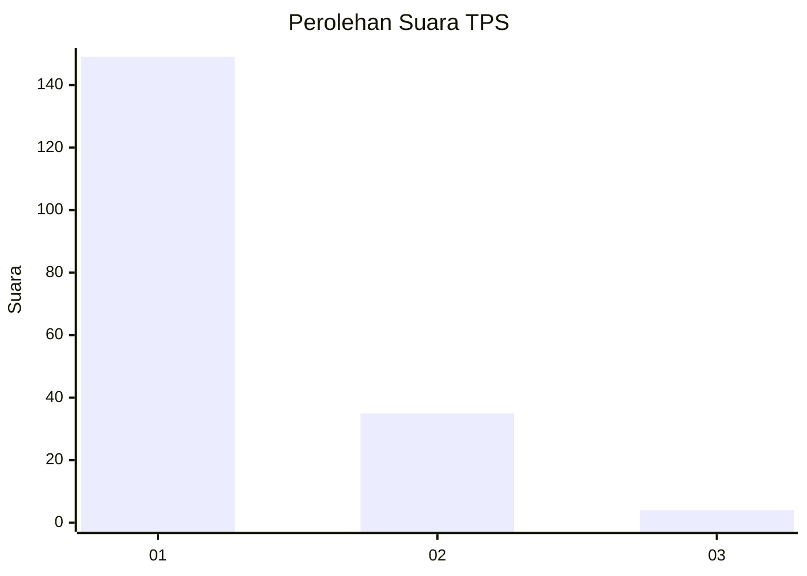
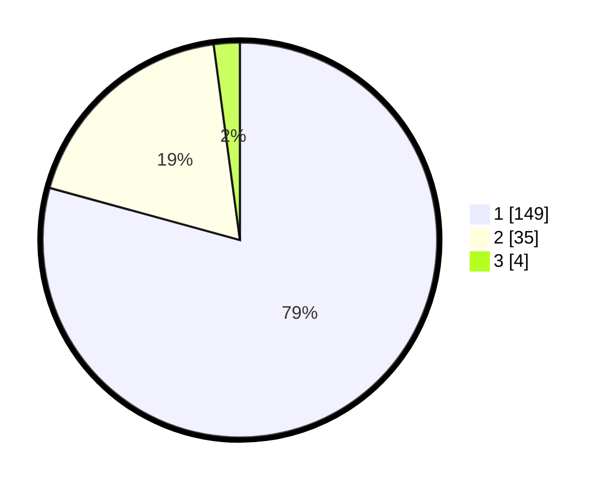

# Hasil

## Grafik

## Tabel

| No. | Nama Paslon    | Suara | Suara (raw) | Persentase |
|:--- |:-------------- | -----:| -----------:| ----------:|
| 1   | ANIES MUHAIMIN | 149   | [149][p-1]  | 79,26      |
| 2   | PRABOWO GIBRAN | 35    | [35][p-2]   | 18,62      |
| 3   | GANJAR MAHFUD  | 4     | [4][p-3]    | 2,13       |

[p-1]: https://github.com/gigit-pemilu/pemilu-2024-32-jawa-barat/blob/main/pilpres/hitung-suara/sub/32-jawa-barat/sub/07-ciamis/sub/13-rajadesa/sub/2003-tanjungsari/sub/001-tps/sub/paslon-1.txt
[p-2]: https://github.com/gigit-pemilu/pemilu-2024-32-jawa-barat/blob/main/pilpres/hitung-suara/sub/32-jawa-barat/sub/07-ciamis/sub/13-rajadesa/sub/2003-tanjungsari/sub/001-tps/sub/paslon-2.txt
[p-3]: https://github.com/gigit-pemilu/pemilu-2024-32-jawa-barat/blob/main/pilpres/hitung-suara/sub/32-jawa-barat/sub/07-ciamis/sub/13-rajadesa/sub/2003-tanjungsari/sub/001-tps/sub/paslon-3.txt

## Foto C Plano

https://sirekap-obj-formc.kpu.go.id/5241/pemilu/ppwp/32/07/13/20/03/3207132003001-20240219-081510--0fb6c760-bbb6-42c7-a5e0-3f223b907fb5.jpg

https://sirekap-obj-formc.kpu.go.id/5241/pemilu/ppwp/32/07/13/20/03/3207132003001-20240219-081106--18e278c8-0484-483f-a265-bb72ec251756.jpg

https://sirekap-obj-formc.kpu.go.id/5241/pemilu/ppwp/32/07/13/20/03/3207132003001-20240219-073340--a7e27769-c9eb-4cfa-9eb6-b61c297c9969.jpg

## Metadata

| Key        | Value               |
| ---------- | ------------------- |
| Time Stamp | 2024-02-22 13:00:00 |

