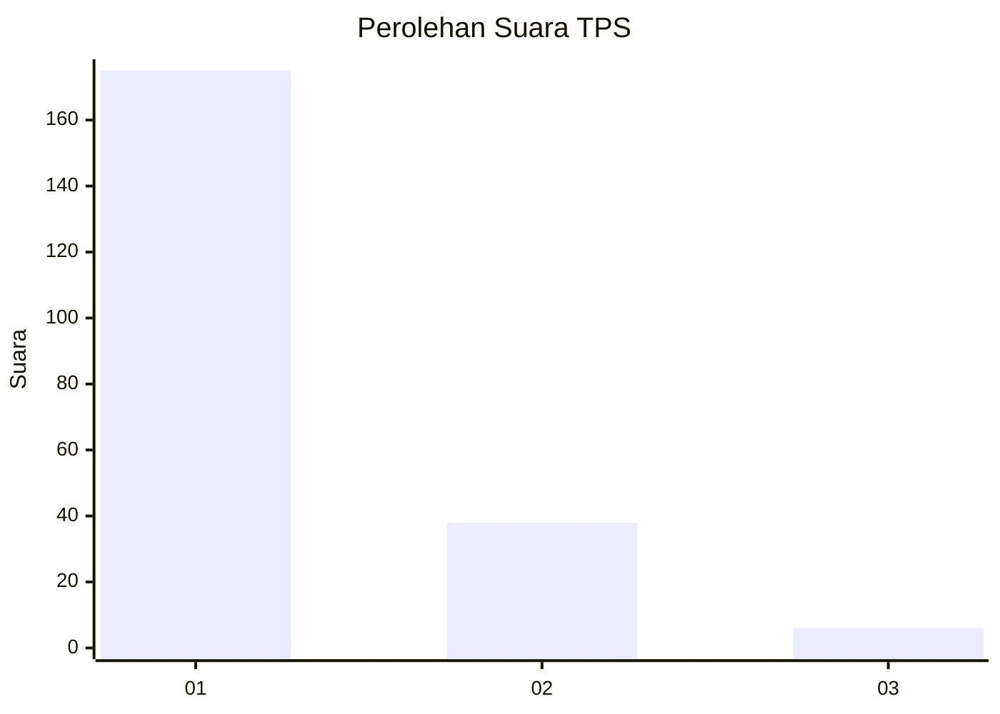
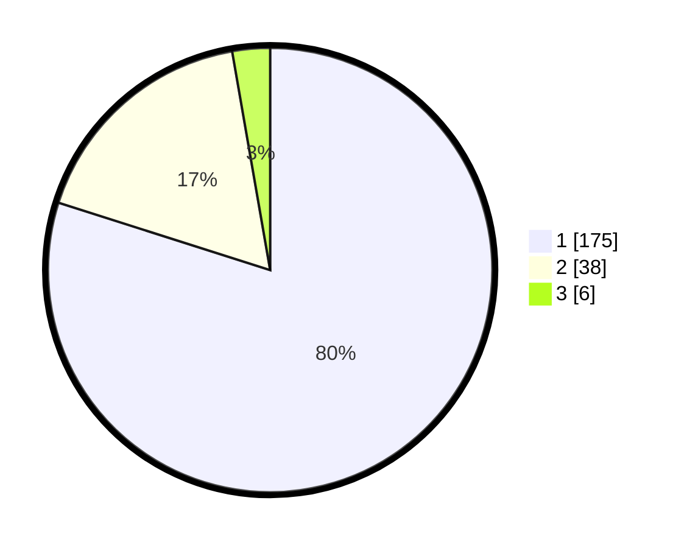

# Hasil

## Grafik

## Tabel

| No. | Nama Paslon    | Suara | Suara (raw) | Persentase |
|:--- |:-------------- | -----:| -----------:| ----------:|
| 1   | ANIES MUHAIMIN | 175   | [175][p-1]  | 79,91      |
| 2   | PRABOWO GIBRAN | 38    | [38][p-2]   | 17,35      |
| 3   | GANJAR MAHFUD  | 6     | [6][p-3]    | 2,74       |

[p-1]: https://github.com/gigit-pemilu/pemilu-2024-32-jawa-barat/blob/main/pilpres/hitung-suara/sub/32-jawa-barat/sub/07-ciamis/sub/13-rajadesa/sub/2003-tanjungsari/sub/015-tps/sub/paslon-1.txt
[p-2]: https://github.com/gigit-pemilu/pemilu-2024-32-jawa-barat/blob/main/pilpres/hitung-suara/sub/32-jawa-barat/sub/07-ciamis/sub/13-rajadesa/sub/2003-tanjungsari/sub/015-tps/sub/paslon-2.txt
[p-3]: https://github.com/gigit-pemilu/pemilu-2024-32-jawa-barat/blob/main/pilpres/hitung-suara/sub/32-jawa-barat/sub/07-ciamis/sub/13-rajadesa/sub/2003-tanjungsari/sub/015-tps/sub/paslon-3.txt

## Foto C Plano

https://sirekap-obj-formc.kpu.go.id/1bc2/pemilu/ppwp/32/07/13/20/03/3207132003015-20240216-151018--fd12989c-4313-4c29-b7bb-01cf72384e55.jpg

https://sirekap-obj-formc.kpu.go.id/1bc2/pemilu/ppwp/32/07/13/20/03/3207132003015-20240216-151027--a5e7018b-db15-42a5-abf0-02cec334bfbe.jpg

https://sirekap-obj-formc.kpu.go.id/1bc2/pemilu/ppwp/32/07/13/20/03/3207132003015-20240216-151035--8a6e7883-81f8-4c42-a0df-6dbbd1af1d33.jpg

## Metadata

| Key        | Value               |
| ---------- | ------------------- |
| Time Stamp | 2024-02-16 21:01:00 |

