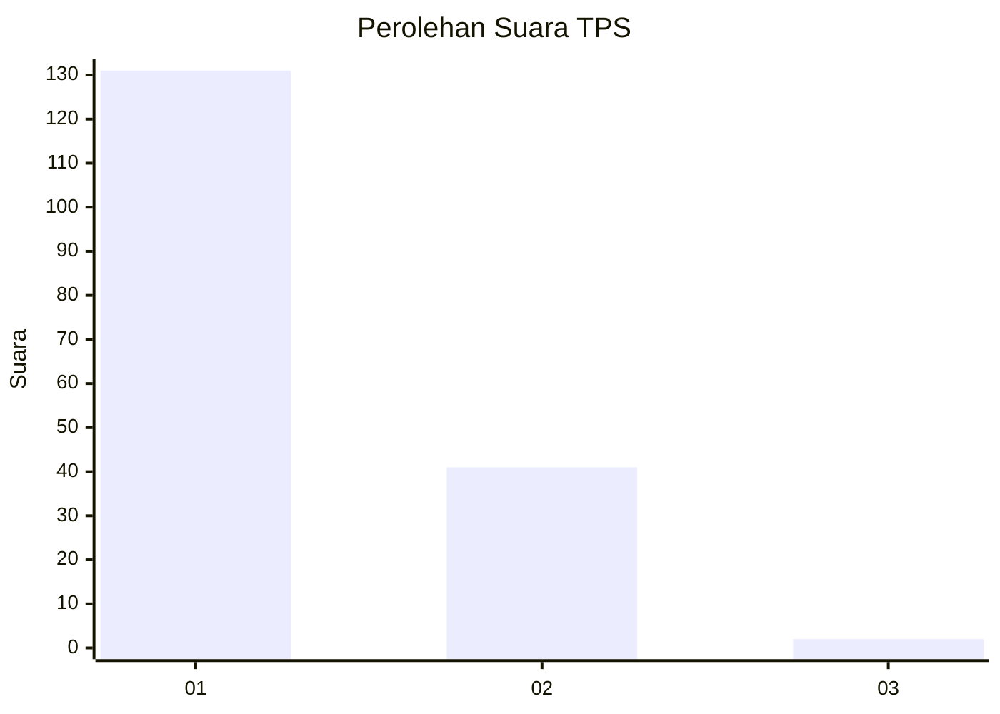
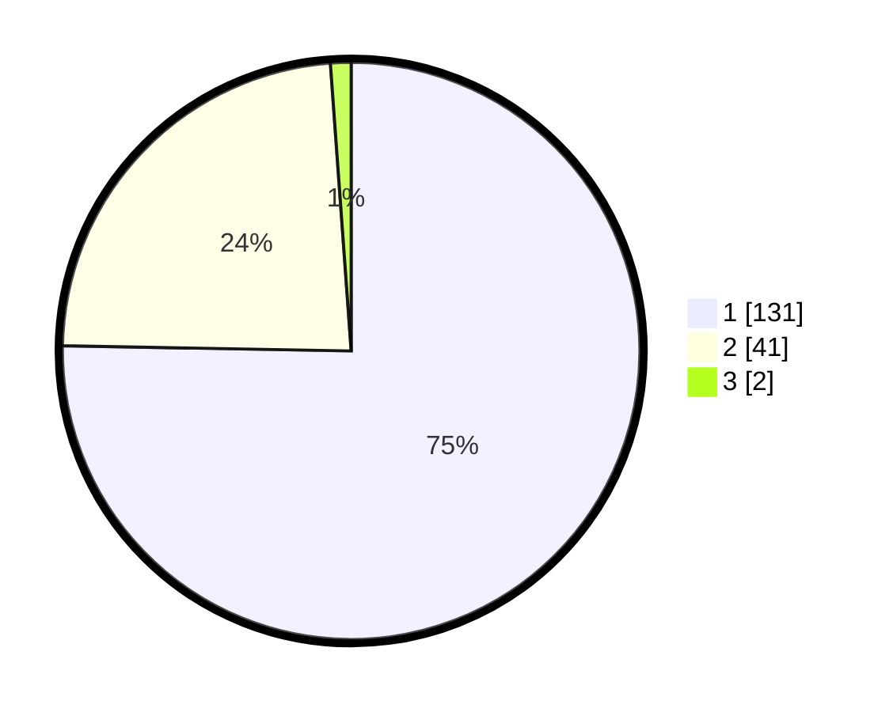

# Hasil

## Grafik

## Tabel

| No. | Nama Paslon    | Suara | Suara (raw) | Persentase |
|:--- |:-------------- | -----:| -----------:| ----------:|
| 1   | ANIES MUHAIMIN | 131   | [131][p-1]  | 75,29      |
| 2   | PRABOWO GIBRAN | 41    | [41][p-2]   | 23,56      |
| 3   | GANJAR MAHFUD  | 2     | [2][p-3]    | 1,15       |

[p-1]: https://github.com/gigit-pemilu/pemilu-2024/blob/main/pilpres/hitung-suara/sub/32-jawa-barat/sub/07-ciamis/sub/13-rajadesa/sub/2008-tigaherang/sub/012-tps/sub/paslon-1.txt
[p-2]: https://github.com/gigit-pemilu/pemilu-2024/blob/main/pilpres/hitung-suara/sub/32-jawa-barat/sub/07-ciamis/sub/13-rajadesa/sub/2008-tigaherang/sub/012-tps/sub/paslon-2.txt
[p-3]: https://github.com/gigit-pemilu/pemilu-2024/blob/main/pilpres/hitung-suara/sub/32-jawa-barat/sub/07-ciamis/sub/13-rajadesa/sub/2008-tigaherang/sub/012-tps/sub/paslon-3.txt

## Foto C Plano

https://sirekap-obj-formc.kpu.go.id/658b/pemilu/ppwp/32/07/13/20/08/3207132008012-20240214-213131--6bf2168e-f616-4817-bdfa-a3905dc65f4a.jpg

https://sirekap-obj-formc.kpu.go.id/658b/pemilu/ppwp/32/07/13/20/08/3207132008012-20240214-235720--4d0ab70c-85d3-410c-ab5b-064115b8d47d.jpg

https://sirekap-obj-formc.kpu.go.id/658b/pemilu/ppwp/32/07/13/20/08/3207132008012-20240214-235849--4c9e6329-ab83-4af6-94ff-55a527b4cb90.jpg

## Metadata

| Key        | Value               |
| ---------- | ------------------- |
| Time Stamp | 2024-02-16 21:01:00 |

