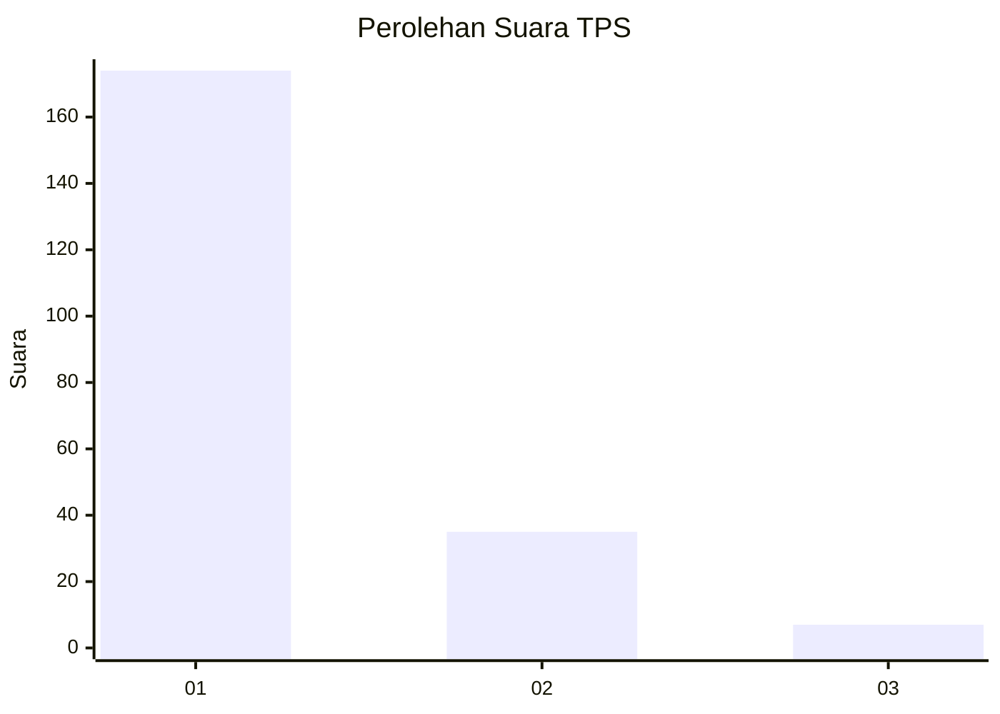
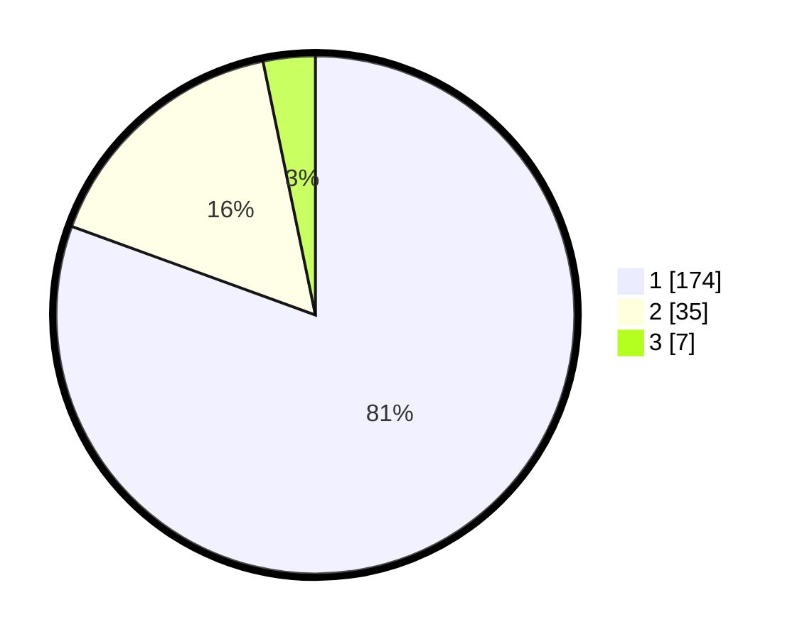

# Hasil

## Grafik

## Tabel

| No. | Nama Paslon    | Suara | Suara (raw) | Persentase |
|:--- |:-------------- | -----:| -----------:| ----------:|
| 1   | ANIES MUHAIMIN | 174   | [174][p-1]  | 80,56      |
| 2   | PRABOWO GIBRAN | 35    | [35][p-2]   | 16,20      |
| 3   | GANJAR MAHFUD  | 7     | [7][p-3]    | 3,24       |

[p-1]: https://github.com/gigit-pemilu/pemilu-2024-32-jawa-barat/blob/main/pilpres/hitung-suara/sub/32-jawa-barat/sub/07-ciamis/sub/13-rajadesa/sub/2009-sirnabaya/sub/002-tps/sub/paslon-1.txt
[p-2]: https://github.com/gigit-pemilu/pemilu-2024-32-jawa-barat/blob/main/pilpres/hitung-suara/sub/32-jawa-barat/sub/07-ciamis/sub/13-rajadesa/sub/2009-sirnabaya/sub/002-tps/sub/paslon-2.txt
[p-3]: https://github.com/gigit-pemilu/pemilu-2024-32-jawa-barat/blob/main/pilpres/hitung-suara/sub/32-jawa-barat/sub/07-ciamis/sub/13-rajadesa/sub/2009-sirnabaya/sub/002-tps/sub/paslon-3.txt

## Foto C Plano

https://sirekap-obj-formc.kpu.go.id/4767/pemilu/ppwp/32/07/13/20/09/3207132009002-20240215-004608--2abee0ee-2d56-4a6f-970e-90b6cfb32c0b.jpg

https://sirekap-obj-formc.kpu.go.id/4767/pemilu/ppwp/32/07/13/20/09/3207132009002-20240220-095523--238ff2fb-a096-464e-acc8-3311c08b6fa0.jpg

https://sirekap-obj-formc.kpu.go.id/4767/pemilu/ppwp/32/07/13/20/09/3207132009002-20240214-220520--34611fb9-3470-4479-8c6d-abee82f15ece.jpg

## Metadata

| Key        | Value               |
| ---------- | ------------------- |
| Time Stamp | 2024-02-24 22:31:28 |

