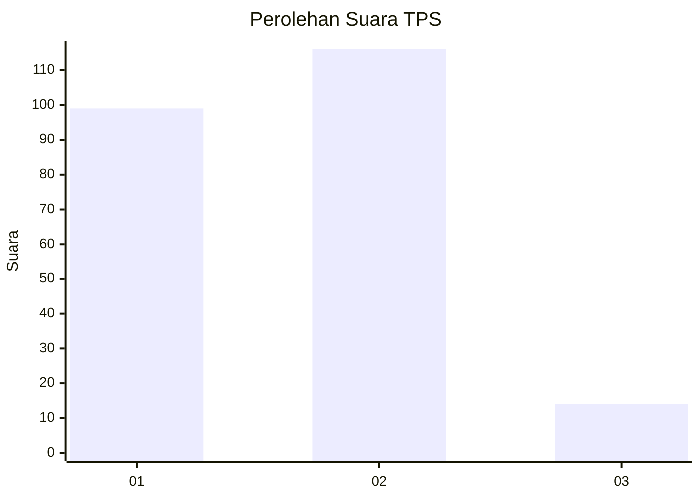
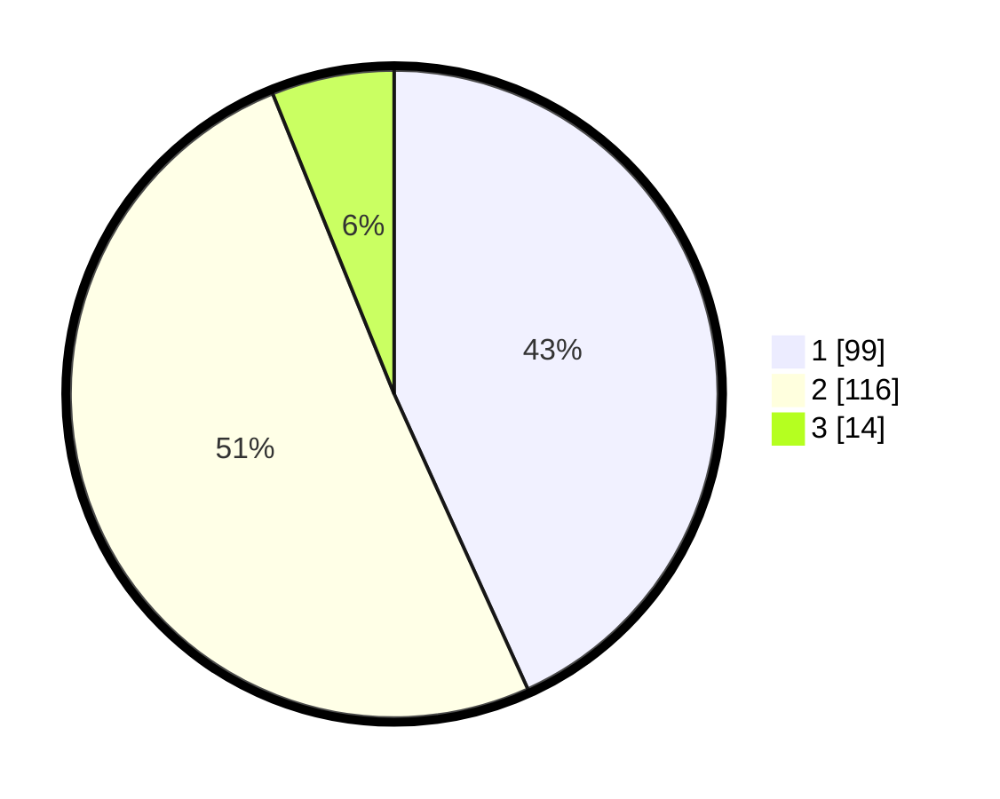

# Hasil

## Grafik

## Tabel

| No. | Nama Paslon    | Suara | Suara (raw) | Persentase |
|:--- |:-------------- | -----:| -----------:| ----------:|
| 1   | ANIES MUHAIMIN | 99    | [99][p-1]   | 43,23      |
| 2   | PRABOWO GIBRAN | 116   | [116][p-2]  | 50,66      |
| 3   | GANJAR MAHFUD  | 14    | [14][p-3]   | 6,11       |

[p-1]: https://github.com/gigit-pemilu/pemilu-2024/blob/main/pilpres/hitung-suara/sub/32-jawa-barat/sub/07-ciamis/sub/15-rancah/sub/2001-rancah/sub/001-tps/sub/paslon-1.txt
[p-2]: https://github.com/gigit-pemilu/pemilu-2024/blob/main/pilpres/hitung-suara/sub/32-jawa-barat/sub/07-ciamis/sub/15-rancah/sub/2001-rancah/sub/001-tps/sub/paslon-2.txt
[p-3]: https://github.com/gigit-pemilu/pemilu-2024/blob/main/pilpres/hitung-suara/sub/32-jawa-barat/sub/07-ciamis/sub/15-rancah/sub/2001-rancah/sub/001-tps/sub/paslon-3.txt

## Foto C Plano

https://sirekap-obj-formc.kpu.go.id/b9a4/pemilu/ppwp/32/07/15/20/01/3207152001001-20240214-215747--801b5255-366a-414c-a45b-bdcaf47b3a65.jpg

https://sirekap-obj-formc.kpu.go.id/b9a4/pemilu/ppwp/32/07/15/20/01/3207152001001-20240214-223705--9e91d90c-8cad-43ff-9173-b0f85db11b64.jpg

https://sirekap-obj-formc.kpu.go.id/b9a4/pemilu/ppwp/32/07/15/20/01/3207152001001-20240214-214138--68c9f827-f80e-4274-bd81-88ad5bc7fdb0.jpg

## Metadata

| Key        | Value               |
| ---------- | ------------------- |
| Time Stamp | 2024-02-16 09:00:28 |

