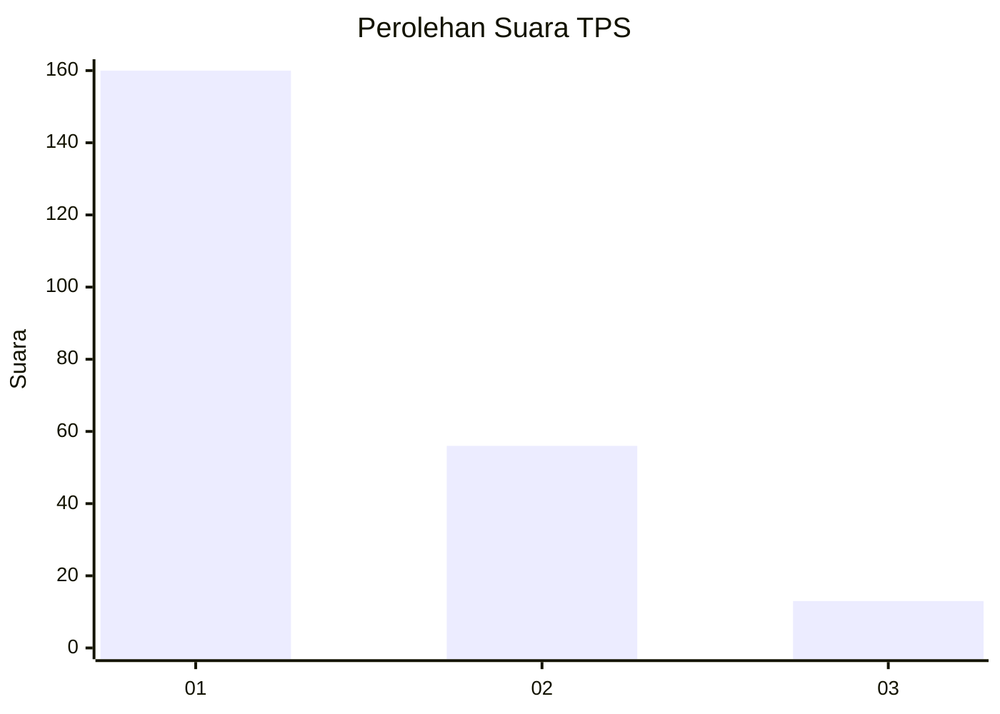
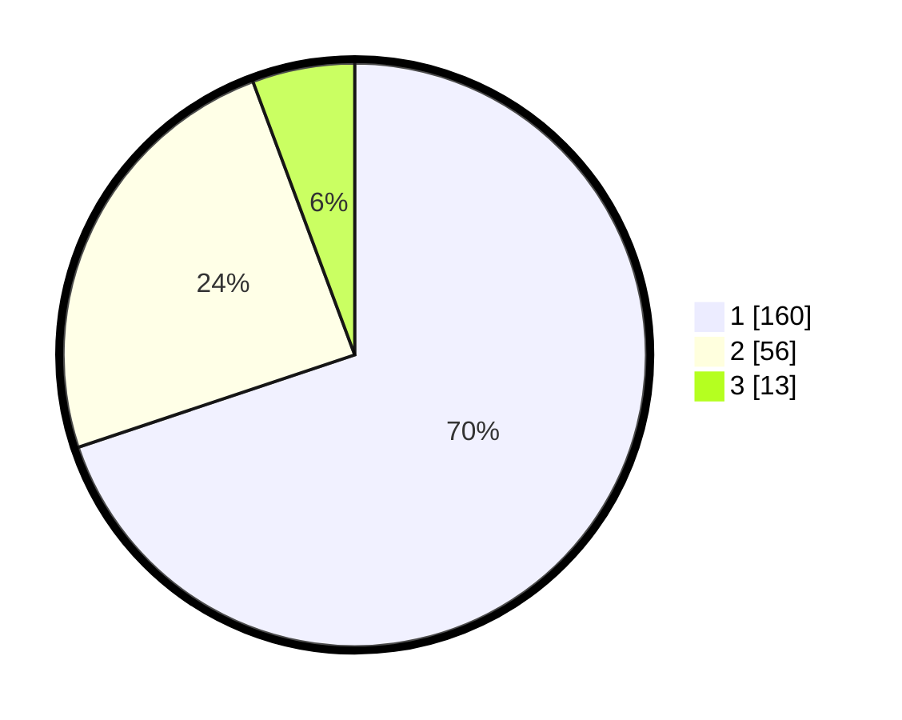

# Hasil

## Grafik

## Tabel

| No. | Nama Paslon    | Suara | Suara (raw) | Persentase |
|:--- |:-------------- | -----:| -----------:| ----------:|
| 1   | ANIES MUHAIMIN | 160   | [160][p-1]  | 69,87      |
| 2   | PRABOWO GIBRAN | 56    | [56][p-2]   | 24,45      |
| 3   | GANJAR MAHFUD  | 13    | [13][p-3]   | 5,68       |

[p-1]: https://github.com/gigit-pemilu/pemilu-2024-32-jawa-barat/blob/main/pilpres/hitung-suara/sub/32-jawa-barat/sub/07-ciamis/sub/15-rancah/sub/2001-rancah/sub/013-tps/sub/paslon-1.txt
[p-2]: https://github.com/gigit-pemilu/pemilu-2024-32-jawa-barat/blob/main/pilpres/hitung-suara/sub/32-jawa-barat/sub/07-ciamis/sub/15-rancah/sub/2001-rancah/sub/013-tps/sub/paslon-2.txt
[p-3]: https://github.com/gigit-pemilu/pemilu-2024-32-jawa-barat/blob/main/pilpres/hitung-suara/sub/32-jawa-barat/sub/07-ciamis/sub/15-rancah/sub/2001-rancah/sub/013-tps/sub/paslon-3.txt

## Foto C Plano

https://sirekap-obj-formc.kpu.go.id/89e7/pemilu/ppwp/32/07/15/20/01/3207152001013-20240214-205805--2220460f-c8da-4f28-ad5f-8b65ec5ad66f.jpg

https://sirekap-obj-formc.kpu.go.id/89e7/pemilu/ppwp/32/07/15/20/01/3207152001013-20240214-205826--de87c5b1-7bbc-4b40-b613-cbcf31b72483.jpg

https://sirekap-obj-formc.kpu.go.id/89e7/pemilu/ppwp/32/07/15/20/01/3207152001013-20240214-222623--0c1d4f66-fba0-4c90-b151-165dca0d8fe7.jpg

## Metadata

| Key        | Value               |
| ---------- | ------------------- |
| Time Stamp | 2024-02-16 21:01:00 |

