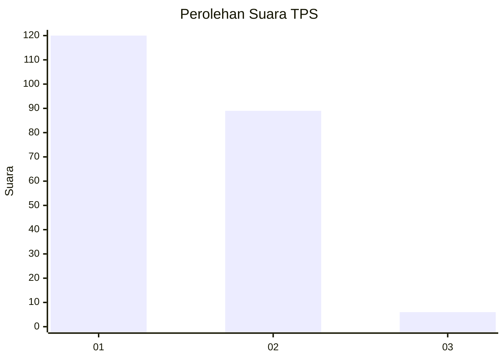
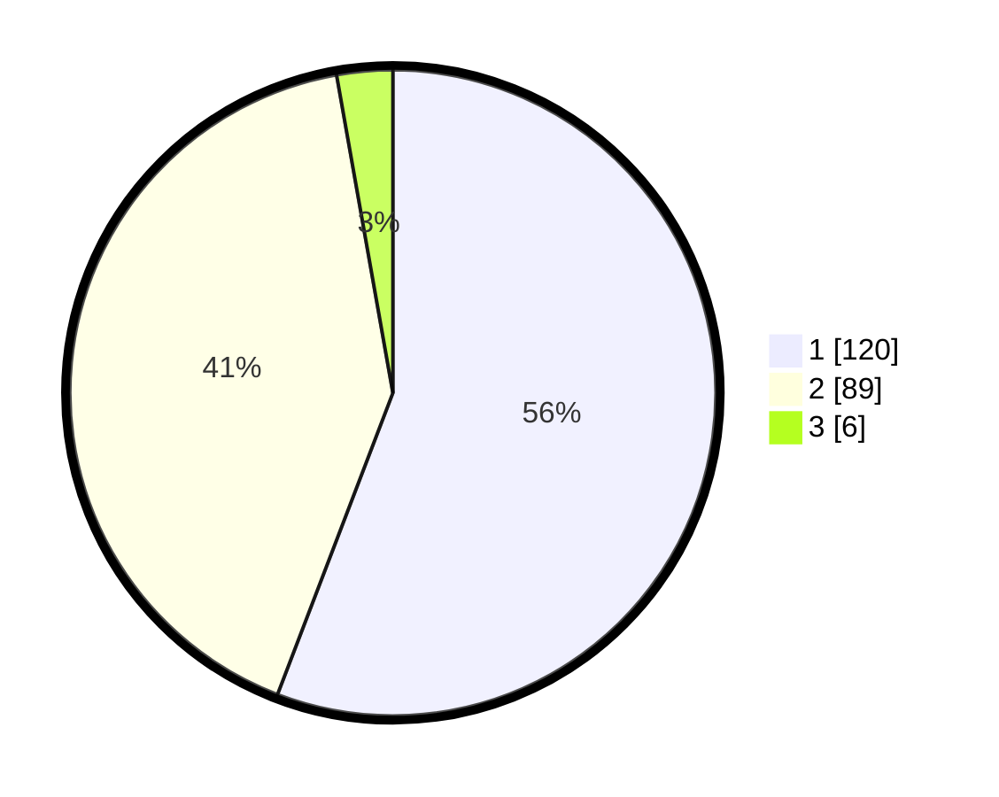

# Hasil

## Grafik

## Tabel

| No. | Nama Paslon    | Suara | Suara (raw) | Persentase |
|:--- |:-------------- | -----:| -----------:| ----------:|
| 1   | ANIES MUHAIMIN | 120   | [120][p-1]  | 55,81      |
| 2   | PRABOWO GIBRAN | 89    | [89][p-2]   | 41,40      |
| 3   | GANJAR MAHFUD  | 6     | [6][p-3]    | 2,79       |

[p-1]: https://github.com/gigit-pemilu/pemilu-2024/blob/main/pilpres/hitung-suara/sub/32-jawa-barat/sub/07-ciamis/sub/15-rancah/sub/2002-kiarapayung/sub/002-tps/sub/paslon-1.txt
[p-2]: https://github.com/gigit-pemilu/pemilu-2024/blob/main/pilpres/hitung-suara/sub/32-jawa-barat/sub/07-ciamis/sub/15-rancah/sub/2002-kiarapayung/sub/002-tps/sub/paslon-2.txt
[p-3]: https://github.com/gigit-pemilu/pemilu-2024/blob/main/pilpres/hitung-suara/sub/32-jawa-barat/sub/07-ciamis/sub/15-rancah/sub/2002-kiarapayung/sub/002-tps/sub/paslon-3.txt

## Foto C Plano

https://sirekap-obj-formc.kpu.go.id/404f/pemilu/ppwp/32/07/15/20/02/3207152002002-20240215-014850--c8dcd5d2-3d45-4601-9d70-626fe3e7865b.jpg

https://sirekap-obj-formc.kpu.go.id/404f/pemilu/ppwp/32/07/15/20/02/3207152002002-20240215-014948--20758605-69aa-49e9-aff2-4a60b331e0f6.jpg

https://sirekap-obj-formc.kpu.go.id/404f/pemilu/ppwp/32/07/15/20/02/3207152002002-20240215-015035--13d5c3eb-f7f9-4bef-b7a2-41f98aef6b8e.jpg

## Metadata

| Key        | Value               |
| ---------- | ------------------- |
| Time Stamp | 2024-02-15 15:00:29 |

