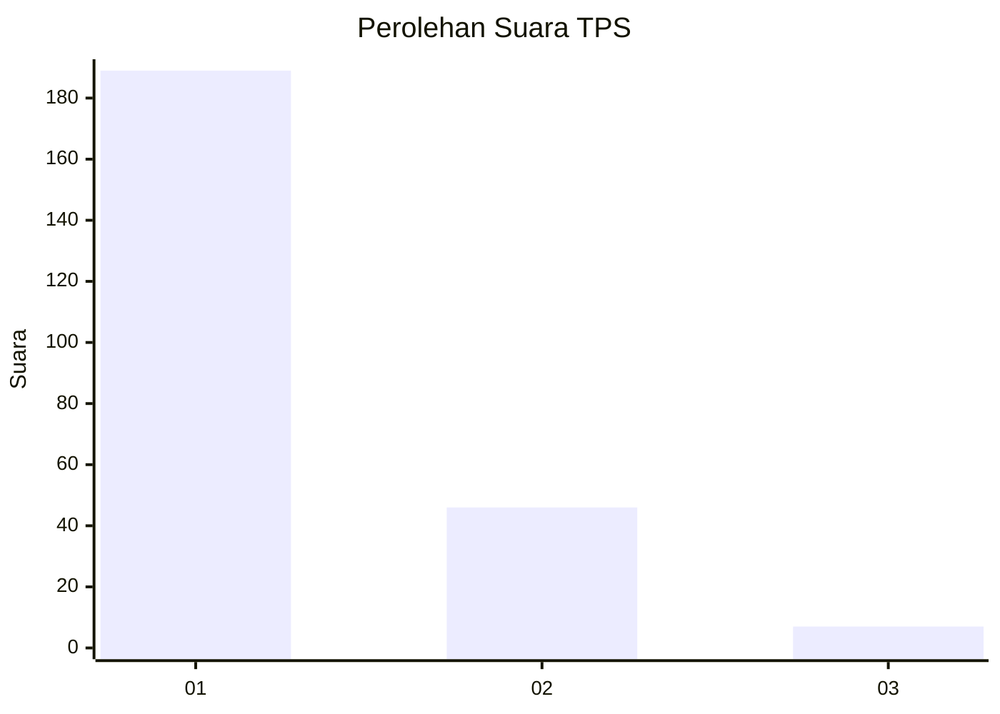
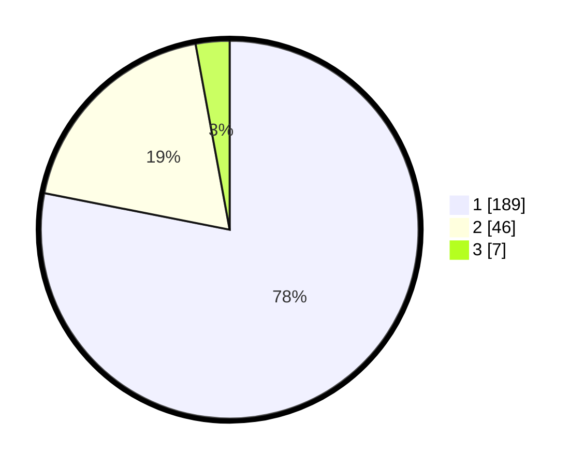

# Hasil

## Grafik

## Tabel

| No. | Nama Paslon    | Suara | Suara (raw) | Persentase |
|:--- |:-------------- | -----:| -----------:| ----------:|
| 1   | ANIES MUHAIMIN | 189   | [189][p-1]  | 78,10      |
| 2   | PRABOWO GIBRAN | 46    | [46][p-2]   | 19,01      |
| 3   | GANJAR MAHFUD  | 7     | [7][p-3]    | 2,89       |

[p-1]: https://github.com/gigit-pemilu/pemilu-2024/blob/main/pilpres/hitung-suara/sub/32-jawa-barat/sub/07-ciamis/sub/15-rancah/sub/2002-kiarapayung/sub/004-tps/sub/paslon-1.txt
[p-2]: https://github.com/gigit-pemilu/pemilu-2024/blob/main/pilpres/hitung-suara/sub/32-jawa-barat/sub/07-ciamis/sub/15-rancah/sub/2002-kiarapayung/sub/004-tps/sub/paslon-2.txt
[p-3]: https://github.com/gigit-pemilu/pemilu-2024/blob/main/pilpres/hitung-suara/sub/32-jawa-barat/sub/07-ciamis/sub/15-rancah/sub/2002-kiarapayung/sub/004-tps/sub/paslon-3.txt

## Foto C Plano

https://sirekap-obj-formc.kpu.go.id/e069/pemilu/ppwp/32/07/15/20/02/3207152002004-20240215-031931--9863639c-7b31-4728-a075-f7503789117b.jpg

https://sirekap-obj-formc.kpu.go.id/e069/pemilu/ppwp/32/07/15/20/02/3207152002004-20240215-032331--e042cfbf-5dbf-49f0-a187-4f0b673d49df.jpg

https://sirekap-obj-formc.kpu.go.id/e069/pemilu/ppwp/32/07/15/20/02/3207152002004-20240215-032824--06da95c8-9596-4886-b219-c301421f0f7f.jpg

## Metadata

| Key        | Value               |
| ---------- | ------------------- |
| Time Stamp | 2024-02-16 21:01:00 |

