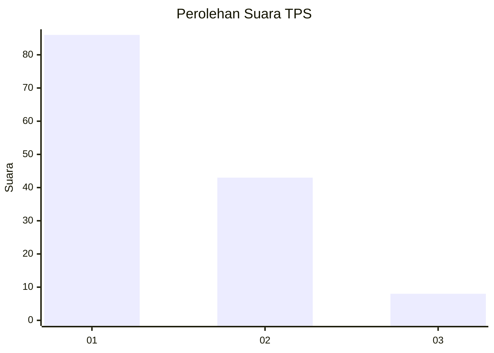
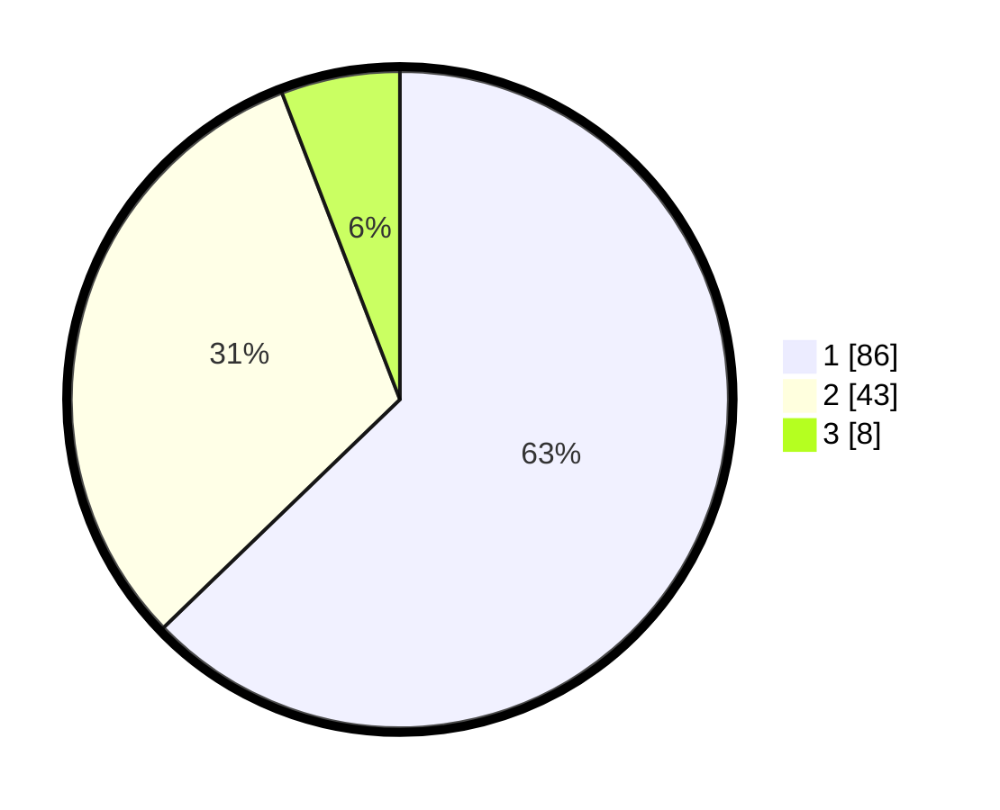

# Hasil

## Grafik

## Tabel

| No. | Nama Paslon    | Suara | Suara (raw) | Persentase |
|:--- |:-------------- | -----:| -----------:| ----------:|
| 1   | ANIES MUHAIMIN | 86    | [86][p-1]   | 62,77      |
| 2   | PRABOWO GIBRAN | 43    | [43][p-2]   | 31,39      |
| 3   | GANJAR MAHFUD  | 8     | [8][p-3]    | 5,84       |

[p-1]: https://github.com/gigit-pemilu/pemilu-2024/blob/main/pilpres/hitung-suara/sub/32-jawa-barat/sub/07-ciamis/sub/15-rancah/sub/2006-kawunglarang/sub/001-tps/sub/paslon-1.txt
[p-2]: https://github.com/gigit-pemilu/pemilu-2024/blob/main/pilpres/hitung-suara/sub/32-jawa-barat/sub/07-ciamis/sub/15-rancah/sub/2006-kawunglarang/sub/001-tps/sub/paslon-2.txt
[p-3]: https://github.com/gigit-pemilu/pemilu-2024/blob/main/pilpres/hitung-suara/sub/32-jawa-barat/sub/07-ciamis/sub/15-rancah/sub/2006-kawunglarang/sub/001-tps/sub/paslon-3.txt

## Foto C Plano

https://sirekap-obj-formc.kpu.go.id/2eb5/pemilu/ppwp/32/07/15/20/06/3207152006001-20240214-141646--a302d36d-74b3-439f-b112-99f5086769f6.jpg

https://sirekap-obj-formc.kpu.go.id/2eb5/pemilu/ppwp/32/07/15/20/06/3207152006001-20240214-141727--dc4c3f0a-0cae-43fd-b621-3d95eb4fe2d3.jpg

https://sirekap-obj-formc.kpu.go.id/2eb5/pemilu/ppwp/32/07/15/20/06/3207152006001-20240214-195647--6ee7e8d3-87b4-4082-9fb5-0c691ab132c1.jpg

## Metadata

| Key        | Value               |
| ---------- | ------------------- |
| Time Stamp | 2024-02-14 21:46:01 |

