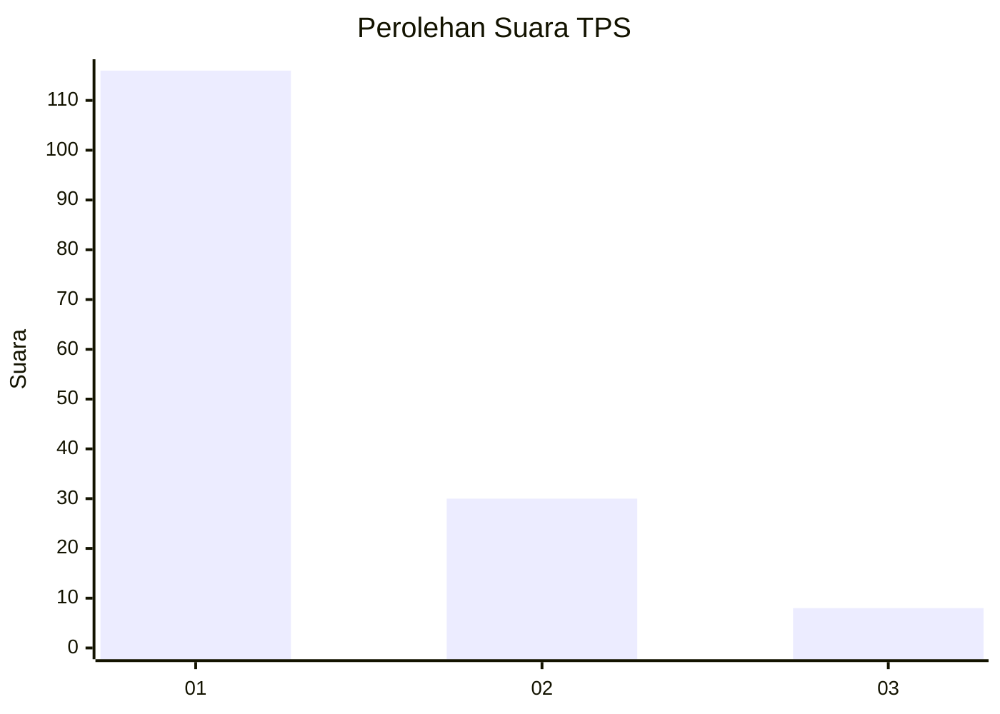
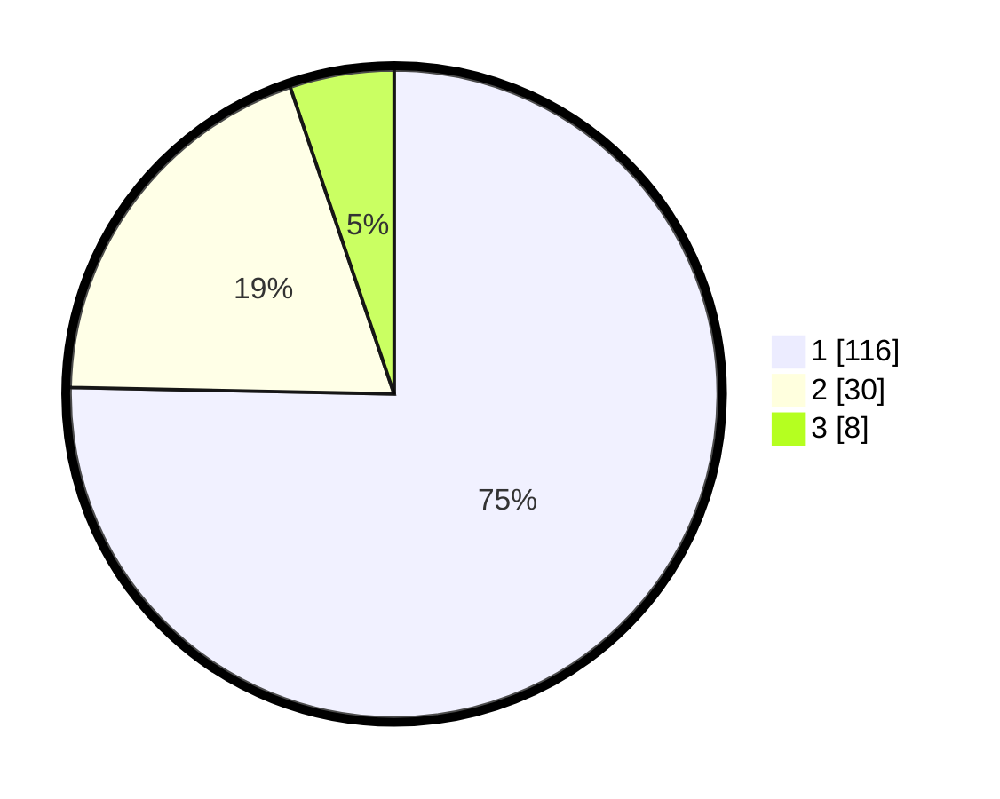

# Hasil

## Grafik

## Tabel

| No. | Nama Paslon    | Suara | Suara (raw) | Persentase |
|:--- |:-------------- | -----:| -----------:| ----------:|
| 1   | ANIES MUHAIMIN | 116   | [116][p-1]  | 75,32      |
| 2   | PRABOWO GIBRAN | 30    | [30][p-2]   | 19,48      |
| 3   | GANJAR MAHFUD  | 8     | [8][p-3]    | 5,19       |

[p-1]: https://github.com/gigit-pemilu/pemilu-2024-32-jawa-barat/blob/main/pilpres/hitung-suara/sub/32-jawa-barat/sub/07-ciamis/sub/15-rancah/sub/2006-kawunglarang/sub/022-tps/sub/paslon-1.txt
[p-2]: https://github.com/gigit-pemilu/pemilu-2024-32-jawa-barat/blob/main/pilpres/hitung-suara/sub/32-jawa-barat/sub/07-ciamis/sub/15-rancah/sub/2006-kawunglarang/sub/022-tps/sub/paslon-2.txt
[p-3]: https://github.com/gigit-pemilu/pemilu-2024-32-jawa-barat/blob/main/pilpres/hitung-suara/sub/32-jawa-barat/sub/07-ciamis/sub/15-rancah/sub/2006-kawunglarang/sub/022-tps/sub/paslon-3.txt

## Foto C Plano

https://sirekap-obj-formc.kpu.go.id/dd53/pemilu/ppwp/32/07/15/20/06/3207152006022-20240216-140203--af832988-61c9-46af-a815-93c78d583c7d.jpg

https://sirekap-obj-formc.kpu.go.id/dd53/pemilu/ppwp/32/07/15/20/06/3207152006022-20240216-211115--2da50ded-5f67-49ea-87d6-fa57837bf013.jpg

https://sirekap-obj-formc.kpu.go.id/dd53/pemilu/ppwp/32/07/15/20/06/3207152006022-20240216-204337--d47d65a7-ac97-4fc1-88d8-aa69f4e294fd.jpg

## Metadata

| Key        | Value               |
| ---------- | ------------------- |
| Time Stamp | 2024-02-19 06:16:00 |

