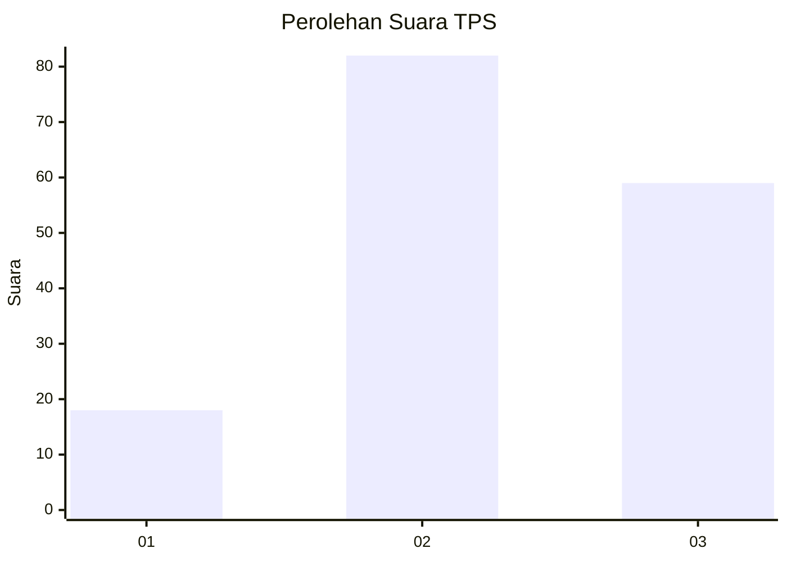
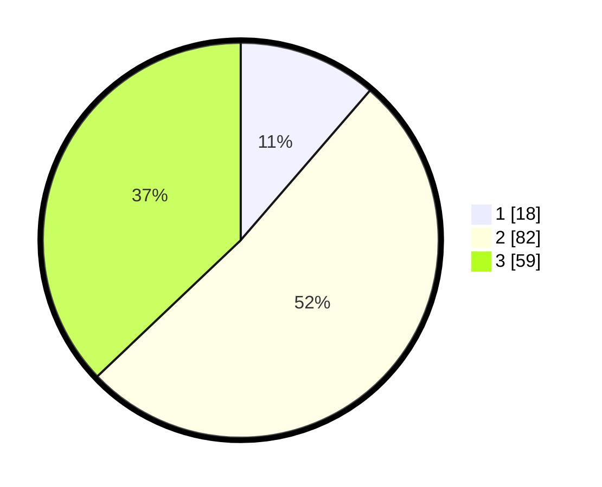

# Hasil

## Grafik

## Tabel

| No. | Nama Paslon    | Suara | Suara (raw) | Persentase |
|:--- |:-------------- | -----:| -----------:| ----------:|
| 1   | ANIES MUHAIMIN | 18    | [18][p-1]   | 11,32      |
| 2   | PRABOWO GIBRAN | 82    | [82][p-2]   | 51,57      |
| 3   | GANJAR MAHFUD  | 59    | [59][p-3]   | 37,11      |

[p-1]: https://github.com/gigit-pemilu/pemilu-2024-32-jawa-barat/blob/main/pilpres/hitung-suara/sub/32-jawa-barat/sub/07-ciamis/sub/17-lakbok/sub/2006-sidaharja/sub/001-tps/sub/paslon-1.txt
[p-2]: https://github.com/gigit-pemilu/pemilu-2024-32-jawa-barat/blob/main/pilpres/hitung-suara/sub/32-jawa-barat/sub/07-ciamis/sub/17-lakbok/sub/2006-sidaharja/sub/001-tps/sub/paslon-2.txt
[p-3]: https://github.com/gigit-pemilu/pemilu-2024-32-jawa-barat/blob/main/pilpres/hitung-suara/sub/32-jawa-barat/sub/07-ciamis/sub/17-lakbok/sub/2006-sidaharja/sub/001-tps/sub/paslon-3.txt

## Foto C Plano

https://sirekap-obj-formc.kpu.go.id/d155/pemilu/ppwp/32/07/17/20/06/3207172006001-20240215-014659--82111df1-9602-4a5b-b817-4278a4897ca4.jpg

https://sirekap-obj-formc.kpu.go.id/d155/pemilu/ppwp/32/07/17/20/06/3207172006001-20240215-015058--1cc1c749-3c8e-4c62-a373-00caf0c5f760.jpg

https://sirekap-obj-formc.kpu.go.id/d155/pemilu/ppwp/32/07/17/20/06/3207172006001-20240215-015135--d98fa35a-1ccf-44ef-838f-c85481af7da7.jpg

## Metadata

| Key        | Value               |
| ---------- | ------------------- |
| Time Stamp | 2024-02-16 21:01:00 |

