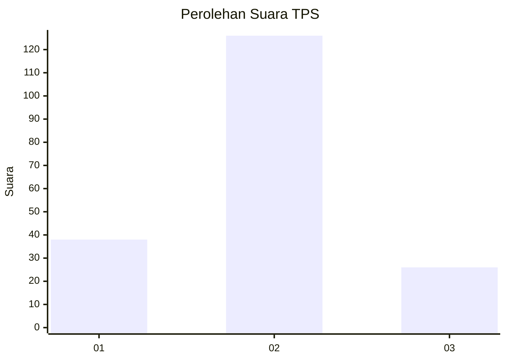
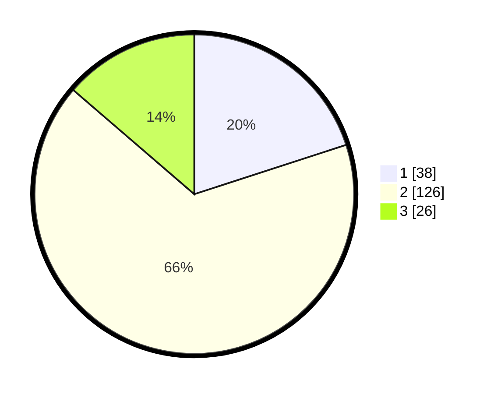

# Hasil

## Grafik

## Tabel

| No. | Nama Paslon    | Suara | Suara (raw) | Persentase |
|:--- |:-------------- | -----:| -----------:| ----------:|
| 1   | ANIES MUHAIMIN | 38    | [38][p-1]   | 20,00      |
| 2   | PRABOWO GIBRAN | 126   | [126][p-2]  | 66,32      |
| 3   | GANJAR MAHFUD  | 26    | [26][p-3]   | 13,68      |

[p-1]: https://github.com/gigit-pemilu/pemilu-2024-32-jawa-barat/blob/main/pilpres/hitung-suara/sub/32-jawa-barat/sub/07-ciamis/sub/17-lakbok/sub/2006-sidaharja/sub/006-tps/sub/paslon-1.txt
[p-2]: https://github.com/gigit-pemilu/pemilu-2024-32-jawa-barat/blob/main/pilpres/hitung-suara/sub/32-jawa-barat/sub/07-ciamis/sub/17-lakbok/sub/2006-sidaharja/sub/006-tps/sub/paslon-2.txt
[p-3]: https://github.com/gigit-pemilu/pemilu-2024-32-jawa-barat/blob/main/pilpres/hitung-suara/sub/32-jawa-barat/sub/07-ciamis/sub/17-lakbok/sub/2006-sidaharja/sub/006-tps/sub/paslon-3.txt

## Foto C Plano

https://sirekap-obj-formc.kpu.go.id/da30/pemilu/ppwp/32/07/17/20/06/3207172006006-20240215-053828--8b5bf5f2-f96e-4528-b46e-3ffad29656e1.jpg

https://sirekap-obj-formc.kpu.go.id/da30/pemilu/ppwp/32/07/17/20/06/3207172006006-20240215-053856--87f0e47c-199b-4cea-92d1-37303fbb1941.jpg

https://sirekap-obj-formc.kpu.go.id/da30/pemilu/ppwp/32/07/17/20/06/3207172006006-20240215-053938--de41470a-f75a-4133-8c03-155a47be9237.jpg

## Metadata

| Key        | Value               |
| ---------- | ------------------- |
| Time Stamp | 2024-02-15 17:30:25 |

