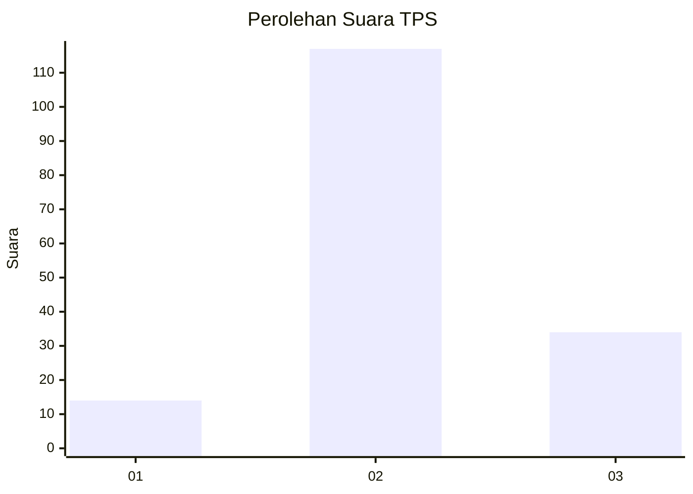
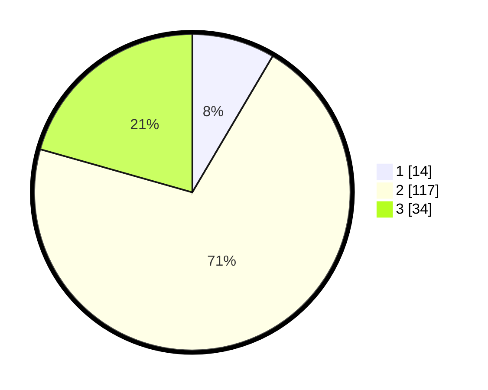

# Hasil

## Grafik

## Tabel

| No. | Nama Paslon    | Suara | Suara (raw) | Persentase |
|:--- |:-------------- | -----:| -----------:| ----------:|
| 1   | ANIES MUHAIMIN | 14    | [14][p-1]   | 8,48       |
| 2   | PRABOWO GIBRAN | 117   | [117][p-2]  | 70,91      |
| 3   | GANJAR MAHFUD  | 34    | [34][p-3]   | 20,61      |

[p-1]: https://github.com/gigit-pemilu/pemilu-2024/blob/main/pilpres/hitung-suara/sub/32-jawa-barat/sub/07-ciamis/sub/17-lakbok/sub/2006-sidaharja/sub/007-tps/sub/paslon-1.txt
[p-2]: https://github.com/gigit-pemilu/pemilu-2024/blob/main/pilpres/hitung-suara/sub/32-jawa-barat/sub/07-ciamis/sub/17-lakbok/sub/2006-sidaharja/sub/007-tps/sub/paslon-2.txt
[p-3]: https://github.com/gigit-pemilu/pemilu-2024/blob/main/pilpres/hitung-suara/sub/32-jawa-barat/sub/07-ciamis/sub/17-lakbok/sub/2006-sidaharja/sub/007-tps/sub/paslon-3.txt

## Foto C Plano

https://sirekap-obj-formc.kpu.go.id/abf9/pemilu/ppwp/32/07/17/20/06/3207172006007-20240214-185734--b796e9fa-0c58-47bb-9add-2dd9adb0d662.jpg

https://sirekap-obj-formc.kpu.go.id/abf9/pemilu/ppwp/32/07/17/20/06/3207172006007-20240214-192028--132d5dfb-be46-4f44-b541-1a4d7dafc282.jpg

https://sirekap-obj-formc.kpu.go.id/abf9/pemilu/ppwp/32/07/17/20/06/3207172006007-20240214-192308--bd54af7c-ee59-4bb2-9bf3-ecaff4cfa195.jpg

## Metadata

| Key        | Value               |
| ---------- | ------------------- |
| Time Stamp | 2024-02-16 21:01:00 |

