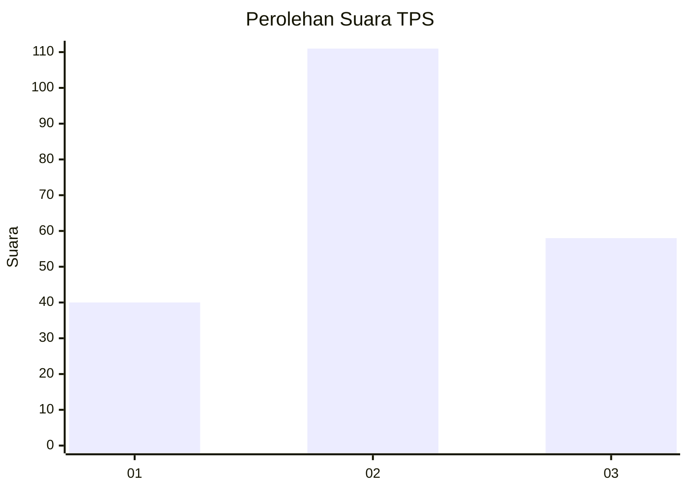
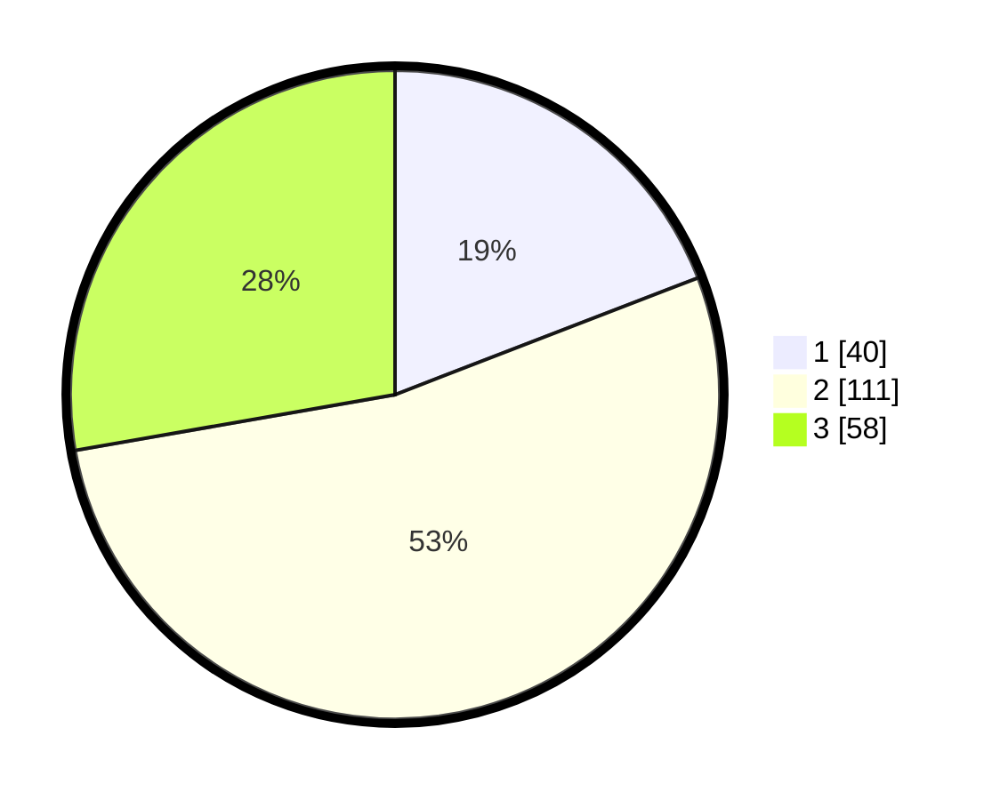

# Hasil

## Grafik

## Tabel

| No. | Nama Paslon    | Suara | Suara (raw) | Persentase |
|:--- |:-------------- | -----:| -----------:| ----------:|
| 1   | ANIES MUHAIMIN | 40    | [40][p-1]   | 19,14      |
| 2   | PRABOWO GIBRAN | 111   | [111][p-2]  | 53,11      |
| 3   | GANJAR MAHFUD  | 58    | [58][p-3]   | 27,75      |

[p-1]: https://github.com/gigit-pemilu/pemilu-2024/blob/main/pilpres/hitung-suara/sub/32-jawa-barat/sub/07-ciamis/sub/18-banjarsari/sub/2005-kawasen/sub/001-tps/sub/paslon-1.txt
[p-2]: https://github.com/gigit-pemilu/pemilu-2024/blob/main/pilpres/hitung-suara/sub/32-jawa-barat/sub/07-ciamis/sub/18-banjarsari/sub/2005-kawasen/sub/001-tps/sub/paslon-2.txt
[p-3]: https://github.com/gigit-pemilu/pemilu-2024/blob/main/pilpres/hitung-suara/sub/32-jawa-barat/sub/07-ciamis/sub/18-banjarsari/sub/2005-kawasen/sub/001-tps/sub/paslon-3.txt

## Foto C Plano

https://sirekap-obj-formc.kpu.go.id/0df2/pemilu/ppwp/32/07/18/20/05/3207182005001-20240215-035153--0c5d056d-97d7-4514-a783-a814ca6a941b.jpg

https://sirekap-obj-formc.kpu.go.id/0df2/pemilu/ppwp/32/07/18/20/05/3207182005001-20240215-035528--3628e80d-aef5-4f38-8db7-7278f8de5b95.jpg

https://sirekap-obj-formc.kpu.go.id/0df2/pemilu/ppwp/32/07/18/20/05/3207182005001-20240215-035714--0f199c11-d15a-4388-938d-7650a655f7fc.jpg

## Metadata

| Key        | Value               |
| ---------- | ------------------- |
| Time Stamp | 2024-02-16 12:51:22 |

