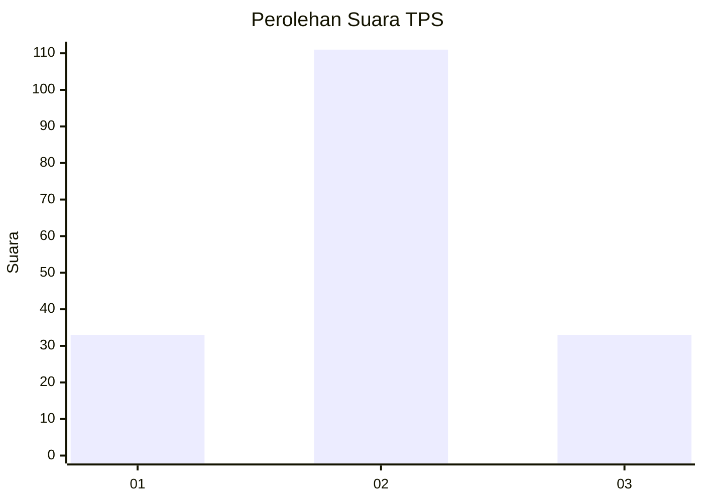
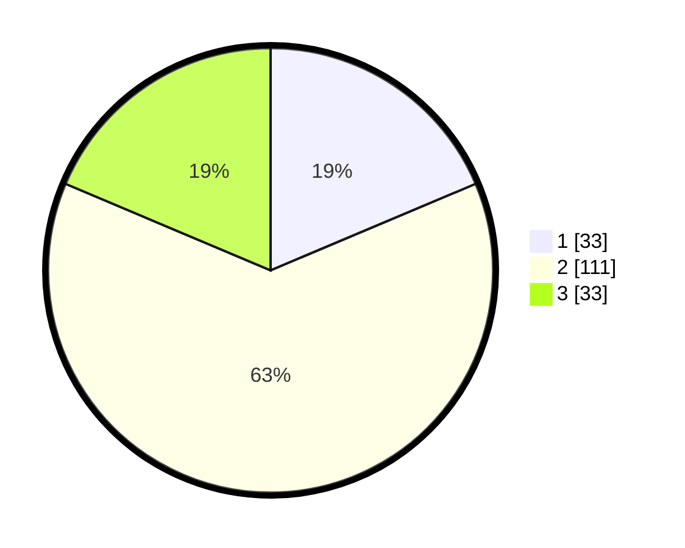

# Hasil

## Grafik

## Tabel

| No. | Nama Paslon    | Suara | Suara (raw) | Persentase |
|:--- |:-------------- | -----:| -----------:| ----------:|
| 1   | ANIES MUHAIMIN | 33    | [33][p-1]   | 18,64      |
| 2   | PRABOWO GIBRAN | 111   | [111][p-2]  | 62,71      |
| 3   | GANJAR MAHFUD  | 33    | [33][p-3]   | 18,64      |

[p-1]: https://github.com/gigit-pemilu/pemilu-2024-32-jawa-barat/blob/main/pilpres/hitung-suara/sub/32-jawa-barat/sub/07-ciamis/sub/18-banjarsari/sub/2005-kawasen/sub/003-tps/sub/paslon-1.txt
[p-2]: https://github.com/gigit-pemilu/pemilu-2024-32-jawa-barat/blob/main/pilpres/hitung-suara/sub/32-jawa-barat/sub/07-ciamis/sub/18-banjarsari/sub/2005-kawasen/sub/003-tps/sub/paslon-2.txt
[p-3]: https://github.com/gigit-pemilu/pemilu-2024-32-jawa-barat/blob/main/pilpres/hitung-suara/sub/32-jawa-barat/sub/07-ciamis/sub/18-banjarsari/sub/2005-kawasen/sub/003-tps/sub/paslon-3.txt

## Foto C Plano

https://sirekap-obj-formc.kpu.go.id/83b7/pemilu/ppwp/32/07/18/20/05/3207182005003-20240215-015052--9009c6d3-6f86-45ee-bbab-bb09f8bdee8d.jpg

https://sirekap-obj-formc.kpu.go.id/83b7/pemilu/ppwp/32/07/18/20/05/3207182005003-20240215-015150--f714be2e-44f5-49c3-ac94-24d8188850bd.jpg

https://sirekap-obj-formc.kpu.go.id/83b7/pemilu/ppwp/32/07/18/20/05/3207182005003-20240215-015241--c740f270-4354-45a8-a1e6-b0aeb5f3f96d.jpg

## Metadata

| Key        | Value               |
| ---------- | ------------------- |
| Time Stamp | 2024-02-16 12:51:22 |

