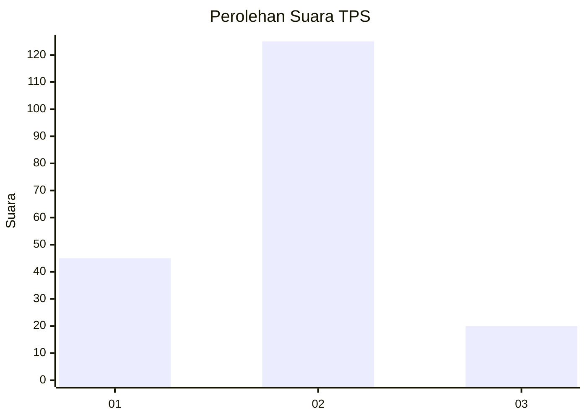
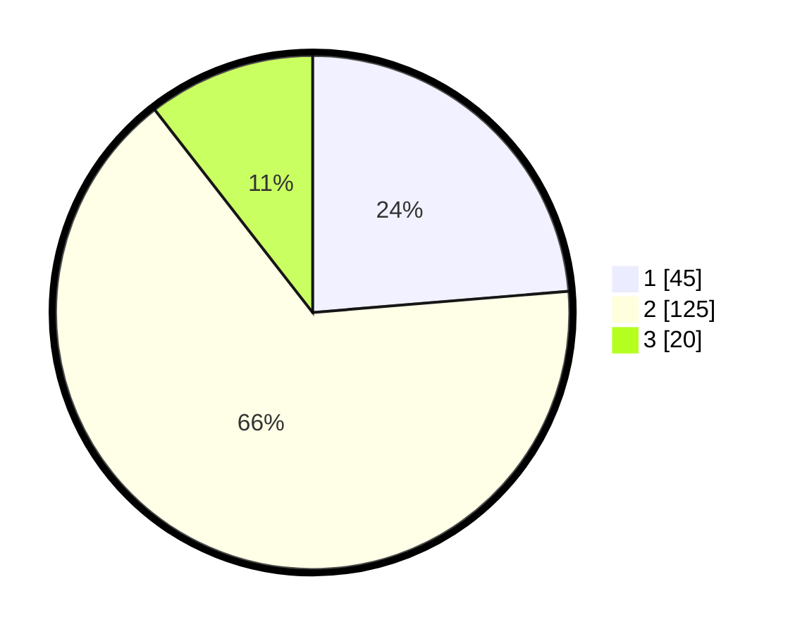

# Hasil

## Grafik

## Tabel

| No. | Nama Paslon    | Suara | Suara (raw) | Persentase |
|:--- |:-------------- | -----:| -----------:| ----------:|
| 1   | ANIES MUHAIMIN | 45    | [45][p-1]   | 23,68      |
| 2   | PRABOWO GIBRAN | 125   | [125][p-2]  | 65,79      |
| 3   | GANJAR MAHFUD  | 20    | [20][p-3]   | 10,53      |

[p-1]: https://github.com/gigit-pemilu/pemilu-2024-32-jawa-barat/blob/main/pilpres/hitung-suara/sub/32-jawa-barat/sub/07-ciamis/sub/18-banjarsari/sub/2005-kawasen/sub/006-tps/sub/paslon-1.txt
[p-2]: https://github.com/gigit-pemilu/pemilu-2024-32-jawa-barat/blob/main/pilpres/hitung-suara/sub/32-jawa-barat/sub/07-ciamis/sub/18-banjarsari/sub/2005-kawasen/sub/006-tps/sub/paslon-2.txt
[p-3]: https://github.com/gigit-pemilu/pemilu-2024-32-jawa-barat/blob/main/pilpres/hitung-suara/sub/32-jawa-barat/sub/07-ciamis/sub/18-banjarsari/sub/2005-kawasen/sub/006-tps/sub/paslon-3.txt

## Foto C Plano

https://sirekap-obj-formc.kpu.go.id/be89/pemilu/ppwp/32/07/18/20/05/3207182005006-20240214-234639--eec42499-1920-47c4-bed9-c9469773b21d.jpg

https://sirekap-obj-formc.kpu.go.id/be89/pemilu/ppwp/32/07/18/20/05/3207182005006-20240214-234803--61bdee01-1139-4f2a-8a1c-f5062ca38ff9.jpg

https://sirekap-obj-formc.kpu.go.id/be89/pemilu/ppwp/32/07/18/20/05/3207182005006-20240214-234950--bd5ee1ad-f7c0-497b-bfea-f10bb1f9250b.jpg

## Metadata

| Key        | Value               |
| ---------- | ------------------- |
| Time Stamp | 2024-02-16 12:51:22 |

