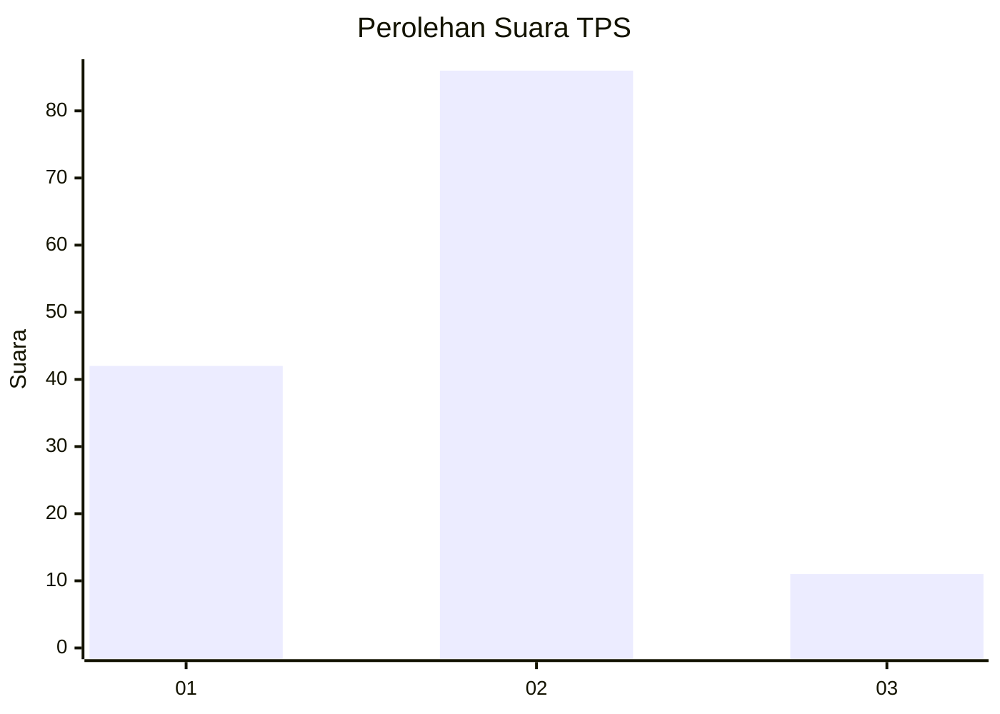
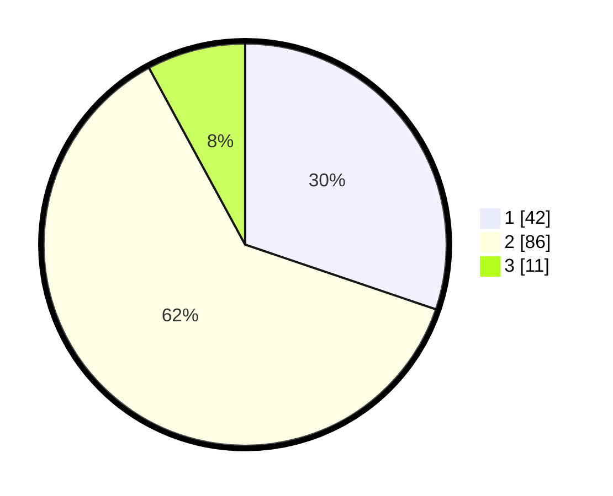

# Hasil

## Grafik

## Tabel

| No. | Nama Paslon    | Suara | Suara (raw) | Persentase |
|:--- |:-------------- | -----:| -----------:| ----------:|
| 1   | ANIES MUHAIMIN | 42    | [42][p-1]   | 30,22      |
| 2   | PRABOWO GIBRAN | 86    | [86][p-2]   | 61,87      |
| 3   | GANJAR MAHFUD  | 11    | [11][p-3]   | 7,91       |

[p-1]: https://github.com/gigit-pemilu/pemilu-2024/blob/main/pilpres/hitung-suara/sub/32-jawa-barat/sub/07-ciamis/sub/19-pamarican/sub/2001-pamarican/sub/004-tps/sub/paslon-1.txt
[p-2]: https://github.com/gigit-pemilu/pemilu-2024/blob/main/pilpres/hitung-suara/sub/32-jawa-barat/sub/07-ciamis/sub/19-pamarican/sub/2001-pamarican/sub/004-tps/sub/paslon-2.txt
[p-3]: https://github.com/gigit-pemilu/pemilu-2024/blob/main/pilpres/hitung-suara/sub/32-jawa-barat/sub/07-ciamis/sub/19-pamarican/sub/2001-pamarican/sub/004-tps/sub/paslon-3.txt

## Foto C Plano

https://sirekap-obj-formc.kpu.go.id/7f8b/pemilu/ppwp/32/07/19/20/01/3207192001004-20240214-195415--7fd13671-0120-4d97-b6ce-e3b3ea1873e3.jpg

https://sirekap-obj-formc.kpu.go.id/7f8b/pemilu/ppwp/32/07/19/20/01/3207192001004-20240214-195615--e48166cb-b0a7-4022-a6ef-ad5adfb92f90.jpg

https://sirekap-obj-formc.kpu.go.id/7f8b/pemilu/ppwp/32/07/19/20/01/3207192001004-20240216-033546--84f02345-5d3c-4ed0-b03d-22bd4b825bfc.jpg

## Metadata

| Key        | Value               |
| ---------- | ------------------- |
| Time Stamp | 2024-02-16 04:00:27 |

