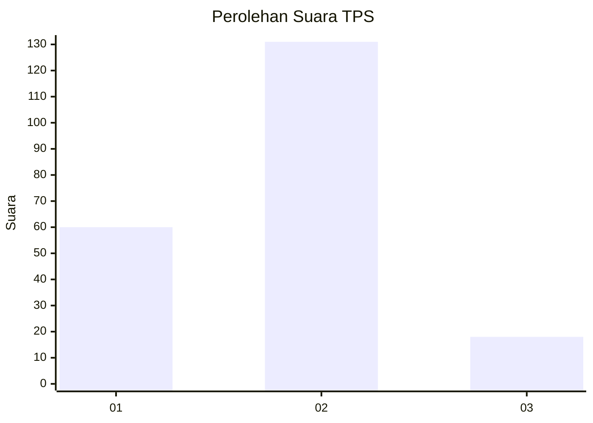
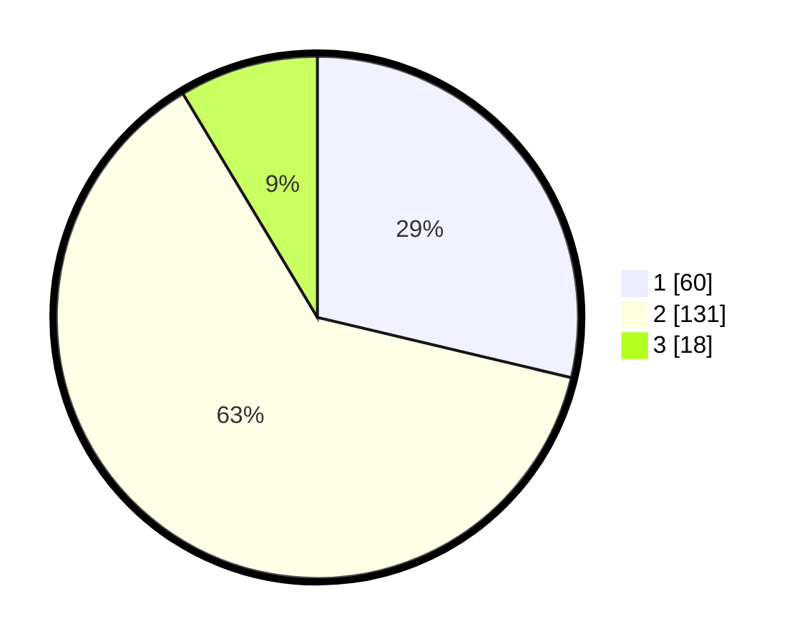

# Hasil

## Grafik

## Tabel

| No. | Nama Paslon    | Suara | Suara (raw) | Persentase |
|:--- |:-------------- | -----:| -----------:| ----------:|
| 1   | ANIES MUHAIMIN | 60    | [60][p-1]   | 28,71      |
| 2   | PRABOWO GIBRAN | 131   | [131][p-2]  | 62,68      |
| 3   | GANJAR MAHFUD  | 18    | [18][p-3]   | 8,61       |

[p-1]: https://github.com/gigit-pemilu/pemilu-2024/blob/main/pilpres/hitung-suara/sub/32-jawa-barat/sub/07-ciamis/sub/29-cimaragas/sub/2001-cimaragas/sub/001-tps/sub/paslon-1.txt
[p-2]: https://github.com/gigit-pemilu/pemilu-2024/blob/main/pilpres/hitung-suara/sub/32-jawa-barat/sub/07-ciamis/sub/29-cimaragas/sub/2001-cimaragas/sub/001-tps/sub/paslon-2.txt
[p-3]: https://github.com/gigit-pemilu/pemilu-2024/blob/main/pilpres/hitung-suara/sub/32-jawa-barat/sub/07-ciamis/sub/29-cimaragas/sub/2001-cimaragas/sub/001-tps/sub/paslon-3.txt

## Foto C Plano

https://sirekap-obj-formc.kpu.go.id/8e8b/pemilu/ppwp/32/07/29/20/01/3207292001001-20240215-021858--99708947-e65c-4e86-985b-69ec82540eb2.jpg

https://sirekap-obj-formc.kpu.go.id/8e8b/pemilu/ppwp/32/07/29/20/01/3207292001001-20240215-022012--cab75e5d-478d-4f9f-83eb-54a61886fdba.jpg

https://sirekap-obj-formc.kpu.go.id/8e8b/pemilu/ppwp/32/07/29/20/01/3207292001001-20240215-022140--7e096482-1950-4ea3-8618-564409311dd7.jpg

## Metadata

| Key        | Value               |
| ---------- | ------------------- |
| Time Stamp | 2024-02-16 10:00:28 |

